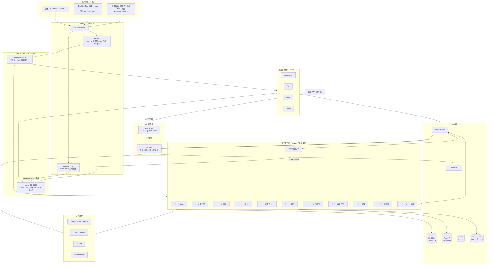

# 电池全生命周期管理平台 · 技术架构文档

**版本**：v2.0（micro-new 重建版）
**日期**：2026-10-06
**对应需求**：《01-需求文档.md》v2.0
**本文回答的问题**：HOW——每一项技术**是什么、为什么选它、用来干什么、放弃了什么备选**；自研了哪些公共组件、为什么自研；关键机制如何实现；代码仓库怎么组织（**后端分仓方案**）；怎么部署、观测、测试。

---

## 目录

1. [文档说明](#1-文档说明)
2. [总体架构](#2-总体架构)
3. [仓库架构与工程组织（后端分仓方案）](#3-仓库架构与工程组织后端分仓方案)
4. [后端技术选型详解](#4-后端技术选型详解)
5. [接入与边缘组件](#5-接入与边缘组件)
6. [自研公共组件库（common）](#6-自研公共组件库common)
7. [关键机制设计](#7-关键机制设计)
8. [前端技术选型](#8-前端技术选型)
9. [可观测性架构](#9-可观测性架构)
10. [安全架构](#10-安全架构)
11. [数据架构](#11-数据架构)
12. [部署架构](#12-部署架构)
13. [测试与质量体系](#13-测试与质量体系)
14. [架构决策记录（ADR）汇总](#14-架构决策记录adr汇总)

---

## 1. 文档说明

- 技术决策分两类：**继承决策**（原 micro 项目已实机验证的选型，本文直接继承）与**重建决策**（micro-new 新做的决策，主要是仓库拆分与端口重规划）。重建决策单独标注 ★。
- 每个选型按"**是什么 → 为什么选 → 用来干什么 → 放弃了什么**"四段式书写，新人可以只看加粗句。
- 原 16 个月实施过程中的真实教训（brokerIP1、冒烟并发、select{} 挂消费协程等）以 `> 💡 教训` 标注——这些都是踩过坑换来的，重建时直接规避。

---

## 2. 总体架构

### 2.1 架构总览图



### 2.2 一次典型请求

**管理端查询**：浏览器 → APISIX（验 RS256 JWT + 限流）→ admin-bff（三层鉴权：验签 → Redis 会话 → RBAC）→ 业务 RPC（gRPC，etcd 发现，metadata 透传 uid/租户）→ MySQL。

**设备遥测**：电池 → EMQX（一机一密 + TLS）→ iotingest 转发协程 → RocketMQ（缓冲）→ iotingest 写入协程 → 批量写 TDengine；越限 → alert_candidate → ops 判定 → Centrifugo 推送。

### 2.3 分层职责与禁区

| 层 | 职责 | 禁止事项 |
|---|---|---|
| 边缘层 | TLS 终结、JWT 验签、限流、路由、WebSocket 透传 | 不做业务逻辑 |
| BFF 层 | 聚合多个 RPC、字段裁剪、推送订阅鉴权 | 不写业务规则、不直连数据库 |
| 业务服务层 | **唯一写入方原则**：每张表只归属一个服务 | 禁止跨服务直连他人数据库 |
| IoT 接入域 | 协议终结、认证、削峰、批量写时序库 | 不做业务判断（越限规则来自 ops 下发的缓存） |
| 基础设施层 | 通知/文件/审计/配置通用能力 | 不依赖业务服务 |

---

## 3. 仓库架构与工程组织（后端分仓方案）★

> 原项目是单一 monorepo（Go workspace 22 个 module + 前端 pnpm workspace + Tauri + 部署 + 文档，全部在一个仓库）。**体积大、职责混杂、发布节奏互相牵制**是拆分的直接动因。本节是 micro-new 的重建决策。

### 3.1 分仓方案（推荐：5 仓库）

| 仓库 | 内容 | 独立理由 |
|---|---|---|
| **`micro-common`** | Go 公共库（第 6 节全部 12 个包，单一 Go module） | 稳定、被所有服务依赖，**必须版本化发布**（semver tag），避免"改公共库全仓重编" |
| **`micro-server`** | 19 个后端服务（每服务独立 Go module + go.work）+ server/tools 工具箱 | 服务迭代快，与 common 的稳定节奏解耦 |
| **`micro-web`** | Web 三端（admin/dealer/station）+ 两个小程序 + 运维 App（pnpm workspace 统一管理） | 前端技术栈/CI/依赖更新节奏与后端完全不同 |
| **`micro-desktop`** | Tauri 运维 PC（Rust + 复用 micro-web 产物） | **Rust 工具链隔离**——不想编译后端的机器不需要装 cargo |
| **`micro-deploy`** | docker-compose / K3s 清单 / ArgoCD / 密钥样例 / runbook / 环境凭据模板 | 部署配置单独授权（运维），且密钥管理边界清晰 |

文档跟随各仓库（每仓库自带 docs/），跨仓库的总体文档放 `micro-deploy/docs` 或独立 wiki。

### 3.2 为什么这样拆（以及为什么不拆得更细）

**拆分收益**：
1. **发布节奏解耦**：common 走 semver（v0.3.1），服务仓库按需升级版本；前端发版不触发后端 CI。
2. **权限隔离**：deploy 仓库含环境凭据模板，可单独收权；desktop 仓库只有运维工具链同学需要。
3. **仓库体积可控**：原 monorepo 最大的痛点是 docs/tasks/二进制产物与代码混杂；拆分后各仓库职责单一。
4. **CI 变快**：每个仓库只跑自己的流水线；micro-server 按服务 module 粒度增量构建。

**为什么不拆成 19 个服务仓库**：
- 7~8 人团队，跨 19 个仓库做一个"下单改 6 个服务"的需求要开 6 个 PR、6 次 CI、按依赖顺序合并——协调成本远超收益。
- 服务间契约（.api/.proto）变更需要原子性，单仓内一个 PR 覆盖多服务是 monorepo 最大优点。
- 折中：**micro-server 内每服务仍是独立 Go module**（沿用原项目 go.work 方案），未来某个域需要独立仓库时，`git filter-repo` 抽目录即可，模块边界就是拆分边界。

**为什么不保持单仓**：可以（≤4 人团队单仓完全够用），但用户明确要求考虑拆分，且原仓库已在"大而全"方向出现过管理负担。若团队规模收缩，合并回单仓的成本也很低（go.work + pnpm workspace 均支持目录聚合）。

### 3.3 跨仓库协作规则（关键，必须遵守）

| 规则 | 说明 |
|---|---|
| **common 版本化** | micro-common 每次合并 main 打 tag（v0.x.y）；micro-server 各服务 go.mod 引用版本号；破坏性变更必须升次版本号并写 CHANGELOG |
| **本地联调** | 开发机在约定目录（如 `~/code/micro/`）clone 全部仓库，根放一个**开发用 go.work**（`go 1.26; use ./micro-common; ./micro-server/services/*`）——go.work 不入库，实现"分仓存储、单仓开发体验" |
| **接口先行** | 跨仓库变更先改契约：BFF 的 `.api` 文件与服务的 `.proto` 是前后端/服务间的唯一契约源；契约变更 PR 先行评审，实现 PR 跟进 |
| **类型生成** | `apitypes` 工具从 `.api` 生成 TS 类型进 micro-web；`openapi` 工具生成 OpenAPI 文档；两处 CI 均有漂移阻断 |
| **CI 触发** | micro-common 发版触发 micro-server 的"升级 common"机器人 PR（可低频人工批量处理）；其余仓库独立 CI |
| **提交规范** | 中文 conventional commits（`feat(order): ...`）；跨仓库同一需求用同一个任务号关联（任务号在需求文档/任务清单中登记） |

### 3.4 各仓库目录骨架

```
micro-common/                    # Go 公共库（单 module）
├── go.mod                       # module micro/common
├── errcode/ response/ authz/ jwtauth/ sessionx/
├── tenant/ crypto/ ctxkit/ snowflake/
├── eventbus/ pushjwt/ testinfra/
└── README.md

micro-server/                    # 后端服务仓
├── go.work                      # 聚合 services/* 与 tools（不含 common，common 走版本引用）
├── services/
│   ├── identity/                # 每服务一个 module：main + etc/ + internal/ + migrations/ + *.api/.proto
│   ├── ... (19 个服务)
├── tools/                       # migrate/seed/envcheck/dodcheck/openapi/apitypes/devicesim 等
└── README.md

micro-web/
├── pnpm-workspace.yaml
├── apps/                        # admin / dealer / station
├── miniapp/                     # client / station
├── packages/shared/             # 请求层/权限/推送/生成类型
└── apps-mobile/                 # 运维 App（Taro RN）

micro-desktop/
├── src-tauri/                   # Rust：diag.rs / flash.rs / transfer.rs
├── package.json                 # 前端复用 micro-web/apps/admin 产物
└── README.md

micro-deploy/
├── compose/                     # docker-compose.dev-extra.yml + emqx/centrifugo/apisix/observability 配置
├── docker/                      # Dockerfile.service + docker-bake.hcl
├── k8s/                         # K3s + ArgoCD app-of-apps + NetPol
├── conf/keys.example/           # 密钥样例（真实密钥永不入库）
├── runbook/                     # 故障演练脚本
└── docs/                        # 跨仓总体文档/端口表/环境说明
```

---

## 4. 后端技术选型详解

### 4.1 语言与框架

#### Go 1.26

- **是什么**：编译型静态语言，Google 出品，云原生事实标准。
- **为什么选**：①单二进制部署（19 个服务 = 19 个 exe，容器镜像 ~20MB）；②编译快、交叉编译方便（Windows 开发 → Linux 容器运行）；③goroutine 模型适合 IoT 高并发转发（iotingest 单进程扛 2000 设备遥测）；④团队已有技能栈。
- **用来干什么**：全部 19 个后端服务 + 40+ 命令行工具。
- **放弃了什么**：Java/Spring（启动重、内存占用大、小团队运维成本高）；Node.js（CPU 密集的加解密/序列化弱，类型约束松）。

#### go-zero v1.10 + goctl（微服务框架）

- **是什么**：国内流行的 Go 微服务框架，`goctl` 可从 `.api`/`.proto` 描述文件一键生成 handler/路由/客户端代码。
- **为什么选**：①**接口即代码**：`.api` 文件既是文档又是代码生成源，配合 apitypes/openapi 工具形成"契约先行"全链路；②内置服务发现（etcd）、熔断、限流、Prometheus 指标、OpenTelemetry 链路——**可观测性零改造接入**；③zrpc + protobuf 的 RPC 生态成熟；④国内文档/社区中文友好。
- **用来干什么**：15 个业务/基础设施服务用 zrpc（gRPC :808x）；2 个 BFF 用 api（REST :888x）；`goctl` 生成脚手架（newsvc.sh 封装）。
- **放弃了什么**：Kratos（B 站系，设计更"自由"，但约定少、团队协作时风格易发散）；gin/echo（只是 HTTP 框架，服务发现/熔断/指标都要自己拼）；自研框架（不值）。

#### GORM v2（ORM）

- **为什么选**：开发效率优先——模型即结构体，自动迁移检查、Hook、预编译都够用；配合**多租户插件**（GORM Callbacks 机制，见 7.4）实现全局 SQL 改写是选它的决定性原因：Callback 机制让我们能在 ORM 层强制注入 `tenant_id` 过滤，业务代码零感知。
- **用来干什么**：全部 MySQL 访问；每服务独立使用，不共享连接。
- **放弃了什么**：sqlx（要手写太多扫描代码）；ent（代码生成重、学习曲线陡）。**注意**：GORM 默认不阻止慢查询，列表接口必须显式 LIMIT——已列入 code review 检查项。

#### golang-migrate（数据库迁移）

- **为什么选**：纯 SQL 文件驱动（`NNNNNN_xxx.up.sql / .down.sql` 成对），不引入私有格式；CI 可以静态检查"成对 + 顺序"（dodcheck 的一部分）。
- **用来干什么**：16 个库共 60+ 对迁移脚本；`tools/migrate -svc <name> up` 一键执行，自动建库。

#### etcd 3.7（服务发现 + ID 分配）

- **为什么选**：go-zero 默认注册中心，**仅做服务发现，不上 Nacos/Apollo**（少运维一个组件）；同时复用它的租约机制给雪花 ID 分配 worker_id（见 6.6）。
- **放弃了什么**：Consul/Kubernetes DNS（当前部署形态 compose 为主，K3s 后可评估切换，见 ADR-10）。

### 4.2 数据层

#### MySQL 8.0（一服务一库）

- **为什么"一服务一库"**：这是微服务数据自治的底线——服务 A 永远不能 JOIN 服务 B 的表，否则库表重构（加列/换存储）会被别家绑死。跨服务聚合一律走 BFF（实时）或 analytics 读模型（报表）。同实例多 database 起步（成本考虑），量大后按服务拆实例。
- **通用规范**：全表 `tenant_id/created_*/updated_*/deleted_at`；雪花 int64 主键；对外 ID 字符串化；utf8mb4；InnoDB。
- **放弃了什么**：PostgreSQL（功能更强但团队经验与云托管生态默认 MySQL）；分库分表中间件（规模远未到，单库读写分离足够 3 年）。

#### Redis 7（逻辑 DB 划分）

| DB | 用途 |
|---|---|
| 0 | 业务缓存（设备影子之外的缓存、规则缓存等） |
| 1 | 任务队列预留（现延迟任务走 RocketMQ，此库保留） |
| 2 | Centrifugo 引擎（频道/历史/在线状态） |
| 3 | 分布式锁（库存预扣、互斥） |
| 4 | **认证会话中心**（sess/mutex/refresh/login_fail） |

- **为什么按 DB 划分**：dev 环境单实例即可跑全套，运维心智清楚"哪类数据在哪"；生产量大后可按 DB 拆实例，代码零改动。
- **放弃了什么**：KeyDB/Dragonfly（无必要）；memcached（无持久化与丰富结构）。

#### RocketMQ 5.x（事件总线 + 延迟消息 + 缓冲）

- **为什么选（而不是 Kafka）**：①规模匹配——200~2000 条/s 的量级用 Kafka 是杀鸡用牛刀；②**原生延迟消息**（支付超时取消、工单超时升级、重试退避全靠它，Kafka 要自己搭延迟层）；③**消费组/重试队列/死信队列内置**（重试 16 次进 DLQ→告警，Kafka 要自己实现）；④事务消息与顺序消息够用；⑤运维成本低（原项目单 broker 容器跑了全量事件流）。
- **用来干什么**：领域事件总线（唯一事件通道）、iot 遥测缓冲、延迟任务调度。
- **放弃了什么**：Kafka（上述）；RabbitMQ（吞吐与延迟消息弱，且 topic 模型与事件总线语义不合）；Pulsar（运维复杂度高）。
- **代价与教训**：
  - RocketMQ topic 名**只允许 `[%|a-zA-Z0-9_-]`**（点号非法）→ topic 一律下划线（`order_created`），event_type 字段保留点号语义（`order.created`）。
  - go 客户端用 **rocketmq-client-go/v2 直连 NameServer**（环境没有 5.x Proxy，v5 golang 客户端不适用）。
  - broker 跑 Docker 时**必须 `brokerIP1=宿主机IP`**，否则 producer 拿到容器内网 IP 连不上。
  - **消费者实例名（clientID）必须全局唯一**，否则互相踢下线。
  - topic 需 `mqadmin` 预建（auto-create 有鸡生蛋问题：客户端查不到路由不会发）。

#### TDengine 3.x（时序数据库）

- **是什么**：国产时序数据库，为 IoT 遥测设计（超级表-子表模型）。
- **为什么选**：①**超级表 + 一设备一子表**的模型与"设备遥测"场景严丝合缝，按设备查询天然快；②内置**连续查询**（降采样/保留策略开箱即用——原始 3 个月、分钟级聚合 3 年的需求一行配置）；③压缩率高（同设备数据相似度高，实测 1700 万条/天体量无压力）；④国产文档好、SQL 语法接近 MySQL；⑤**同时间戳覆盖写 = 遥测重传天然幂等**（不需要额外去重逻辑）。
- **建模式（ADR-013）**：按 product_key 建超级表，SN 为子表名；热点指标（voltage/temperature/soc/current/power）独立列，完整原始报文存 `raw VARCHAR` 列（新指标不改表结构）；REST 6041 接入（**必须 Basic 认证**，无凭证返回 401 容易误判成"无数据"）。
- **放弃了什么**：InfluxDB（开源版集群能力受限、商业化变化多）；TimescaleDB（PostgreSQL 系，运维栈分裂）；VictoriaMetrics（ADR-015 评估过：单机指标场景优秀，但本需求是"业务遥测"不是"监控指标"，超级表模型更贴合；将来 Prometheus 长期存储可再评估）。

#### MinIO（对象存储，S3 兼容）

- **为什么选**：S3 API 是事实标准——**本地 MinIO 开发、上云换 OSS endpoint，代码零改动**（原项目 D4 决策的"本地等价物"策略核心）。双桶：普通文件桶 + 合同桶（版本控制）。
- **用来干什么**：合同 PDF、固件包、巡检照片、导出文件、备份转储。
- **放弃了什么**：直接写云 OSS（无预算时开发环境跑不了）；本地磁盘目录（无签名 URL/版本化能力）。

### 4.3 端口规划 ★（重建版重新分配，消除旧冲突）

| 服务 | RPC/HTTP | Metrics | 服务 | RPC/HTTP | Metrics |
|---|---|---|---|---|---|
| identity | 8081 | 9101 | order | 8090 | 9110 |
| party | 8082 | 9102 | station | 8091 | 9111 |
| catalog | 8083 | 9103 | finance | 8092 | 9112 |
| inventory | 8084 | 9104 | contract | 8093 | 9113 |
| device | 8085 | 9105 | ops | 8094 | 9114 |
| file | 8086 | 9106 | analytics | 8095 | 9115 |
| audit | 8087 | 9107 | subscription | 8096 | 9116 |
| config | 8088 | 9108 | hello(模板) | 8888 | 9117 |
| notification | 8089 | 9109 | **admin-bff** | **8889** | 9118 |
| iotingest | —（OCPP 8182） | 9120 | **mobile-bff** | **8890** | 9119 |

> 规则：RPC 8081~8096 按服务清单序；metrics 9101 起同序顺延；BFF 固定 8889/8890。**新服务一律在此表登记后才能用端口**（旧项目曾出现 4 个服务抢 2 个 metrics 端口的冲突）。

---

## 5. 接入与边缘组件

### 5.1 APISIX 3.11（API 网关）

- **为什么选**：①etcd 原生存储（与注册中心同套 etcd，prefix `/apisix` 隔离）；②插件生态全：jwt-auth（RS256 与 BFF 共用公钥）、limit-count/limit-req、proxy-rewrite、WebSocket 透传；③动态路由（Admin API 热更新，不用重启）；④国产，文档中文。
- **用来干什么**：公网唯一 HTTP 入口；按 Host 分流（admin./dealer./station. 域名 → 都进 admin-bff，m. → mobile-bff）；边缘 JWT 验签（快速挡掉无效 token，不做 Redis 查询）；限流；`/ws/*` 透传 Centrifugo。
- **放弃了什么**：Kong（PostgreSQL/Declarative 配置链路重）；Nginx 手写（无动态 API）；云网关（锁定供应商）。
- **要点**：APISIX 只在边缘，**BFF 与 RPC 之间没有网关**（go-zero 经 etcd 直连，多一跳网关只扩大故障面）；admin key 必须 ≥32 字符。

### 5.2 EMQX 5.8（MQTT Broker）

- **为什么选**：①开源版自带**内置认证库**（password_based:built_in_database）——一机一密凭证直接 REST API 写入，不需要外挂认证服务；②**共享订阅**（`$share/ingest/...`）让 iotingest 可以多实例负载均衡消费且不丢消息；③规则引擎可做基础过滤；④管理台 18083 可观测连接数；⑤TLS 与 ACL 开箱即用。
- **用来干什么**：设备接入唯一入口（8883 TLS）；设备 ACL：每台设备只能发布 `up/{tenant}/{pk}/{自身SN}/#`、订阅 `down/{自身SN}/#`。
- **放弃了什么**：Mosquitto（无内置认证库与管理台）；云 IoT 平台（锁定 + 计费）；自研接入（不值）。
- **要点/教训**：①开源版数据桥接（bridge）稳定性一般——所以数据出口走"共享订阅 → 自研 iotingest"而不是 EMQX 直接写 MQ（ADR-04）；②容器重建后认证器丢失，**必须重跑 bootstrap.sh**（幂等脚本，已列入灾后恢复三件套）；③自签 TLS 证书挂载 via `SSL_OPTIONS__*` 环境变量。

### 5.3 Centrifugo v6（WebSocket 实时推送）

- **为什么选**：①成品组件，自研长连接网关要 2~3 周 且难做好（心跳/重连/补拉/扇出）；②**subscribe proxy 机制**：客户端订阅频道时 Centrifugo 回调 BFF 做权限校验——频道级鉴权需求（FR-NTF-003）零成本满足；③Redis 引擎支持横向扩展 + history（断线补拉 TTL 5min）；④HTTP API publish 一行代码推消息。
- **用来干什么**：告警/工单实时通知。频道设计即权限模型：`station:{id}.alert`（校验场站归属）、`user:{uid}.ticket`（仅本人）、`ops.all.alert`（运维角色）。
- **教训**：v6 配置键位与 v5 大改（`channel` 相关命名空间分隔符是**冒号**不是点号）；连接 token 用独立的 HS256（pushjwt 包），与业务 RS256 双轨。
- **放弃了什么**：自研 gorilla/websocket 网关（工作量+稳定性）；Socket.IO（客户端绑定 node 生态）；MQTT over WebSocket 复用 EMQX（鉴权模型不适配用户侧）。

### 5.4 OCPP 1.6J 网关（iotingest 内置）

- **为什么做**：充电桩行业协议标准，客户桩型多样；平台充当 CSMS（充电桩管理平台）角色，桩主动 WebSocket 连上来。
- **实现**：BootNotification/Heartbeat/StatusNotification/MeterValues 四类核心消息映射进**既有遥测五指标链路**——桩不需要任何特殊处理逻辑，与电池设备同一套告警/监控。
- **决策**：协议锁 1.6J（开源桩固件支持最广），适配层可插拔预留 2.0.1；真实桩型到位前用 ocppsim 模拟器开发联调（D2）。

---

## 6. 自研公共组件库（common）

> 全部在 `micro-common` 仓库，**只有 12 个包，没有一个包是"为了架构而架构"**——每个都对应一个原项目踩过的坑或锁定的需求。这是"第一步先建公共库"的原因（见 03 任务清单阶段 1）。

### 6.1 errcode —— 错误码分段注册器

- **解决什么**：微服务错误码混乱、gRPC 传输丢业务码。
- **设计**：每域一个万位段（identity=10000, party=20000, catalog=30000, inventory=40000, order=50000, contract=60000, station=70000, device/iot=80000, ops=90000, finance=100000, platform=110000）；`errcode.New(seg, code, msg)` 创建、`Wrap` 附加上下文；**利用 gRPC status 的 code 允许任意 uint32 的特性**，业务码经 `ToGRPC/FromError` 无损往返跨服务传递。
- **约定**：每服务一个 `*_err.go` 集中登记，禁止裸写数字（CI 检查）。

### 6.2 response —— 统一响应信封

- **设计**：HTTP 层一律 `{code, msg, data}`；**业务错误 HTTP 200**（只有认证类 10401~10406 映射 401 触发前端静默刷新/互斥/提级流程）；兜底码 110500。
- **为什么**：前端只需要一套拦截逻辑处理所有错误；业务码与 HTTP 状态解耦（网关 5xx 才意味着系统故障）。

### 6.3 authz —— BFF 三层鉴权

- **设计**：`JWT 验签 → Redis DB4 会话校验（sess:{sid} 状态）→ client 端匹配 → RBAC 路由权限 → 敏感路由查 auth_level`，通过后把 uid/sid/roles/tenant 注入 context 并透传 rpc metadata。
- **降级策略**：Redis 故障默认 fail-open（暴露窗口 ≤ access 剩余 30min）+ 告警；**控制指令与财务路由 fail-close**（直接拒绝）。

### 6.4 jwtauth + sessionx —— 认证双件套

- **jwtauth**：RS256 签发/校验（APISIX 与 BFF 共用 public.pem）；access TTL 30min；claims 极简（uid/sid/client/level/jti），**权限不进 JWT**（膨胀且无法即时回收）。
- **sessionx**：Redis DB4 会话中心——`sess:{sid}` HASH、`uid_sessions:{uid}` ZSET、同端互斥 `mutex:{uid}:{client}`、refresh 轮换+重用墓碑、step-up level、login_fail 锁定计数。**identity 服务是唯一读写方**。
- **为什么自研**：注销即失效/踢人/同端互斥/封禁即时生效都要求服务端会话权威；Go 生态没有 Sa-Token 的对等物（ADR-11），自研范围收敛在"会话中心 + 中间件"两个文件内，可控。

### 6.5 tenant —— 多租户强制隔离（ADR-016）

- **设计**：GORM Callbacks 插件——语句 context 有租户则**自动注入 WHERE tenant_id = ? 与 INSERT 回填**（fail-closed：无租户上下文的业务查询直接拒绝，后台作业/公开回调用 `tenant.Skip(ctx)` 显式豁免）；协程级 ambient 绑定（解决逻辑层大量 `db.Where` 不带 ctx 的存量问题）；平台共享表（product/sku/库存）走 `Scoped` 清单豁免；`Limiter` 做 Redis 分钟桶 RPM 配额。
- **为什么 ORM 层做**：靠人肉在每个 SQL 写租户条件必漏；插件层强制 + `tenantaudit` CI（migrations 表 vs 清单静态对账，漏登记 exit 1）双保险。

### 6.6 snowflake —— 分布式 ID

- **设计**：41bit 时间戳（2026 纪元）+ 10bit worker + 12bit 序列，单机 409 万 QPS；worker_id 用 **etcd 租约抢占分配**（进程退出自动释放），冲突不允许静默吞掉；`NewAuto`：etcd 优先，退化环境变量 `MICRO_WORKER_ID`。
- **为什么不用 UUID**：无序（InnoDB 页分裂）、占 36 字节、不可读；雪花 ID 趋势有序、int64 高效。

### 6.7 eventbus —— 事件总线三件套（Outbox / Relay / 幂等消费）

- **Outbox**：`Emit(tx, event)` 在**业务事务内**写 outbox 表——业务成功事件必然存在，杜绝"业务成功但事件丢失"。
- **Relay**：轮询 PENDING → 投递 RocketMQ（`SKIP LOCKED` 防多实例重复投，退避 1m/5m/30m）。
- **Subscriber**：PushConsumer 封装 + `event_dedup` 去重表（event_id 唯一约束）+ trace/租户上下文恢复。
- **这是整个平台一致性的基石**（NFR-CNS-004/005），所有领域事件一律走它。

### 6.8 crypto —— 安全基线

argon2id 密码哈希（OWASP 参数：64MB/1iter/4thread，PHC 字符串格式）；AES-256-GCM 信封加密 + `KeyProvider` 接口（dev=EnvKeyProvider 环境变量，prod 可换 KMS/Vault，密文头部带 kid 支持轮换）；`Mask*` 脱敏函数（手机号/银行卡展示）。

### 6.9 ctxkit —— 上下文统一取值

操作人/租户/端/角色一律从 context 取（`ctxkit.UID(ctx)` 等），**不在函数间透传参数**——BFF 注入一次，全链路（含 rpc metadata 桥、事件消费恢复）可用，避免每个函数加 3 个重复参数。

### 6.10 pushjwt —— Centrifugo 连接令牌

HS256 手工 JWT（sub/exp/name/roles），零外部依赖；与业务 RS256 双轨，hmac_secret_key 由 BFF 与 Centrifugo 共享。

### 6.11 testinfra —— 测试环境三级解析

单测连中间件时按 `MICRO_TEST_* 环境变量 → 本机 dev 中间件 → testcontainers → t.Skip` 顺序解析——本地有 MySQL 就用本地的（快），CI 没有 就 testcontainers 起容器（可重复），都没有则跳过（不阻塞单测运行）。

### 6.12 公共库使用铁律

1. 错误码不裸写数字；2. handler 不手写 JSON（走 response）；3. ID 对外一律 string；4. 敏感数据入库 Encrypt、展示 Mask；5. 事件一律 eventbus.Emit（事务内）；6. 日志 logx 结构化（JSON 带 trace_id）。

---

## 7. 关键机制设计

### 7.1 Saga 订单状态机（自研，ADR-03）

```
CREATED → INVENTORY_LOCKED → PAID → STOCK_OUT → CONTRACT → [STATION] → DONE
                │                │
                └─超时30min─→ CANCELLED   └─出库失败→ COMPENSATING(退款+人工队列)
```

- **三件套**：saga 表（step/status/retry/next_retry_at/context_json）+ outbox（步骤推进与事件同事务）+ RocketMQ 延迟消息（支付超时/重试退避 1m/5m/30m，超限进人工介入队列）。
- **补偿表**：锁库存→可释放；支付→可退款；**出库扣减不可自动补偿（钱已收）→ 人工介入**；合同/建站→无资金副作用，重试至成功。
- **幂等**：每步幂等键 `saga_id+step`，重放返回 ErrTxnReplay。
- **为什么不引 Temporal**：单条编排流几百行代码可控；**触发条件**（写入 ADR-03）：编排流 ≥3 条或出现多天级人工节点。
- **教训**：Saga 后续步骤由事件消费异步推进时**严禁挂 HTTP 请求的 ctx**（用 `context.WithoutCancel`），否则请求返回连接断开，推进被取消。

### 7.2 库存防超卖（双保险）

1. **Redis 原子预扣**（DB3）：DECRBY，负值即回滚拒绝——挡住 99% 并发；
2. **DB 行锁兜底**：`SELECT ... FOR UPDATE` + 余量守卫（GORM `clause.Locking{Strength:"UPDATE"}`）。
- Redis 是加速层、DB 是唯一权威；**key 缺失/Redis 故障自动降级纯 DB 路径，同样不超卖**。
- 状态记账 available→locked→deducted + stock_record 流水，幂等键 `(biz_type, biz_no)`。
- 验收：100 并发抢 50 库存零超卖（集成测试固化）。

### 7.3 事件驱动与最终一致

- 生产侧：业务事务内写 outbox → relay 投 MQ（at-least-once）。
- 消费侧：event_dedup 去重表按 event_id 幂等；重试 16 次进 DLQ → Alertmanager → 企微告警。
- 兜底：库存/资金日结对账（reconcile 工具 + analytics recon_diff），**差异修复只允许补投递重放，禁止裸删数据**。

### 7.4 多租户运行时（见 6.5）+ 事件消费侧租户恢复（信封 tenant_id → ambient 绑定）。

### 7.5 认证体系（三层检查点）

```
APISIX（快，无Redis）      BFF 中间件（准，查Redis）         identity（唯一写入方）
├─ TLS/限流                ├─ 解析claims取sid                ├─ 登录/刷新/踢人/封禁
├─ JWT验签+过期            ├─ 查 sess:{sid} 状态             ├─ refresh轮换+重用检测
└─ Host路由                ├─ client端匹配校验 ★             ├─ step-up二级认证
                           ├─ RBAC路由→权限码                └─ 会话查询
                           ├─ 敏感路由查auth_level
                           └─ 注入uid/sid/tenant到ctx
```

★ client 匹配防"小程序 token 调管理端接口"。同端互斥 = QQ 模式（同 client 踢旧，跨 client 共存）。认证错误码 10401~10406 前端分流处理（10401 静默刷新 / 10402 互斥弹窗 / 10406 提级弹窗）。

### 7.6 遥测管道（背压设计）

```
设备 → EMQX(TLS/一机一密) → iotingest转发协程(共享订阅)
      → RocketMQ iot_telemetry_raw【缓冲区：MQ ack后才ack MQTT】
      → iotingest写入协程(消费者组) → 批量500条/200ms → TDengine
                                   → 越限判定(本地规则缓存30s TTL+事件失效)
                                   → alert_candidate → ops
```

- **背压本质**：TDengine 慢时 MQ 积压而不丢数据（NFR"5 倍峰值不丢"由此保证）；设备影子（Redis）用 Lua 时间戳比较防乱序回退。
- iotingest 是**独立进程**（非 gRPC 服务）——遥测流量不穿透业务 RPC。

### 7.7 指令下行与 OTA（安全关键）

- 指令：cmd 表(PENDING) + cmd_audit 独立审计 → MQTT `down/{sn}/cmd` QoS1 → ACK 3s → 超时重试≤3 → FAILED→告警；控制类指令 BFF 侧要求 step-up。
- OTA：固件 sha256 + **Ed25519 签名**（私钥环境变量/KMS，不入库）→ 灰度分批 → 失败率超阈值自动暂停 → 设备端验签（不支持则降级 sha256 并 ADR 记风险）→ 断点续传（分片位点记录）→ 失败回滚。

### 7.8 推送链路

ops 告警生成 → Centrifugo HTTP publish（best-effort）→ 频道 `station:{sid}.alert` + `ops.all.alert`；**持久通知走 notification 事件**（推送只保证"及时"，不保证"必达"，两边互补）。客户端连接令牌 BFF 签发；订阅鉴权 Centrifugo → proxy 回 BFF `/push/authorize` → 越权 403 + 审计。

### 7.9 analytics 读模型（CQRS 变体）

订阅 14 类事件 → 六大日聚合表（report_*，业务键幂等，watermark 水位）→ 消费组版本号支持全量重建 → 对账（recon_diff）暴露上游漏发事件 → 异步导出（MQ 管道，10 万行 3.6s）。**为什么**：报表 JOIN 六个库不现实，读模型把复杂度移到消费侧，业务库零报表负担。

---

## 8. 前端技术选型

### 8.1 Web 三端：React 19 + TypeScript + Vite 8 + Ant Design 6（pnpm workspace）

- **为什么**：antd 的中后台组件密度（表格/表单/详情页）至今无出其右，30 页管理后台的开发速度是第一优先级；React 19 + Vite 8 冷启动/热更快；pnpm workspace 三端共享 `packages/shared`（请求层/权限/推送/生成类型），**三入口三产物一套逻辑**。
- **shared 包核心**：`request.ts`（信封解析、Bearer 注入、**401 单飞静默刷新后重放**、10402/10403 清凭证、10406 自动提级重试）；`permission.ts`（hasPerm）；`push.ts`（Centrifugo 最小客户端：指数退避重连 1s→30s、订阅重放、心跳）。
- **放弃了什么**：Vue/element（团队 React 背景）；qiankun 微前端（三端独立部署足够，微前端只增加复杂度）；GraphQL（BFF 聚合场景 REST 足够，类型已由 .api 生成）。

### 8.2 小程序：Taro 4.3 + React（编译到 weapp）

- **为什么选 Taro（而不是 uni-app）**：React 系——与 Web 端**共享 TS 类型与请求层设计**（原 ADR-05：共享"纯逻辑设计"而非代码，小程序用 Taro.request 重写同款请求层）；一套框架出客户端+场站端两个小程序。
- **分包**：客户端小程序主包 ≤2M（tabBar 四页）+ mall/station/service/profile 四个分包。
- **微信能力**：wx.login code2session 静默登录、getPhoneNumber、JSAPI 支付、checkSession 续期；dev 用 MOCKWX_* 环境变量绕过真实微信。

### 8.3 运维 App：Taro + React Native（骨架）

选型同上（一套技术栈）。离线能力：工单草稿本地存储 + client_action_id 幂等键恢复同步。**风险登记**：RN 依赖安装与真机联调是原项目阻塞点，重建排期必须预留 spike 窗口（ADR-05 的回退方案：仅运维端回退 uni-app/原生壳）。

### 8.4 运维 PC：Tauri 2（Rust 壳 + 复用 Web 管理后台）

- **为什么选（而不是 Electron）**：①产物小（Electron 打包 100MB+，Tauri ~10MB）；②**系统 API 受限更安全**（capabilities 白名单机制）；③串口/CAN/BLE 这类本地硬件访问用 Rust 库（serialport/btleplug）比 Node addon 稳定。
- **架构**：前端**不独立开发**——直接复用 `micro-web/apps/admin` 产物（frontendDist 指向其 dist）；Rust 侧 12 个 invoke 命令：diag（串口/CAN 盒透传/BLE BMS JBD 帧解析，仅本地不上云）、flash（**自实现 XMODEM-1K 状态机** + 断点续传位点文件 + 固件本地缓存 sha256 命名）、transfer（CSV 带 BOM/XLSX 导出、zip 日志包）。
- **放弃了什么**：Electron（体积/内存/安全）；纯 Web（浏览器访问不了串口）。

### 8.5 类型生成（apitypes）

后端 `.api` 文件 → 工具生成 TS 类型 → 前端 `types/`，CI diff 校验防漂移。**为什么**：前后端字段不一致是联调最大时间黑洞，契约自动化生成后类型错误在编译期暴露。

---

## 9. 可观测性架构

```
指标: go-zero /metrics(:91xx) → Prometheus 抓取 → Grafana RED 看板（自动装配）
链路: go-zero otel → OTLP gRPC :4317 → Jaeger（trace_id 贯穿 HTTP→rpc→MQ→消费）
日志: logx(JSON, 含 trace_id) → 文件/stdout → Promtail → Loki(:3100)（按 trace_id 跨服务检索）
告警: Prometheus rules 三级 → Alertmanager → webhook → notification（复用短信/企微渠道）+ MQ DLQ 告警
```

- **为什么 Jaeger 而非 SkyWalking 为主力**：原项目 SkyWalking 的 BanyanDB 存在 SpanForward NPE 阻塞（登记在案），go-zero 内置 otel exporter 直发 Jaeger **Go 侧零 agent**，稳定满足"trace_id 贯穿"需求。SkyWalking 三选一处置方案见 04 文档。
- **为什么 Loki 而非 ELK**：Loki 只索引标签不索引全文，资源占用低一个量级；我们按 trace_id 检索的场景正好是标签检索。
- **看板分层**：全局总览（QPS/错误率/活跃设备/MQ 积压/Saga 卡单）→ 服务 RED → 业务指标（订单成功率/告警端到端延迟/OTA 失败率）→ 资源。
- **告警分级**：P0 电话+短信（交易不可用/大面积离线）、P1 企微（错误率/延迟）、P2 日报（趋势）。

---

## 10. 安全架构

| 层 | 措施 |
|---|---|
| 边缘 | TLS 1.2+ 全站；APISIX jwt-auth RS256（密钥环境变量注入）；per-route 限流 |
| 应用 | argon2id 密码；BFF 统一越权拦截（水平+垂直）；登录失败锁定；会话/互斥/踢人/step-up（7.5） |
| 设备 | 一机一密 + TLS 8883 唯一端口 + ACL 最小主题；错误凭证告警；凭证轮换接口预留 |
| 指令 | 控制类二次确认（step-up）+ cmd_audit 100% 独立审计流；QoS1 + ACK 状态机 |
| OTA | Ed25519 签名，私钥出库；未签名不可下发；设备端验签 |
| 数据 | AES-256-GCM 信封加密（手机号/银行账号）；展示脱敏；kid 密钥轮换 |
| 密钥管理 | 三件套（RS256/Ed25519/数据密钥）keygen 工具生成，**仓库只存公钥与样例**；种子密码统一 `MICRO_ADMIN_PW` 环境变量 |
| 网络 | VPC 内网；公网仅 SLB(443/8883)；K3s NetworkPolicy namespace 隔离 |
| 合规 | 等保 2.0 二级设计；审计追加式 ≥3 年 |

---

## 11. 数据架构

### 11.1 库划分

16 个 MySQL 业务库（identity_db … subscription_db）+ TDengine iot_db + MinIO 双桶 + Redis DB0~4。**跨库禁止 JOIN**；跨服务只存 ID 逻辑引用；一致性靠事件 + 对账（唯一写入方原则）。

### 11.2 存储矩阵与保留

| 数据 | 存储 | 保留 |
|---|---|---|
| 业务库表 | MySQL 各服务库 | 永久 |
| 遥测原始 | TDengine | 3 个月 |
| 遥测降采样 | TDengine 连续查询（1min） | 3 年 |
| 告警/工单 | MySQL + 归档 | 热 1 年/归档 3 年 |
| 审计 | MySQL（追加式禁改删） | ≥3 年 |
| 合同 PDF/固件/照片 | MinIO（合同桶版本控制） | 永久 |
| 缓存/锁/会话 | Redis DB0~4 | 随 TTL |

### 11.3 备份与恢复

| 对象 | 方案 | RPO/RTO |
|---|---|---|
| MySQL | 每日 mysqldump 全备（脚本 13+ 库实测）→ MinIO；生产换云 RDS 自动备份+binlog | RPO<5min / RTO<30min |
| TDengine | taosdump 每日 → MinIO；原始遥测可从 MQ 重放（保留 3 天） | RPO 24h（可接受） |
| RocketMQ/EMQX/Centrifugo | 不备份（可重建，消息可重放） | — |
| MinIO | 合同桶版本控制；异地复制（上云后） | — |

### 11.4 灾后恢复三件套（实战总结）

① 重拉容器：`compose up -d` + 手动 `docker start redis tdengine rocketmq-*`（独立容器不自启）；② 重跑 `emqx/bootstrap.sh`（认证器随容器重建丢失）；③ 全部后端服务 restart（Redis/EMQX 断连需重连）。

---

## 12. 部署架构

### 12.1 环境矩阵

| 环境 | 用途 | 形态 |
|---|---|---|
| dev | 本地开发 | 本机五件套（MySQL/Redis/etcd/TDengine/RocketMQ 直装）+ compose 全家桶（EMQX/Centrifugo/APISIX/可观测/MinIO） |
| test | 部署验证 | **本机 compose 拉镜像**（deploy-test.ps1：pull GHCR 镜像 + 滚动重启）；ECS 就绪后平移 |
| staging | 预生产 | 与 prod 同构缩配 |
| prod | 生产 | 见 12.2 |

### 12.2 生产拓扑（两阶段）

**阶段一（Docker Compose，单机起步）**：

| 资源 | 规格 | 运行 |
|---|---|---|
| ECS-1 | 4C8G | APISIX、Centrifugo、19 个业务服务容器 |
| ECS-2 | 4C16G + 500G SSD | RocketMQ、EMQX、TDengine、iotingest、可观测套件 |
| MySQL/Redis | 本机 → 云 RDS/云 Redis（切换点已留） | 托管 |
| OSS | MinIO → 云 OSS（S3 兼容切换） | — |

**阶段二（K3s + ArgoCD GitOps）**：

| 资源 | 角色 |
|---|---|
| K3s ×3（4C8G） | 业务服务（无状态 Deployment replicas=2，模板化清单）+ iotingest |
| obs 节点 ×1（8C16G） | 可观测全家桶（独立防自监控连环故障）+ TDengine（local-path） |
| ArgoCD | app-of-apps：CI 出镜像 → argocd image updater 自动同步；GitOps 唯一变更入口 |
| NetworkPolicy | default-deny + 白名单（仅 BFF/iotingest 可打 rpc 命名空间） |

- **为什么 K3s 而非完整 K8s**（ADR-06）：无专职运维，K3s 单二进制、资源占用小；节点 >10 或多集群时再升级。
- **镜像策略**：统一 `Dockerfile.service`（golang builder 共享编译 + alpine 运行时非 root）+ `docker-bake.hcl` 参数化按服务装配；tag=git sha；Trivy 扫描（CRITICAL/HIGH 且有修复版才阻断）。

### 12.3 发布流程

```
PR → CI（lint/test/audit/build）→ 合并 main → 镜像构建+扫描 → push GHCR
  → test（本机 deploy-test.ps1 拉镜像滚动重启）→ 手动批准 → staging → 生产窗口手动发布
数据库纪律：只前向兼容（先加列后删列、两阶段发布），禁止直接改列类型
```

---

## 13. 测试与质量体系

| 层 | 手段 |
|---|---|
| 单测 | 各服务 module 内 `go test`；中间件依赖走 testinfra 三级解析；核心域（库存扣减/Saga 状态机/金额计算/权限中间件）必须覆盖 |
| 集成 | testcontainers-go（MySQL/Redis 容器）；并发场景固化（如 100 并发抢库存零超卖） |
| 冒烟（黑盒） | e2esmoke（六步全链）/bizsmoke/p3~p6smoke（各阶段回归）/iotsmoke/otasmoke/chaosmoke（6 用例：幂等重放/部分锁定补偿/并发支付/无超卖）/p5accept/p5perf——**严禁并发执行**（共享 FIFO 库存池会交叉消耗造成假失败，原项目真实教训） |
| CI 门槛 | ① build ② tenantaudit（漏租户过滤 exit 1）③ openapi -check（文档漂移阻断）④ go vet ⑤ dodcheck（探针/指标/迁移成对，0 FAIL 才放行）⑥ golangci-lint（lenient 集合）⑦ oxlint（web）⑧ 全量 go test（Redis/MySQL service 容器） |
| 性能 | devicesim 压 2000 台；p4load 导出压测；p5perf NFR 全表复测 |

---

## 14. 架构决策记录（ADR）汇总

| # | 决策 | 结论 | 理由 | 重新评估条件 |
|---|---|---|---|---|
| ADR-01 | 边缘网关 | APISIX；BFF 后不加内部网关 | etcd 原生/插件全/WS 透传 | 多语言后端或复杂流量治理 |
| ADR-02 | 实时推送 | Centrifugo 成品 | subscribe proxy 满足频道鉴权，省 2~3 周 | 推送需强业务逻辑改写时自研 |
| ADR-03 | Saga | 自研状态机（saga+outbox+延迟消息） | 单编排流几百行可控 | 编排流 ≥3 或多天级人工节点 → Temporal |
| ADR-04 | EMQX 数据出口 | 共享订阅 + 自研 iotingest，MQ 作缓冲 | 开源版 bridge 不稳；背压天然成立 | EMQX 官方稳定支持 RocketMQ bridge |
| ADR-05 | 小程序栈 | Taro（React） | 与 Web 共享类型/请求层设计 | RN BLE spike 失败则运维端回退 |
| ADR-06 | 容器编排 | K3s | 无专职运维 | 节点 >10 或多集群 |
| ADR-07 | 托管/自建分界 | MySQL/Redis/OSS 云托管；MQ/EMQX/TDengine/Centrifugo 自建 | 备份复杂不可丢的交云；可重放的自建省成本 | 云服务降价明显时 |
| ADR-08 | ORM | GORM + golang-migrate | 小团队效率；Callbacks 支撑租户插件 | — |
| ADR-09 | 延迟任务 | RocketMQ 延迟消息（不用 asynq） | 少一个组件，重试/死信内置 | 任务量极大或复杂依赖编排 |
| ADR-10 | 服务发现/配置 | etcd 仅发现；配置 yaml+env+config 服务 | 少运维 Nacos/Apollo | 多语言/多集群 |
| ADR-11 | 认证体系 | 自研会话中心 + 双 Token + 三层检查 | 踢人/互斥/封禁需服务端权威；Go 无 Sa-Token 对等物 | 多 IdP 联邦 SSO → Keycloak |
| ADR-12 | MQ 客户端 | rocketmq-client-go/v2 直连；topic 下划线预建 | 环境无 5.x Proxy；点号 topic 非法 | 升级 5.x Proxy 后评估 v5 客户端 |
| ADR-13 | TDengine 建模 | 超级表按 product_key + SN 子表；热点列+raw 列；同 ts 覆盖幂等 | 设备查询快；新指标不改表 | — |
| ADR-14 | Elasticsearch | **不引入**（P4 评估后仍不引入） | MySQL 检索在当前规模足够，省一个重型组件 | 检索 P95 超 1s 或全文检索需求 |
| ADR-15 | VictoriaMetrics | 暂不引入 | 当前指标量 Prometheus 单机足够 | 指标保留 > 90 天或采样压力过大 |
| ADR-16 | 多租户隔离 | 共享库 + tenant_id + GORM 插件强制 + 豁免清单 + CI 审计 | 不分库（成本），插件强制（不靠自觉） | 单租户数据量 > 500GB 或合规要求物理隔离 |
| ★ADR-17 | 仓库策略 | 5 仓库分仓（common/server/web/desktop/deploy）+ 开发机 go.work 聚合 | 发布节奏解耦/权限隔离/体积可控 | 团队 ≤4 人可合并回单仓 |

---

**文档结束**

> 维护约定：技术口径变更先改本文档并追加 ADR；与《01-需求文档》冲突时以需求文档为准；实施细节（字段/接口/页面）见《03-任务清单》。
