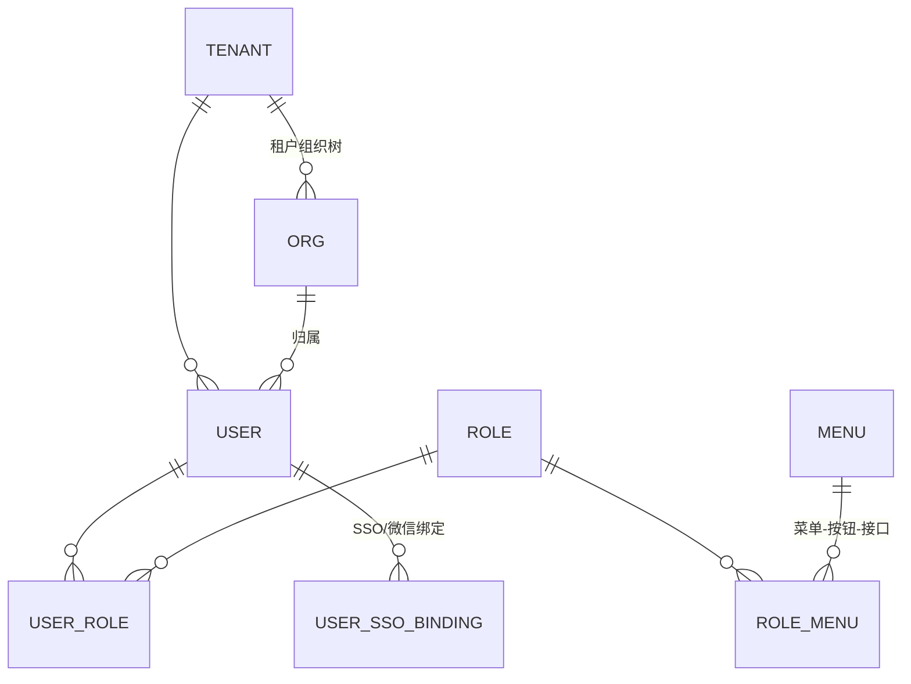

# 开发任务清单 · 分阶段实施指南（新手友好版）

**版本**：v2.0 ｜ **日期**：2026-10-06
**配套**：《01-需求文档》（做什么）、《02-技术文档》（为什么用这些技术）
**本文是什么**：把整个平台的重建工作拆成 **0~11 共 12 个阶段、约 120 个任务**。每个任务都有：做什么、**为什么这么做**、做到什么程度算完成（验收）。新手按顺序做即可，不需要再做架构决策。

---

## 使用说明（先读这 10 行）

1. **顺序即依赖**：阶段 N 依赖阶段 N-1 的产物（如阶段 5 的订单 Saga 依赖阶段 1 的 eventbus 包）。跳阶段做会返工。
2. **任务号规则**：`S<阶段>-<序号>`（S0-01 = 阶段 0 第 1 个任务）。提交信息引用任务号：`feat(identity): S3-04 用户表迁移`。
3. **每个任务的标配**：代码 + `.api`/`.proto` 契约 + 成对迁移脚本 + 单测 + 冒烟步。缺一样不算完成（见附录 B 新表 checklist）。
4. **勾选**：`[ ]` 未开始 / `[x]` 完成。完成时在任务后标注日期。
5. **冒烟纪律**：冒烟用例**严禁并发执行**（共享 FIFO 库存池会交叉消耗造成假失败）。
6. **本文约定**：所有命令默认在仓库根执行；`<svc>` 是服务名占位符；端口见 02 文档 §4.3 端口表。
7. **遇到"为什么"**：查《02-技术文档》对应章节；每个机制在本文只给一句话理由 + 指向详细章节。
8. **前端同学**：可直接跳到对应阶段的"前端任务"小节，但请先读阶段 0 的约定（S0-05 契约先行）。
9. **启动顺序总口诀**：中间件 → 迁移 → 种子 → 后端 → 前端。任何环境问题先跑 `go run ./envcheck`。
10. **卡住了**：先查附录 D 常见坑速查，再查 02 文档，还不行就带着 trace_id 问人（Jaeger :16686）。

---

## 阶段总览

| 阶段 | 名称 | 核心交付 | 依赖 |
|---|---|---|---|
| S0 | 工程准备 | 5 个仓库骨架、CI、约定 | 无 |
| S1 | 公共库 | micro-common 12 个包 | S0 |
| S2 | 环境与中间件 | 本机五件套 + compose 全家桶 + envcheck | S0 |
| S3 | 认证与后台骨架 | identity + admin-bff + Web 登录/用户管理 | S1、S2 |
| S4 | 主数据域 | party / catalog / inventory + file/audit/config/notification + Web 页面 | S3 |
| S5 | 交易域 | order + finance + contract（Saga/Outbox/支付） | S4 |
| S6 | 资产与 IoT | device + station + iotingest + EMQX 链路 | S5 |
| S7 | 运维域 | ops（告警/工单/巡检/SLA）+ Centrifugo 推送 + 场站 Web | S6 |
| S8 | 分析域 | analytics（读模型/报表/导出/对账） | S5~S7 |
| S9 | 多端 | mobile-bff + 客户端小程序 + 经销商端 + 场站小程序 + 运维 App/PC | S5~S7 |
| S10 | 增值域 | 租赁 / 订阅 / 退役回收 / 商城 / BI | S5~S9 |
| S11 | 上线准备 | 多租户复核 / 压测 / 数据迁移 / 生产部署 | 全部 |

---

# 阶段 0 · 工程准备与仓库骨架

**目标**：5 分钟 clone 完所有仓库就能开始写代码；CI 从第一天就拦住坏代码。
**为什么最先做**：仓库结构、命名、CI 门槛后补的成本是先做的 10 倍——后期改目录结构要动所有人的本地环境与全部 import 路径。

### S0-01 创建 5 个仓库并初始化骨架

按 02 文档 §3.4 的目录骨架创建：

```
micro-common / micro-server / micro-web / micro-desktop / micro-deploy
```

- [ ] GitHub 建 5 个私有仓库，按 02 §3.1 命名；默认分支 `main`，保护规则：PR 必须过 CI 才能合并
- [ ] 每仓库加 `.gitignore`（Go 仓库排除 `*.exe *_run.log`；deploy 仓库排除真实密钥）、`README.md`（一段话说清本仓职责）
- [ ] `micro-server` 根建 `go.work`（先只含 tools）；约定 Go module 命名：`micro-server/services/<svc>` 与 `micro-common`
- [ ] 开发机按 02 §3.3 约定目录 clone 全部仓库，根目录放**不入库的开发用 go.work**

**为什么分仓**：见 02 §3.2（发布节奏解耦 / 权限隔离 / 体积可控）。**如果团队 ≤4 人且你确定不会拆**，可以合并为单仓 micro（目录结构不变），本文后续所有任务照做。

### S0-02 工具链版本锁定

- [ ] Go ≥ 1.26（`go.mod` 全部 `go 1.26`）；Node ≥ 22 + pnpm ≥ 9；Docker Desktop；Windows 下 PowerShell 7
- [ ] 工具：`goctl`（go-zero 代码生成）、`golangci-lint` v2（lenient 规则集）、`oxlint`（web）、`golang-migrate` CLI（本地调试用）
- [ ] 各仓库提交 `Makefile` / `Taskfile`（最常用的 10 个命令：build/test/lint/migrate/restart）

### S0-03 统一编码与提交约定

- [ ] 提交规范：中文 conventional commits——`feat(order): S5-03 支付超时自动取消`；一个提交只做一件事
- [ ] 分支：trunk-based（main 保护 + 短命 feature 分支）；支付/库存/IoT 三个关键模块**双人熟悉制**
- [ ] PR 模板：变更范围勾选（services/common/tools/web/deploy）+ DoD 自查 6 项（编译+vet / 迁移成对+冒烟 / openapi 重生成 / 新表过 tenantaudit / dodcheck 0 FAIL / 冒烟串行）
- [ ] CODEOWNERS：common / identity / deploy 关键目录指定评审人（单人开发期写自己，团队化后改双人）

### S0-04 CI 流水线（第一天就要能跑）

- [ ] `micro-server`：GitHub Actions 五作业——①build（逐 module go build，**workspace 模式必须用 import 路径 `micro-server/...` 而非 `./...`**）②test（redis:7+mysql:8 service 容器 + MICRO_TEST_* 直连）③lint-go ④tenantaudit+openapi-check+dodcheck（此时还没有服务，先放占位通过）⑤images（仅 main：bake 构建 → GHCR → trivy）
- [ ] `micro-web`：pnpm install → oxlint → tsc --noEmit → build
- [ ] `micro-common`：test + lint，合并 main 自动打 tag（v0.1.x 起）
- [ ] 行尾统一 LF（.gitattributes）

### S0-05 契约先行约定（最重要的一条流程纪律）

**规则：改任何接口，先改契约文件（`.api` / `.proto`），评审合并后再写实现。**

- 为什么：①前后端/服务间并行开发的唯一依据；②`apitypes` 从 `.api` 生成前端 TS 类型、`openapi` 从路由生成文档，两处 CI 漂移检查都以契约为源——**契约对了一致性自动保证**；
- 落地：每个服务目录下放 `<svc>.api`（BFF/HTTP）或 `internal/proto/<svc>.proto`（RPC），与代码同仓库同 PR 提交。

### S0-06 文档骨架

- [ ] 把本套 4 份文档放入 `micro-deploy/docs/`（或独立文档仓），README 索引
- [ ] 每仓库 `docs/runbook/README.md` 占位：规定每个服务上线前必须补同名 runbook（职责依赖/健康指标/常见故障/发布回滚/紧急操作五节，见 02 §13 DoD）

---

# 阶段 1 · 公共库（micro-common）

**目标**：12 个包一次建好，全平台复用。
**为什么第二个做**：所有服务都依赖它；先建库后建服务，服务从头就有统一错误码/响应/租户/事件能力，避免每个服务各写一套再返工。**这 12 个包每一个都对应一个明确痛点**（02 §6 有完整理由），不是过度设计。

### S1-01 errcode 错误码分段注册器

- [ ] `Segment` 常量：SegIdentity=10000 … SegPlatform=110000（与 02 §6.1 一致）
- [ ] `New(seg, code, msg)` / `Error.Wrap(err)` / `FromError` / `ToGRPC`（gRPC status 无损往返）
- [ ] 单测：业务码跨 gRPC 往返不丢
- **为什么这么定义**：分段让"看码知域"（5xxxx=订单域）；gRPC 传输不丢码靠 status code 允许任意 uint32——没有这个包，跨服务错误处理只能靠字符串匹配，脆弱且不可国际化。

### S1-02 response 统一响应信封

- [ ] `Body{Code,Msg,Data}` + `Success/Fail(w, ...)`；认证码 10401~10406 映射 HTTP 401，其余业务错误 HTTP 200；兜底 110500
- **好处**：前端一套拦截器处理全部错误；"HTTP 状态=系统健康、code=业务结果"心智清晰。

### S1-03 ctxkit 上下文取值

- [ ] `WithUID/WithTenant/WithSID/WithClient/WithRoles/WithDataScope...` 与对应 `UID(ctx)` 取值函数；`TenantDefault="default"`
- **为什么**：操作人/租户这类"横切信息"放 context，全链路自动透传（BFF 注入→rpc metadata→事件恢复），避免每个函数加 3 个重复参数、漏传即越权。

### S1-04 snowflake 分布式 ID

- [ ] 41bit 时间戳（2026 纪元）+10bit worker+12bit 序列；`AllocateWorkerEtcd`（租约抢占 worker_id，退出释放）；`NewAuto`（etcd 优先→`MICRO_WORKER_ID` 环境变量）
- [ ] 单测：同 worker 内严格递增、并发生成不重复
- **为什么不用自增主键**：多服务多实例下自增会撞；UUID 无序致 InnoDB 页分裂。雪花"趋势有序 + 全局唯一 + int64 高效"。

### S1-05 crypto 安全基线

- [ ] argon2id（OWASP 参数，PHC 串格式）+ 校验函数；AES-256-GCM `EncryptString/DecryptString` + `KeyProvider` 接口（EnvKeyProvider 实现，密文头部 kid 支持轮换）；`MaskMobile/MaskBankCard`
- [ ] 单测：加解密往返、密钥轮换后旧密文可解
- **为什么**：手机号/银行账号明文入库 = 数据库一拖库就泄露；argon2 参数低于 OWASP 会被安全评审打回。

### S1-06 jwtauth + sessionx 认证双件套

- [ ] jwtauth：RS256 签发/校验，access 30min，claims 只放 `uid/sid/client/level/jti`
- [ ] sessionx：Redis DB4——`sess:{sid}` HASH（状态/端/IP/UA/level）、`uid_sessions:{uid}` ZSET、`mutex:{uid}:{client}` 同端互斥、refresh 哈希轮换+重用墓碑、`login_fail:{uid}` 锁定计数
- [ ] 单测：互斥踢旧、重用检测触发全端注销、锁定计数
- **为什么权限不进 JWT**：JWT 无状态、塞进去的角色 30 分钟内无法回收；权限缓存放 BFF（identity 变更事件失效）。

### S1-07 authz BFF 三层鉴权中间件

- [ ] `BFFAuthConfig`（免鉴权路径清单/FailClose 路径清单/RBAC 加载器）；中间件链：验签→会话→client 匹配→RBAC→auth_level→ctx 注入；rpc metadata 桥（透传 uid/roles/tenant + `tenant.SetAmbient`）
- [ ] Redis 故障 fail-open + 告警；FailClosePaths（指令/财务）一律拒绝
- [ ] 单测：免鉴权路径、端不匹配 403、fail-close 行为

### S1-08 eventbus 事件总线三件套

- [ ] `Outbox` 表模型 + `Emit(tx, event)`（业务事务内写入）；`Envelope` 信封（event_id/tenant_id/trace_id/event_type/occurred_at/payload）+ Topic 常量（下划线命名）
- [ ] `Relay`：轮询 PENDING→RocketMQ，SKIP LOCKED + 退避 1m/5m/30m
- [ ] `Subscriber`：PushConsumer 封装 + event_dedup 去重 + trace/租户恢复；`NewRocketProducer`
- [ ] 集成测试（testinfra）： Emit→Relay→消费→去重全链
- **为什么 Outbox**：直接"业务落库后再发 MQ"存在两个写操作，中间崩溃就丢事件；同事务写 outbox 让"业务成功"蕴含"事件必然存在"。这是全平台最终一致性的基石（02 §7.3）。

### S1-09 tenant 多租户插件

- [ ] GORM Callbacks：INSERT 回填 tenant_id、SELECT/UPDATE/DELETE 注入 WHERE；显式租户 fail-closed（无租户的业务查询报错）
- [ ] `Skip(ctx)` 显式豁免、`Scoped`（按服务登记需过滤的表）/`ExemptWithColumn`（豁免清单）、协程级 `SetAmbient/GetAmbient`
- [ ] `Limiter`：Redis 分钟桶 RPM（429 + X-RateLimit-* 头）
- [ ] 单测：注入/豁免/ambient 三路径
- **为什么 ORM 层强制**：靠人肉写 `where tenant_id=?` 必漏（原项目审计驱动后才补成插件）；插件+CI 审计双保险后，业务代码完全不用关心租户（02 §6.5/ADR-16）。

### S1-10 pushjwt + testinfra + 收尾

- [ ] pushjwt：HS256 手工 JWT（Centrifugo 连接令牌，零外部依赖）
- [ ] testinfra：`MICRO_TEST_*` → 本机 → testcontainers → t.Skip 三级解析（Redis/MySQL 先做，TDengine 后补）
- [ ] micro-common 打 tag v0.1.0；micro-server 各服务 go.mod 引用（开发机 go.work replace）

**阶段验收**：`go test ./...` 全绿；golangci-lint 0 告警；tag v0.1.0 发布。

---

# 阶段 2 · 开发环境与中间件

**目标**：`envcheck` 5/5 通过 + compose 全家桶起来 + 密钥就绪。
**为什么此时做**：阶段 3 起每个服务都要连中间件；环境不稳是新手最大的挫败源。

### S2-01 本机五件套（MySQL/Redis/etcd/TDengine/RocketMQ）

- [ ] Windows 直装：MySQL 8.0（3306）、Redis（6379，密码环境变量）、etcd 3.7（2379，无认证）、TDengine（6041 REST，root/taosdata，**客户端必须 Basic 认证**）、RocketMQ NameServer 9876 + broker
- [ ] 端口/账号写入 `micro-deploy/env.md`（dev 凭据，仅 dev）；`env.md.example` 入库、真实 env.md 不入库
- **为什么本机直装这五样**：原项目决策——这五件本机已有/常用且需要 Windows 原生调试，容器化的收益低于其网络映射复杂度（尤其 RocketMQ brokerIP 问题）。**新机器没有既有安装时，全部容器化也完全可以**，只是 env.md 换成容器端口映射。

### S2-02 compose 全家桶（micro-deploy/compose）

- [ ] `docker-compose.dev-extra.yml`：emqx 5.8（1883/8883/18083）、centrifugo v6（8000）、apisix 3.11（9080/9180）、prometheus（9090）、alertmanager（9500）、grafana（3000，provisioning 自动装配 RED 看板）、loki+promtail（3100，抓 `*_run.log`）、jaeger 1.57（16686/4317 OTLP）、minio+init（9000/9001，幂等建桶 micro-file/micro-contract）
- [ ] 配置子目录：`emqx/bootstrap.sh`（幂等建认证器+平台账号 iot-ingest/device-rpc）、`centrifugo/config.json`（Redis DB2 引擎、namespace、subscribe_proxy 回 BFF）、`apisix/config.yaml`（配置存 etcd prefix=/apisix）、`observability/`（prometheus rules 三级告警 + 抓取任务模板）
- [ ] RocketMQ broker.conf：`brokerIP1=<宿主机IP>`（**否则宿主机 producer 连不上**，原项目踩坑）；topic 由工具预建（S5-01）
- [ ] 验证：`docker compose -f docker-compose.dev-extra.yml up -d` 全部 healthy

### S2-03 环境自检工具 envcheck

- [ ] `micro-server/tools/envcheck`：检查 MySQL/Redis/etcd/TDengine(带 Basic 认证)/RocketMQ 五项连通，输出 x/5
- **为什么**：中间件问题占新手环境故障的 90%；一个自检工具把"服务起不来"的二分定位提前到第 0 步。

### S2-04 密钥三件套 keygen + 种子密码约定

- [ ] `tools/keygen`：生成 RS256 密钥对（JWT）、Ed25519（OTA 固件签名）、数据密钥（AES）→ 输出到 `deploy/conf/keys/`（**gitignore，永不入库**）
- [ ] 种子管理员密码统一走 `MICRO_ADMIN_PW` 环境变量（admpw 工具读取，seed 未设置时强告警）——**仓库里不出现任何真实密码**（原项目 D11 安全清理的直接产物）

### S2-05 基础工具集

- [ ] `tools/migrate`（golang-migrate 封装：`-svc <name> up|down`，自动建库）
- [ ] `tools/seed`（种子数据：初始租户 default/管理员/角色菜单，密码走 admpw）
- [ ] `tools/newsvc.sh <name> [api|rpc]`（goctl 封装脚手架，见附录 A）
- [ ] `tools/restart-svc.ps1 <svc>`（重编译+杀旧+拉起+日志重定向 `<svc>_run.log/.err.log`）
- [ ] `deploy/start_all.ps1`（按依赖顺序批量拉起全部服务，注意路径含空格要加引号——原项目 P4 教训）

**阶段验收**：envcheck 5/5；compose 全 healthy；keygen 产出三件套且 keys 目录不在 git status。

---

# 阶段 3 · 认证服务 + 管理后台骨架（identity + admin-bff + Web）

**目标**：登录/登出/刷新/踢人/step-up 全链通，管理后台能登录并管理用户/角色/组织。
**为什么先做认证**：所有接口都要过鉴权——没有它，后续每个服务都要用假中间件再拆掉；且它验证了公共库 80% 的代码（errcode/response/authz/jwtauth/sessionx/tenant 全用上）。

## S3-01 用户数据库设计（identity_db）

> 这是全项目第一个库，字段级讲解设计理由；后面的服务照此模式自己推。

### 表：user（核心表，字段逐个说理由）

| 字段 | 类型 | 说明与设计理由 |
|---|---|---|
| user_id | BIGINT PK | 雪花 ID。**不用自增**：多实例会撞、对外可被遍历 |
| org_id | BIGINT | 归属部门，逻辑外键 org.org_id（可空=未分配） |
| mobile | VARCHAR | **AES-256-GCM 加密存储**（NFR-SEC-005），拖库不泄露 |
| mobile_hash | CHAR(64) | mobile 的 HMAC-SHA256，**带唯一索引**。加密字段无法建索引，靠哈希列做唯一约束与等值查询 |
| email | VARCHAR | 同样加密 + hash 索引（如需邮箱登录） |
| password_hash | VARCHAR(255) | argon2id PHC 串（含盐含参数，迁移算法零成本） |
| types | JSON | 可登录端集合 `["ADMIN_WEB","OPS_APP"]`——**单账号多端**，不做 User/Admin 两套表 |
| status | TINYINT | 1 正常 / 2 禁用 / 3 锁定。禁用即时踢全部会话 |
| locked_until | DATETIME | 连续 5 次失败锁 30 分钟的到期时间（自动解锁，不需要人工干预） |
| party_id | BIGINT | 关联 party（客户身份绑定，S4 补充，可空） |
| tenant_id / created_at / updated_at / created_by / updated_by / deleted_at | — | 通用字段（全表强制，见 01 §7.2） |

### 其余表（同库）

| 表 | 关键字段 | 理由 |
|---|---|---|
| tenant | tenant_code(UK)/name/plan/quota(JSON) | 多租户开户与配额；default 租户种子内置 |
| org | org_id/parent_id/name/type | 公司-部门-岗位树（parent_id 空为根） |
| role | role_id/code(UK)/name/data_scope(JSON) | data_scope 存数据权限（组织/区域/场站过滤条件） |
| menu | menu_id/parent_id/perm_code(UK)/path/type | 菜单-按钮-接口四级；perm_code 是 BFF RBAC 的匹配键 |
| user_role / role_menu | 联合主键 | 经典 RBAC 多对多 |
| user_sso_binding | user_id/provider/openid(UK) | 钉钉/企微/微信绑定（一种 IdP 一行） |

### ER 图



> 会话数据（sess/mutex/refresh）**不在 MySQL**——在 Redis DB4（sessionx），关系库只存"账号是什么"，Redis 存"这次登录还行不行"。

### 迁移脚本

- [ ] `migrations/000001_init.up.sql`（全部 8 张表 + 索引：mobile_hash UK、types、org 索引）与 `.down.sql` 成对
- **为什么成对**：dodcheck 检查；回滚能力是迁移安全网（02 §4.1）

## S3-02 identity RPC 接口（proto）

> 模式：BFF 调 RPC 全部 gRPC。下表"入参/返回"只列关键字段，完整定义看 proto。

| 方法 | 入参 | 返回 | 说明 |
|---|---|---|---|
| LoginByPassword | mobile, password, client | token 对（access 30min/refresh）、uid、过期时间 | 校验锁定→argon2id→互斥踢旧→写会话→发 auth.login 审计事件 |
| LoginByWechat | code, client | 同上 + need_bind_phone 标志 | code2session；未绑定手机号返回 need_bind（客户端小程序用） |
| BindParty | uid, party_id, sso 信息 | — | 统一账号-参与方绑定 |
| Refresh | refresh_token, client | 新 token 对 | **轮换式**：旧 refresh 作废；重用→注销全部会话+告警 |
| Logout / StepUp | sid / password+sid | — / level=2（5min） | step-up 供控制指令/财务路由用 |
| ListSessions / KickSessions | uid（可按 client 过滤）/ uid+client 或 sid | 会话列表(端/IP/UA/时间/状态) / — | 会话管理页数据源 |
| ValidateSession / GetAuthCache | sid / uid | 状态/角色+数据权限 | BFF 中间件与 RBAC 缓存刷新用 |
| CreateUser/ListUser/UpdateUserStatus/ResetPassword/BindUserRole | 常规 CRUD 入参 | 分页列表等 | 用户管理 |
| Role/Org/Menu CRUD + 绑定 | 常规 | — | 权限管理 |
| CreateTenant/ListTenant/GetTenant/UpdateTenant | 常规 | — | 租户管理 |
| Impersonate | target_uid | 临时凭证（imp_by 留痕） | 模拟他人（L2） |

## S3-03 admin-bff 骨架（第一个 BFF）

- [ ] go-zero api 服务骨架 + authz 中间件接入（免鉴权：/auth/login /auth/refresh /sso/*；FailClose：预留指令/财务）
- [ ] HTTP 端点（前端唯一入口）：

| 端点 | 方法 | 入参 | 返回 | 前端行为 |
|---|---|---|---|---|
| /api/v1/auth/login | POST | mobile, password, client | {access,refresh,uid} | 存 localStorage(micro.access/refresh)，跳工作台 |
| /api/v1/auth/refresh | POST | refresh | 新 token 对 | **单飞**（并发 401 只发一次刷新，其余等待后重放） |
| /api/v1/auth/logout | POST | — | — | 清凭证回登录页 |
| /api/v1/auth/step-up | POST | password | level=2 | 敏感操作前弹密码框调用 |
| /api/v1/auth/me | GET | — | uid/mobile(脱敏)/types/roles | 顶部用户信息 |
| /api/v1/auth/menus | GET | — | 菜单树（按角色过滤） | 动态渲染侧边栏（失败回退静态声明） |
| /api/v1/users 等 CRUD | — | 分页+筛选 | 分页列表 | 用户/角色/组织/租户/会话管理页 |

- [ ] `tools/openapi` 扫描路由生成 `docs/api/admin-bff.json`（CI -check 漂移阻断从此生效）
- [ ] `tools/apitypes` 从 .api 生成 TS 类型到 micro-web shared

## S3-04 前端：登录 + 布局 + 用户管理（micro-web/apps/admin）

- [ ] `packages/shared`：request.ts（信封/Bearer/401 静默刷新/10402 互斥弹窗/10406 提级）、auth.ts、permission.ts（hasPerm）
- [ ] 登录页：手机号+密码+记住我；错误码分流提示（10400 凭证错误/10407 锁定倒计时）
- [ ] AppLayout：菜单数据驱动 + 面包屑；step-up 全局 Modal
- [ ] 页面（antd Table/Form 标准件）：
  - **用户管理**：列表列 = 用户名/手机号(脱敏展示，详情页解密)/部门/端类型标签/状态/创建时间；操作 = 编辑、禁用、重置密码、绑定角色
  - **角色管理**：角色 CRUD + 菜单权限树勾选（menu 表数据）+ data_scope 配置
  - **组织管理**：树形 CRUD
  - **会话管理**：在线会话列表（端图标/IP/最近活跃）+ 按端/按会话踢下线
  - **租户管理**：租户 CRUD + 配额设置
- [ ] 展示层通用规则：**ID 一律按字符串渲染**（雪花 int64 超 2^53，JS Number 丢精度）；列表统一 `usePaged` 分页 hook

## S3-05 服务启动与部署（identity 示范，全服务通用）

```
# 首次
cd micro-server
go run ./tools/migrate -svc identity up      # 建库+迁移
go run ./tools/seed                           # 种子：default 租户+管理员(密码读 MICRO_ADMIN_PW)
# 启动（开发）
go run ./services/identity -f services/identity/etc/identity.yaml   # RPC 8081 / metrics 9101
# 或脚本方式
./tools/restart-svc.ps1 identity              # 编译+后台拉起+日志重定向
# 验证
curl http://localhost:8889/api/v1/auth/me -H "Authorization: Bearer <token>"
# 部署（容器）
docker buildx bake --file deploy/docker-bake.hcl identity   # Dockerfile.service + sha tag → GHCR
```

- [ ] `etc/identity.yaml`：RPC 端口/etcd/Redis DSN（环境变量覆盖 `${REDIS_DSN}`）/MySQL DSN/雪花 worker 来源；**密钥与密码一律 `${ENV}` 占位，不写死**
- [ ] runbook：`docs/runbook/identity.md` 五节补全（DoD 要求）

## S3-06 hello 模板服务

- [ ] `services/hello`（GET /api/v1/ping）作为**新服务参考模板**：目录结构/配置/健康检查/指标齐全，新人抄它起服务

**阶段验收**：登录→me→menus 全通；刷新单飞与互斥踢旧手测通过（authctl CLI：登录→再登录→旧 token 10402）；openapi/apitypes 生成物入库；dodcheck 0 FAIL；Grafana 出现 identity RED 指标；Jaeger 可查登录链路。

---

# 阶段 4 · 主数据域（party / catalog / inventory + 四个基础服务）

**目标**：参与方、商品、库存可用；file/audit/config/notification 四个基础服务就绪；管理后台对应页面。
**为什么这个顺序**：订单（S5）的外键全是它们——party（谁买）、sku（买什么）、inventory（有没有货）；基础四件套被所有服务依赖。

## S4-01 party 参与方服务（party_db）

表（字段理由挑重点）：

| 表 | 关键字段与理由 |
|---|---|
| party | type **SET 语义存 JSON**（CUSTOMER/DEALER/SUPPLIER/ENTERPRISE/RECYCLER 可并存——经销商自己也会下单）；credit_code 企业必填唯一；level/tags |
| contact | party_id FK；mobile 加密；is_default；notify_pref(JSON) 通知偏好——通知渠道选择依据 |
| staff | user_id 逻辑引用 identity（**一人一账号，员工属性归 party**）；staff_type（运维/客服/场站/销售）；**skill_tags(JSON) + work_region**——工单派单的匹配依据（S7 用） |
| dealer_ext | party_id PK(1:1)；dealer_level；authorized_region（下单校验）；rebate_rule(JSON) 返利规则 |
| crm_record / opportunity | 跟进记录 / 商机（阶段、预计金额、关联客户） |

接口（proto）：CreateParty/GetParty/ListParty/UpdateParty/AddContact/ListContact/CreateStaff/ListStaff/UpsertDealerExt/GetDealerExt/CreateOpportunity/ListOpportunity/UpdateOpportunityStage。
前端页面：参与方管理（列表=编号/名称/类型标签/等级/状态；详情=基本信息+联系人+跟进记录）、商机看板（阶段列拖拽）。

## S4-02 catalog 商品服务（catalog_db）

表：product（型号/分类/品牌/上下架）、sku（**type=STANDARD/EXT_WARRANTY——延保也是 SKU，下单链路统一**）、price（**price_type=RETAIL/DEALER/TIER + tier_qty + version 版本化**——价格变更留版本，审计可回溯）、warranty_policy（按 SKU：period_months + start_rule=ACTIVATION/RECEIPT——**起算规则这里定义、contract 执行时快照**）、station_product + station_product_item（场站 BOM 模板）。
接口：CreateProduct/ListProduct/CreateSKU/ListSKU/SetPrice/ListPrice/UpsertWarrantyPolicy/CreateStationProduct/GetStationProduct。
前端：商品中心（商品/SKU/价格版本切换查看）、场站模板管理（BOM 明细表格编辑）。

## S4-03 inventory 库存服务（inventory_db）★本阶段核心

表：warehouse（中心仓/备件仓/退货仓）、inventory（warehouse_id+sku_id 唯一；**qty_available/qty_locked 四态账** + low_stock_threshold）、stock_record（**每笔变动流水：biz_type+biz_no+before/after**——审计与对账的唯一依据）、stocktake(+item)（盘点差异→审批→调整流水）。

**防超卖双保险（必须按 02 §7.2 实现）**：

```
Reserve(sku, qty, bizType, bizNo):
  1. Redis DECRBY inv:{wid}:{sku}，负值 → INCRBY 回滚 + 返回库存不足（挡并发）
  2. DB 事务：SELECT ... FOR UPDATE 行锁 → 校验 qty_available ≥ qty
     → available-=qty, locked+=qty → INSERT stock_record
  3. 幂等键 (biz_type,biz_no) 唯一约束，重复请求返回 ErrTxnReplay
  4. Redis key 不存在/故障 → 跳过步骤 1，纯 DB 路径（同样不超卖）
```

- [ ] 接口：CreateWarehouse/ListWarehouse/StockIn/Reserve/Release/DeductLocked/GetInventory/ListInventory/ListStockRecord/CreateStocktake/SubmitStocktakeCount/ApproveStocktake/SpareOut/SpareReturn
- [ ] **并发测试固化**：100 goroutine 抢 50 库存断言零超卖（这是 CI 必跑用例）
- 前端：库存中心（仓库管理/四态库存列表/出入库操作/流水查询/盘点单）；预留量在列表用不同颜色标签

## S4-04 基础四件套（file / audit / config / notification）

| 服务 | 表 | 要点 |
|---|---|---|
| file | file_meta | S3 兼容（MinIO）；oss_key 规范 `/{tenant}/{biz_type}/{yyyy}/{mm}/{uuid}.{ext}`；**下载走临时令牌**（HMAC 签名 URL，时效）；biz_type 路由双桶（contract→合同桶） |
| audit | audit_log + **cmd_audit（指令独立流）** | 追加式（应用层禁 UPDATE/DELETE）；before/after JSON 快照；trace_id；on_behalf_of 预留 |
| config | dict | type(字典/开关/灰度)+key+value+**version 可回滚**；config_changed 事件驱动各服务缓存失效 |
| notification | message/notify_template/notify_channel/outbound_log/user_notify_setting | **只消费 notification_request 事件**（业务不直连渠道）；渠道 Provider 接口（dev=log 桩）；频控/免打扰（同模板 24h 3 条）；站内信已读未读 |

- **为什么四件不合并**：接口独立、故障隔离（audit 写入高峰不影响通知）；部署上初期可同机，量大再拆。

## S4-05 阶段联调

- [ ] admin-bff 补齐四组业务端点（parties/products/inventory/files/audits/configs/messages）
- [ ] apitypes/openapi 重生成；页面六张（参与方/商机/商品/库存/消息/字典配置）接入
- [ ] 冒烟（新增 bizsmoke 前置用例）：建仓库→入库→预留→释放→流水核对

---

# 阶段 5 · 交易域（order + finance + contract：Saga 主链路）

**目标**：下单→支付→出库→合同质保 全链自动流转；Saga 补偿可用。
**为什么最难的一段放这**：主数据齐了，交易域是平台心脏；它同时验证 eventbus/延迟消息/幂等/对账四大机制。

## S5-01 RocketMQ topic 预建 + 事件契约落地

- [ ] `tools/mqinit`（或 mqadmin 脚本）预建：order_created/order_paid/order_cancelled/order_pay_timeout/stock_out/stock_low/payment_refunded/order_return_approved/warranty_started/notification_request/audit_event/config_changed
- [ ] **命名铁律**：topic 下划线、event_type 点号；消费者组名全局唯一（02 §4.2 教训清单全读一遍）

## S5-02 order 订单服务（order_db）

表：order（**type=DEVICE/STATION/PURCHASE/RETURN/LEASE**；pay_expire_at 30min；status 状态机）、order_item（sku_id+sn 明细+单价快照——**价格下单时快照**，之后改价不影响已下订单）、shipment(+trace)（物流轨迹手工/API）、return_order、**saga**（见下）。

**Saga 状态机（本阶段核心任务，按 02 §7.1 实现）**：

| 步骤 | 动作 | 服务 | 补偿 | 幂等键 |
|---|---|---|---|---|
| 1 | 创建订单 | order | 本地回滚 | order_no |
| 2 | 锁定库存 | inventory | 释放 | saga_id+lock |
| 3 | 发起支付 | finance | 退款 | saga_id+pay |
| 4 | 出库扣减 | inventory | **不可自动补偿→人工队列** | saga_id+out |
| 5 | 合同+质保 | contract | 重试至成功 | saga_id+contract |
| 6 | 建站+绑设备（场站单） | station | 重试+人工队列 | saga_id+station |

- [ ] saga 表：current_step/status(RUNNING/WAIT_EXTERNAL/COMPENSATING/DONE/FAILED)/retry_count/next_retry_at(退避 1m/5m/30m)/context_json
- [ ] 支付超时：`order_pay_timeout` 延迟消息（30min）→ 未支付则取消+释放库存
- [ ] 事件消费：payment 回调推进 PAID→STOCK_OUT；**消费协程推进 Saga 用 `context.WithoutCancel`**（教训：挂请求 ctx 请求一断推进被取消）
- [ ] 接口：CreateOrder/GetOrder/ListOrder/PayOrder/CancelOrder/GetSaga/CreateReturnOrder/ApproveReturnOrder/CreateShipment/AddShipmentTrace/ConfirmShipmentSigned/SumPaidSales
- 前端：订单列表（类型/状态标签/金额/倒计时）+ 详情（**Saga 进度条可视化**：6 步当前停在哪、失败原因、人工介入按钮）+ 退货/发运页

## S5-03 finance 财务服务（finance_db）

表：payment（**payment_no UK 幂等键 + channel_txn_id UK**；channel=WECHAT/ALIPAY/BANK_OFFLINE；status 含 **REVIEWING 双人复核中间态**）、refund、invoice（ISSUED/REVERSED 红冲）、reconcile_task（渠道 vs 系统差异）、rebate_settlement（返利，规则快照）。

- [ ] 微信支付 v3（JSAPI 下单+回调验签）；**dev 模拟网关**（mock 签名/回调，冒烟不依赖真实商户号）；支付宝 RSA2 同模式
- [ ] 对公转账：客户线下转→运营录入→**第二人复核**（ApprovePayment，职责分离：录入人≠复核人）
- [ ] 退款：ApproveReturnOrder 事件 → CreateRefund 原路退回 → payment_refunded 事件回写退货单
- [ ] 接口：CreatePayment/ConfirmPayment/ApprovePayment/SettlePayment/WechatPayURL/WechatCallback/AlipayPayURL/AlipayCallback/GetPayment/ListPayment/CreateRefund/ListRefund/IssueInvoice/ReverseInvoice/ListInvoice/CreateReconcileTask/ResolveReconcileTask
- 前端：支付单列表（渠道图标/REVIEWING 高亮待复核/双人复核操作弹窗）、退款、发票、对账任务页

## S5-04 contract 合同质保服务（contract_db）

表：contract_template（变量+body 版本化）、contract（type 含 LEASE；status 草稿→审批→签署中→生效→归档）、**contract_sign + contract_sign_evidence（存证三件套表）**、warranty（**level=STATION/DEVICE 双层 + target_type/target_id + start_rule 快照**）、warranty_extension、sla_strategy、contract_sla、claim。

**存证型电子签署（SignatureProvider 抽象，02/决策 D3）**：

- [ ] `internal/esign`：`SignatureProvider` 接口 + `InPlatformProvider`（平台内确认）实现；签署动作 = step-up 校验 → 生成合同 PDF（固化）→ SHA-256 双哈希（内容+文件）入存证表 → 签署事件留痕（谁/何时/IP/UA/版本）；e签宝实现留接口商务就绪即插
- [ ] 质保起算：消费 device_activated / shipment_signed 事件 → 按策略快照写 warranty.start_at → warranty_started 事件（notification 推凭证）
- [ ] 接口：CreateTemplate/CreateFromOrder/GetContract/ListContract/StartSign/ConfirmSign/BindStation/ListWarranty/GetWarrantyByTarget/CreateSlaStrategy/BindContractSla/CreateClaim/ApproveClaim/SettleClaim/SellExtension/TransferExtension/RefundExtension
- 前端：合同列表/详情（签署状态、存证信息展示、PDF 预览下载）、质保查询（双层树）、SLA 策略、延保销售、索赔流程页

## S5-05 对账兜底 + 冒烟

- [ ] `tools/reconcile`：库存日结（inventory 四态 vs stock_record 汇总）+ 资金日结（payment vs refund 流水）→ 差异报告
- [ ] **e2esmoke**：导入 SN→入库→下单→支付→Saga→出库 全链
- [ ] **chaosmoke**（6 用例）：幂等重放/部分锁定补偿/并发支付/无超卖——CI 可跑（串行！）

**阶段验收**：e2esmoke/chaosmoke 全绿；杀掉 contract 服务再恢复，Saga 停在步骤 5 的订单自动续推（人工介入队列验证）；对公双人复核流程手测。

---

# 阶段 6 · 资产与 IoT 域（device + station + iotingest + EMQX）

**目标**：设备上云——导入即有凭证，上报即入库，越限即告警候选，指令可下发可审计，OTA 可灰度。

## S6-01 device 设备服务（device_db）

表：device（**sn UK 全局唯一**；product_key；**device_secret 一机一密**（加密）；status=PRODUCED/IN_STOCK/OUT/ACTIVATED/RENTED/RETIRED/SCRAPPED；customer_id/order_no/activated_at）、device_lifecycle_log（**状态机流水：from/to/event/trace_id——状态只由事件驱动，禁止人工直改**）、device_topology、firmware（sha256+Ed25519 signature）、ota_task+ota_device（灰度批次/进度/回滚）、cmd（PENDING/ACKED/FAILED+retry+confirmed）。

- [ ] ImportSN：批量导入 + 唯一性校验 + **自动 ProvisionCredential**（REST 写 EMQX 内置认证库）+ 返回 secrets CSV（产线下发，仅此一次明文）
- [ ] 状态机消费事件：stock_in/stock_out → IN_STOCK/OUT；cmd_ack 回执；ota_check 定时校验
- [ ] 指令下行：SendCommand（写 cmd + cmd_audit 独立流 → MQTT down/{sn}/cmd QoS1 → 等 ACK 3s → 重试≤3 → FAILED→告警事件）；控制类 BFF 侧 step-up 强制
- [ ] OTA：SaveFirmware（验签校验：**未签名拒绝入库**）→ CreateOtaTask（batch_plan 灰度 JSON）→ 失败率超阈值自动 PAUSED → RollbackOtaTask
- [ ] 设备影子 internal/shadow：Redis 最近遥测 + Lua 时间戳比较防乱序
- 接口：ImportSN/GetDevice/ListDevice/ListByOrderNo/Transition/Activate/ProvisionCredential/GetDeviceShadow/SendCommand/ListCmd/GetDeviceTopology/SaveDeviceTopology/SaveFirmware/ListFirmware/CreateOtaTask/GetOtaTask/ListOtaTask/RollbackOtaTask
- 前端：设备列表（SN/型号/状态机标签/客户/场站）+ **设备详情页**（影子实时卡片 SOC/电压/温度、TDengine 趋势图、生命周期时间线、指令下发弹窗（step-up）、OTA 任务页）

## S6-02 station 场站服务（station_db）

表：station（station_no UK/type/经纬度/capacity/status 生命周期/order_no 来源）、station_device（**station_id+device_id 联合 PK；sn 冗余展示字段**——SN 变更不影响关系）、station_staff（驻场+排班 JSON）、station_topology（version+nodes/edges JSON 版本化）。
- [ ] CreateStation：消费/接收 Saga 步骤 6 调用 → 建站+绑清单 → station_created 事件（ops 消费建巡检计划）
- 接口：CreateStation/GetStation/ListStation/BindDevices/ListStationDevices/SaveTopology/GetTopology/GetStationMonitor/AddStationStaff/RemoveStationStaff/ListStationStaff/GetDeviceStation
- 前端：场站管理页（列表/详情/设备绑定表格/拓扑图（React Flow）/监控聚合卡片）

## S6-03 iotingest 遥测接入（独立进程，无业务库）

- [ ] `internal/forwarder`：EMQX `$share/ingest/up/+/+/+/telemetry` 共享订阅 → produce `iot_telemetry_raw`；**MQ 发送成功后才 ack MQTT**（背压核心）
- [ ] `internal/writer`：消费 → 攒批 **500 条/200ms** 写 TDengine（超级表按 product_key、SN 子表；热点五指标独立列+raw 列；同 ts 覆盖幂等）→ 影子更新 → 规则命中发 `alert_candidate`
- [ ] `internal/rules`：ops 告警规则只读缓存（30s TTL + 变更事件失效）
- [ ] `internal/ocpp`：OCPP 1.6J WebSocket CSMS（BootNotification/Heartbeat/StatusNotification/MeterValues → 五指标映射）
- [ ] `tools/devicesim`：设备模拟器（`-n 2000 -qps` 压测，secrets CSV 直用）；`tools/ocppsim` 模拟桩
- [ ] EMQX bootstrap 重跑进 runbook（容器重建即丢认证器）

**阶段验收**：iotsmoke（devicesim 上报→TDengine 可查 P95<5s→影子→越限告警候选）；otasmoke（签名/灰度/暂停/回滚）；**2000 台 72h 稳定性**（可用缩短版：2h 冒烟 + 上线前 72h 正式）；TDengine 停机重启零丢失（MQ 缓冲验证）。

---

# 阶段 7 · 运维域（ops + Centrifugo 推送 + 场站 Web）

**目标**：告警从产生到关闭全闭环；工单派单到验收全流程；巡检异常自动转工单；SLA 计时升级；实时推送到位。

## S7-01 ops 服务（ops_db）

表：alert_rule（metric/comparator/threshold/duration_seconds/level/suppress_window/scope）、alert（status OPEN/ACKED/CLOSED/ARCHIVED；**aggregate_count 聚合计数**；closed_ticket_id 关闭前置）、ticket（type 含 LEASE_RETURN；source_type/source_id 溯源；status CREATED→ASSIGNED→ACCEPTED→PROCESSING→WAIT_VERIFY→CLOSED）、ticket_log、sla_strategy、**sla_timer（strategy_snapshot 快照冻结 + pause_minutes + escalate_level）**、inspection_plan/template/task/item（**item.ticket_id 异常项直生成工单**）。

- [ ] 告警：消费 alert_candidate/cmd_failed/ota_paused/device_anomaly → 规则判定（抑制窗口/级别）→ 场站聚合 → alert_created 事件 + Centrifugo publish（`station:{sid}.alert` + `ops.all.alert`，best-effort）+ notification 持久通知
- [ ] 工单：TransferAlertToTicket（OPEN 告警隐含确认→ACKED；level 映射优先级 critical→P1）；**MatchStaff（区域+技能标签匹配）**→ DispatchTicket；接单超时 `ticket_check` 延迟消息自动升级
- [ ] SLA：ScanBreaches 定时扫描（快照计时/暂停恢复留痕/分级升级）
- [ ] 巡检：station_created 事件自动建巡检计划；cron 生成任务；提交时异常项批量生成工单
- 接口（26 个）：告警规则 CRUD / AckAlert/ListAlert/TransferAlertToTicket/CloseAlert/ArchiveAlert / 工单 12 个（Create/Get/List/MatchStaff/Dispatch/Accept/StartProcess/SubmitVerify/Verify/SyncTicketOps）/ SLA 4 个 / 巡检 8 个 / GetPushLatency

## S7-02 推送链路（Centrifugo）

- [ ] BFF `POST /api/v1/push/token` 签发连接令牌（pushjwt）；`/push/authorize` 订阅代理（**频道归属校验：station.* 查场站人员/user.* 仅本人/ops.* 查角色**；越权 403+审计）
- [ ] shared/push.ts 客户端（指数退避重连/订阅重放/心跳）
- [ ] **注意**：Centrifugo v6 namespace 分隔符是**冒号**，与事件 topic 的下划线区分开

## S7-03 场站 Web 端（apps/station）

- [ ] 登录（client=STATION_WEB）→ data_scope 锁定本场站（BFF 侧过滤）
- [ ] 5 页：工作台（状态卡+待办+告警概览）/ 监控（聚合指标+设备清单+影子）/ 运维（**告警确认→转工单一键**、工单接单处理、巡检**批量提交**）/ 我的（排班/消息/合同）/ 大屏（4K scale 等比缩放、**免登录专用设备账号**、10s 轮询）
- [ ] 告警页接 Centrifugo 实时刷新（对照 403 越权用例）

**阶段验收**：p3smoke（告警闭环/工单流程/SLA 升级/巡检转工单）；推送延迟 P95 < 100ms；越权订阅被拒并审计；杀 ops 单实例推送恢复（best-effort+持久面兜底）。

---

# 阶段 8 · 分析域（analytics）

**目标**：六大报表 + 异步导出 + 日级对账，业务库零报表负担。

- [ ] S8-01 读模型：14 类事件消费 → 六大日聚合表（report_sales/inventory/warranty/sla/finance/station_daily）；**业务键幂等 + report_watermark 水位 + 消费组版本号（改逻辑全量重建）**；handler 失败不阻塞（记日志，由对账+backfill 补）
- [ ] S8-02 指标字典 report_metric_dict（18+ 指标口径可查——"口径字典化"是报表可信的前提）
- [ ] S8-03 异步导出：report_export_requested 事件 → export_task 表（进度/文件 file_id）→ CSV/XLSX/PDF → 下载中心；**10 万行 < 5s 且在线请求零影响**（p4load 验证）
- [ ] S8-04 日级对账：recon_diff 表 + 差异站内信告警；`tools/p4backfill` 补投递修复（**禁止裸删**）
- [ ] S8-05 报表接口：六大 Report + DataFreshness + ListMetricDict；BFF 端点 + 前端报表页（日期区间/维度筛选）+ 下载中心页
- 验收：p4smoke；p4quality 差异率 0.0000%；对账能抓出"上游漏发事件"注入用例

---

# 阶段 9 · 多端（mobile-bff + 小程序 + 经销商 + 运维 App/PC）

**目标**：7 端全部可用。

## S9-01 mobile-bff（:8890）

- [ ] approutes：运维 App（login/me/我的工单/巡检/告警/推送 token/健康检查，client=OPS_APP）
- [ ] customerroutes：客户端小程序 30+ 端点（微信登录 wxLogin→code2session→自动注册→need_bind_phone；档案/联系人/设备激活/合同/质保/延保购买/工单/消息/场站/SLA/汇总）——**requireParty 中间件：一切查询按 party_id 隔离**（水平越权防线）
- [ ] mallroutes：商城（货架/下单/订单）
- [ ] dev 微信模拟：MOCKWX_* 环境变量绕过真实 code2session

## S9-02 客户端小程序（miniapp/client）

- [ ] 主包 4 页：首页（四格指标+扫码激活 Taro.scanCode）/ 登录（wx.login 静默+手机号绑定 button open-type）/ 设备列表（影子 SOC/功率卡片）/ 设备详情（实时影子+质保剩余+TDengine 趋势+场站归属）
- [ ] 分包 mall（货架/购物车 storage 本地/结算——**金额服务端重算防篡改**/wx.requestPayment JSAPI）、station（我的场站聚合）、service（质保/合同/延保购买/售后拍照 Taro.chooseImage+uploadFile/进度）、profile（消息/我的）
- [ ] 请求层：与 web shared 同设计的 Taro.request 版本（401 刷新/重登兜底 wxLogin）
- [ ] 主包 ≤2M（分包策略）；appid 占位 touristappid，资质到位替换

## S9-03 场站小程序（miniapp/station）

- [ ] 5 页：登录（密码/微信，client=STATION_MINI）/ 工作台 / 告警（确认/转工单）/ 工单（自领/处理/提交）/ 巡检（表单+**Taro.getLocation gcj02 定位**+拍照+批量提交）；走 admin-bff /station-web/* 同一套 data_scope

## S9-04 经销商端（apps/dealer）

- [ ] 7 页：登录（DEALER_WEB）/ 工作台（指标+**信用额度卡**）/ 目录（经销商价回退零售价+可售库存）/ 下单（购物车批量+现结/账期+场站单）/ 我的订单/库存/客户 / 代客服务（扫 SN 代激活/代报修/质保查询）/ 对账（续签提醒+对账单+发票+返利）

## S9-05 运维 App（Taro RN）与运维 PC（Tauri）

- [ ] App：6 页骨架（登录/工作台/告警 WS 实时/工单**离线草稿+client_action_id 恢复同步**/巡检/设置）；**依赖安装+真机联调是高风险项，先做 spike**（失败回退方案：uni-app 壳，ADR-05）
- [ ] PC（micro-desktop 仓库）：Tauri 2 壳复用 admin 前端（frontendDist 指向）；Rust 三模块——diag（serialport 串口/CAN 盒透传/btleplug BLE BMS JBD 帧，**仅本地不上云**）、flash（**XMODEM-1K 自实现状态机+断点续传位点文件+固件 sha256 本地缓存**）、transfer（CSV BOM/XLSX/zip 日志包）；capabilities 白名单（core:default/window/updater/dialog）；admin /diag 页 `window.__TAURI__.core.invoke` 调用，非 Tauri 环境占位拒绝

**阶段验收**：p5smoke（小程序基座+客户接口+微信支付模拟）；互斥矩阵全组合（同端踢旧/跨端共存）；运维 PC 在 Windows 实机构建通过（**Rust 工具链预装验证放最前**）。

---

# 阶段 10 · 增值域（租赁 / 订阅 / 退役回收 / 商城 / BI）

> 模型已 ER v2 定稿（原项目评审文档），**按定稿建表，不再发散设计**。每项独立可启动，顺序按业务优先级。

## S10-01 租赁管理（LEASE）

- [ ] contract_db：contract_lease_terms（lease_mode/起止/押金快照/买断价/逾期规则快照）+ lease_rental_plan（期数/账期/金额/status PENDING→BILLED→PAID→OVERDUE/WAIVED）
- [ ] finance_db：deposit_account（party 维度 UK/balance）+ deposit_flow（COLLECT/DEDUCT/RELEASE 三动作，**只记账，资金走收款单通道**）
- [ ] 联动：order.type=LEASE（Saga 步骤 5 建合同、**质保步骤跳过**）；device.status=RENTED（互斥校验：已售不可租/RENTED 不可二次出库）；ops.ticket.type=LEASE_RETURN（验收通过→IN_STOCK 或买断转 ACTIVATED）；ScanLeaseOverdue 定时扫逾期→罚息收款单（PENDING 人工确认）
- [ ] Web：租赁列表/详情（租约条款+租金计划表+押金流水三栏）
- 验收：LEASE 全链冒烟（p6smoke 扩展）：签署→生效→RENTED 出库→归还验收→IN_STOCK；押金三流水与收款单对账一致；租户 A 租约对 B 不可见

## S10-02 BaaS 订阅（第一段）

- [ ] subscription_db（新服务 subscription :8096）：subscription_plan/subscription_instance/billing_cycle
- [ ] 月账单 cron 生成 PENDING 收款单 → JSAPI 主动支付；退订不满月不折退；额度超量按场站充电度数（口径不准挂人工账单）
- 验收：开通→两期账单→支付→退订全链；第二段（微信代扣）资质到位再加通道，表不变

## S10-03 退役评估 + 回收（梯次利用）

- [ ] device_db：retirement_assessment（SOH/循环数/内阻/安全检测 JSON/**grade A/B/C 按定稿判定表**/disposition）+ device_soh_snapshot + recycle_order（回收商/残值/凭证 file/溯源码）
- [ ] 评级**A**（SOH≥80 且循环<1500 且一致性达标）→二次销售给新质保；**B**（70~80）→降容备电；**C**（<70 或安全不过）→报废走回收单
- [ ] 检测工单复用 ops 巡检/工单体系录入
- 验收：三评级分支各一例；A 级二次销售新质保生效；C 级回收单+溯源码留痕

## S10-04 商城（客户端小程序已建分包，此处服务端补齐）

- [ ] catalog 商城货架（上架标记）/ order 商城下单类型 / 金额服务端重算（防 localstorage 篡改）/ JSAPI 收银台
- 验收：加购→下单→支付→出库全链；改本地价格攻击无效

## S10-05 BI 自助 + 数仓

- [ ] analytics：BIQuery **白名单查询引擎**（表/字段/维度/聚合白名单，参数化防注入）+ dw_dim_date/tenant/party + dw_fact_order/payment 星型 ETL 日调度
- 验收：白名单外字段查询被拒；ETL 重跑幂等

---

# 阶段 11 · 上线准备

- [ ] S11-01 多租户复核：tenantaudit 0 FAIL；双租户数据隔离渗透用例；配额限流 429 验证
- [ ] S11-02 性能复测：p5perf（NFR-PRF 全表）；devicesim 2000 台 72h 稳定性；MQ 积压恢复演练（补投递不重复）
- [ ] S11-03 故障演练（deploy/runbook 脚本）：scenario3（station 停机→Saga 卡建站→恢复自动补齐）；scenario5a（inventory 停机→下单降级拒绝不超卖）；scenario5b（analytics 停机→积压→恢复补投递）
- [ ] S11-04 数据迁移：`tools/datamigrate`（旧系统 v3.0：设备档案+在保合同+近 2 年订单）→ **校验报告（条数+抽样字段）差异清零**；历史遥测不迁
- [ ] S11-05 生产部署：阶段一 compose（02 §12.2）→ 阶段二 K3s+ArgoCD（清单已有：deployment 模板/NetPol/app-of-apps/发布演练 5 项）
- [ ] S11-06 上线门槛清仓：种子密码轮换、密钥出库核查（CI 已挡）、GHCR PAT、备份脚本定时任务、等保测评启动（外部）、runbook 全服务补齐
- [ ] S11-07 试运行：灰度切流→双跑观察→全量

---

# 附录 A · 新建一个微服务的 checklist（照抄）

1. `./tools/newsvc.sh <name> rpc`（或 api）→ 生成 etc/internal/main 骨架
2. 端口：RPC 80xx / metrics 91xx **在 02 §4.3 表登记后使用**
3. 建库：`tools/migrate -svc <name> up`；迁移成对（up/down）
4. 新表过**附录 B** 的表 checklist
5. 契约：写 `.api` 或 proto → 评审 → 实现 → `apitypes` + `openapi` 重生成
6. 事件：eventbus.Emit（事务内）+ Topic 预建 + 消费组唯一名
7. 消费者协程用 `select {}` 挂住（**defer+return 会立即 Shutdown**——原项目 P1 教训）
8. runbook 五节补齐 → dodcheck 0 FAIL → 冒烟步加入对应 smoke 工具
9. start_all.ps1 / 端口表 / README 服务清单同步登记

# 附录 B · 新表 checklist（每张表过一遍）

- [ ] 通用字段齐全（tenant_id/created_*/updated_*/deleted_at）
- [ ] tenant：要么 Scoped 登记（自动过滤），要么 ExemptWithColumn 豁免并写理由 → tenantaudit 过
- [ ] 主键雪花 BIGINT；**对外 ID string**（proto/JSON 层）
- [ ] 唯一约束覆盖幂等键（如 biz_type+biz_no）；加密列配 hash 列索引
- [ ] 金额 DECIMAL；状态用 VARCHAR 枚举（加枚举零 DDL）
- [ ] 迁移成对；down 真能回滚
- [ ] 大字段（JSON）单独评估是否拆表；列表查询禁止 SELECT *

# 附录 C · 关键环境变量清单（dev 默认值见 deploy/env.md）

| 变量 | 用途 |
|---|---|
| MICRO_ADMIN_PW | 种子管理员密码（seed/admpw 读） |
| MICRO_WORKER_ID | 雪花 worker_id 退化来源（etcd 不可用时） |
| MICRO_TEST_MYSQL/REDIS_DSN | 单测中间件（testinfra 一级） |
| MOCKWX_* | dev 微信登录模拟 |
| JWT_KEYS_DIR / MICRO_DATA_KEY | RS256 公私钥 / AES 数据密钥目录 |
| OTA_SIGN_KEY | Ed25519 固件签名私钥（**不入库**） |
| 各服务 etc/*.yaml | 全部支持 `${ENV}` 覆盖（DSN/密钥零硬编码） |

# 附录 D · 常见坑速查（原项目真实教训，遇到先查这里）

| 症状 | 原因与解法 |
|---|---|
| go build 报找不到包 | workspace 模式要用 `micro-server/...` 而非 `./...` |
| 服务起不来 | 先 envcheck 5/5；再看 `<svc>_run.err.log`；Loki 按 trace_id 搜 |
| RocketMQ producer 发不出 | broker.conf `brokerIP1` 未设宿主机 IP；topic 未预建 |
| 消费者互相"消失" | 消费者实例名（clientID）重复，必须全局唯一 |
| 消费协程启动即退出 | 用 `select {}` 挂住，defer Shutdown 模式错 |
| EMQX 重启后设备全连不上 | 认证器随容器丢失，重跑 `emqx/bootstrap.sh` |
| TDengine 查询"空结果" | REST 必须带 Basic 认证，401 会被误读为无数据 |
| 冒烟大量假失败 | 冒烟并发了（共享 FIFO 库存池），串行重跑 |
| Centrifugo 订阅 403 但配置"没错" | v6 namespace 分隔符是冒号不是点号；先看 /push/authorize 日志 |
| Saga 卡住不推进 | 消费协程挂了 HTTP 请求 ctx；换 context.WithoutCancel |
| Windows 路径脚本失效 | 路径含空格，PowerShell 引号补全 |
| 服务重启后推送/Redis 行为异常 | 独立容器（redis/tdengine/rocketmq）不自启，执行灾后恢复三件套（02 §11.4） |

---

**文档结束**

> 维护约定：完成任务勾选并标日期；新任务插入对应阶段并编续号；跨阶段的机制改动先回 02 文档补 ADR。
