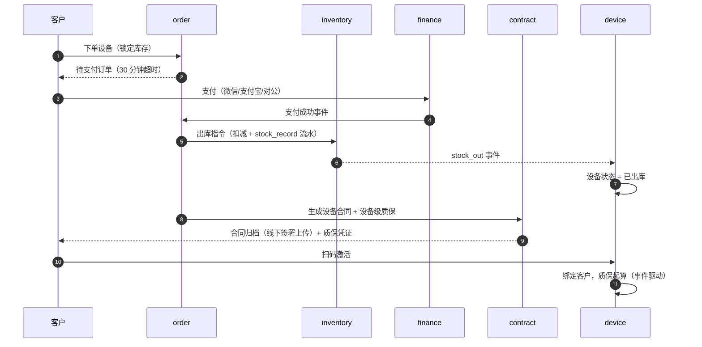
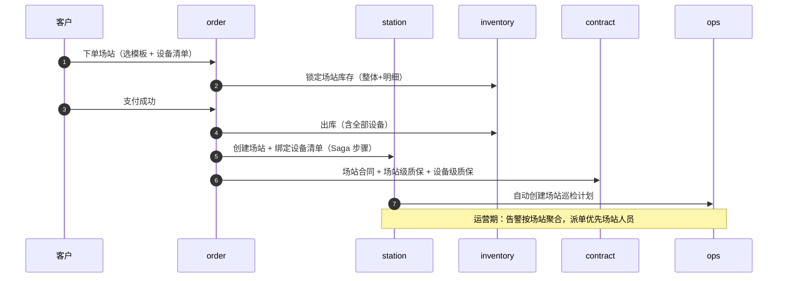
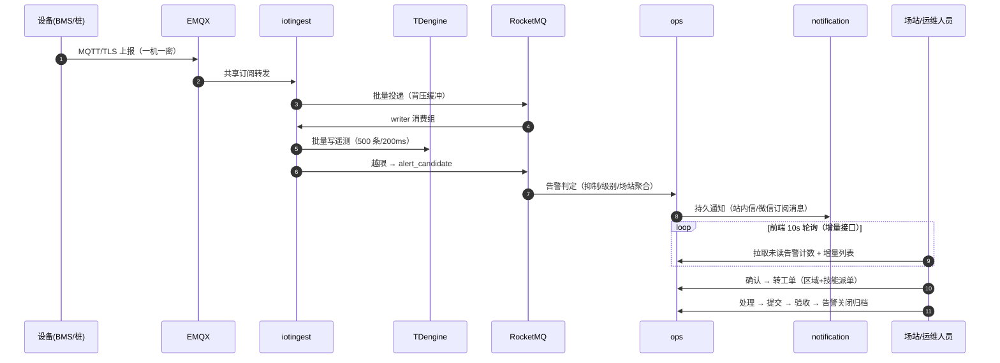

# 电池全生命周期管理平台 · 需求规格说明书

**版本**：v2.0
**日期**：2026-10-06
**文档性质**：纯需求文档（WHAT），**不含任何排期与里程碑**。
**相对 v1 的关键变化**：删除租赁/融资租赁/BaaS 订阅/商城/押金（业务确认不存在）；电子签署改为"线下签署+上传归档"基线；实时性改为统一轮询；配置中心改为 Nacos；删除旧数据迁移与预测性维护。逐条变更见本目录 [README.md](README.md) 决策总表。

---

## 目录

1. [文档说明与需求编号规则](#1-文档说明与需求编号规则)
2. [项目定位与业务模式](#2-项目定位与业务模式)
3. [用户角色与权限矩阵](#3-用户角色与权限矩阵)
4. [总体业务流程](#4-总体业务流程)
5. [功能需求（FR）](#5-功能需求fr)
6. [非功能需求（NFR）](#6-非功能需求nfr)
7. [数据与事件需求概述](#7-数据与事件需求概述)
8. [多端功能需求](#8-多端功能需求)
9. [验收标准](#9-验收标准)
10. [范围外与后续方向](#10-范围外与后续方向)

---

## 1. 文档说明与需求编号规则

### 1.1 交付层级（代替排期）

| 层级 | 含义 | 判断标准 |
|---|---|---|
| **L1 基线** | 平台最小可用闭环，缺一则主链路不通 | 卖→交付→激活→监控→运维 这条链上的所有需求 |
| **L2 增强** | 完整商业体验，基线跑通后应尽快补齐 | 多渠道支付、报表、多端覆盖、经销商体系等 |
| **L3 扩展** | 增值业务，按业务节奏独立启用 | 梯次利用/回收、BI、返利、在线电子签、保司 API 等 |

### 1.2 编号规则

- 功能需求：`FR-<域代码>-<序号>`；非功能需求：`NFR-<类代码>-<序号>`。
- "验收要点"列为测试/验收硬性判据。

---

## 2. 项目定位与业务模式

### 2.1 业务定位

以电池设备为核心资产的**全生命周期管理平台**，覆盖"卖电池 → 装电池 → 修电池 → 再利用"全链路。**两种售卖模式 + 一组增值服务**共用一套系统：

| 模式 | 内容 | 关键差异 |
|---|---|---|
| **A · 售卖场站** | 储能电站/充电站/换电站等"多设备组合"销售 | 场站级合同 + 场站级质保 + 告警聚合 + 驻场人员；下单后自动建站 |
| **B · 售卖设备** | 单台电池包/充电桩销售 | 设备级质保；扫码激活绑定客户 |

**增值服务**（类比"买手机延保"）：

| 服务 | 层级 | 说明 |
|---|---|---|
| 维保/售后 | L1 | 质保期内外售后受理、工单、巡检（运维域承载） |
| 延保 | L2 | 延保产品销售、衔接、转移、退款 |
| 经销商返利 | L3 | 规则快照、月度结算、对账 |
| 梯次利用/回收 | L3 | 退役评估 A/B/C 评级 → 二次销售/降容备电/报废回收 |
| BI 自助分析 | L3 | 白名单查询引擎 + 数仓 |

> 明确**不存在**的业务（v2 定稿）：设备租赁（以租代售）、融资租赁、BaaS 订阅、自营商城、押金托管。若未来业务变化，按新需求评审新增，不复用旧模型。

核心价值链：**商品 → 订单 → 库存 → 合同/质保 → 设备激活 → 监控告警 → 工单运维 → 分析报表**。

### 2.2 范围内（In Scope）

- **商业域**：商品、价格、库存、订单、物流、财务（支付/退款/发票/对账/返利）
- **合同质保域**：合同（线下签署+上传归档）、质保、延保、SLA、索赔
- **资产域**：设备主数据、激活、生命周期（含退役）、IoT 遥测、指令下行、OTA、场站
- **运维域**：告警、工单、巡检、SLA 计时
- **分析域**：六大报表、指标字典、异步导出、业务对账（BI 为 L3）
- **增值域**：延保、返利、梯次利用/回收（L3）
- **平台能力**：身份认证、RBAC、多租户、消息通知、文件、审计、配置中心（Nacos）、可观测性
- **多端**：Web 管理后台、经销商 Web、场站 Web+大屏、客户端小程序、场站小程序、运维 App、运维 PC

### 2.3 范围外（Out of Scope）

- 设备租赁 / 融资租赁 / BaaS 订阅 / 自营商城 / 押金（业务确认不存在）
- 在线电子签署（客户在端内完成签署动作）——基线为线下签署+上传归档，客户明确要求时再启（L3）
- 保司 API 对接——基线为保单登记，单量值得接时再启（L3）
- 预测性维护、AI 客服、智能定价
- 开放平台、V2G、碳足迹、跨境多币种、电池数字护照
- 电网侧调度对接（并网状态仅作字段记录）
- 多租户对外 SaaS 运营（隔离已启用，自助开通/计费不做）

---

## 3. 用户角色与权限矩阵

### 3.1 角色清单

| 角色 | 使用端 | 数据范围 | 核心操作 |
|---|---|---|---|
| 平台管理员 | Web 后台 | 全租户 | 用户/角色/组织/租户管理、系统配置、审计查询、模拟他人排障 |
| 平台运营 | Web 后台 | 全部业务数据 | 商品、订单审核、库存、场站、监控大屏、商机跟进 |
| 财务人员 | Web 后台 | 财务域 | 收款确认（对公双人复核）、退款、发票、对账、返利结算 |
| 客服 | Web 后台 | 服务域 | 售后受理、工单协助、客户查询 |
| 场站人员 | 场站 Web + 场站小程序 | 本场站（data_scope 锁定） | 场站监控、告警确认/转工单、工单自领、巡检 |
| 运维工程师 | 运维 App + 运维 PC | 派单区域 | 接单、处理、巡检、扫码查质保、本地诊断、固件烧录 |
| 经销商 | 经销商 Web | 本经销商 | 下单（账期/现结）、我的库存、代客激活/报修、对账、返利查看 |
| 客户（企业/个人） | 客户端小程序 | 本客户 | 设备激活、监控、质保查询、报修、合同查看、延保购买 |
| 回收商 | Web 后台（委托登记） | 本回收商相关 | 回收单确认、交接凭证（L3） |
| 设备（系统身份） | IoT 接入层 | 本设备 | 遥测上报、指令 ACK、OTA 进度上报 |

### 3.2 权限模型

- **RBAC 四级**：角色 → 菜单 → 按钮 → 接口。未授权接口返回 403 并记审计。
- **数据权限**：按组织/区域/场站过滤数据集（`data_scope`）。
- **敏感操作二级认证（step-up，5 分钟时效）**：控制类指令（充放电/均衡/保护参数）、退款审核、合同归档确认等 + 全量审计。
- **模拟他人（impersonate）**：管理员代客户身份排障，`imp_by` 全程留痕、被模拟方无感知（L2）。

---

## 4. 总体业务流程

### 4.1 设备售卖闭环（模式 B）

### 4.2 场站售卖闭环（模式 A）

### 4.3 告警链路（IoT → 运维闭环，统一轮询版）

> v2 变更：不再引入 WebSocket 推送组件。页面实时性 = **10s 轮询轻量增量接口**（未读计数 + since_id 增量列表）+ 操作后立即刷新；异步触达 = 微信订阅消息/短信/站内信。告警从生成到"打开页面即可见"≤ 10s（NFR-PRF-003）。

---

## 5. 功能需求（FR）

### 5.1 身份与权限（identity，FR-IDN）

| 编号 | 需求 | 层级 | 验收要点 |
|---|---|---|---|
| FR-IDN-001 | 账号管理：手机号/邮箱 + 密码登录，启用/禁用/锁定状态 | L1 | 连续 5 次失败锁定 30 分钟；密码 argon2id 存储；手机号加密存储 + 哈希列保唯一 |
| FR-IDN-002 | RBAC：角色-菜单-按钮-接口四级权限 | L1 | 未授权接口 403 并记审计；菜单数据驱动下发 |
| FR-IDN-003 | 数据权限：按组织/区域/场站过滤数据集 | L1 | 同角色不同 data_scope 的用户列表结果不同 |
| FR-IDN-004 | 会话管理：双 Token（access 30min / refresh 轮换）、同端互斥踢旧、强制下线 | L1 | refresh 轮换 + 重用检测（重用即注销全部会话并告警）；注销/踢人即时生效 |
| FR-IDN-005 | 组织架构：公司-部门-岗位层级，岗位关联角色模板 | L1 | — |
| FR-IDN-006 | 微信登录：code2session + 自动注册 + 手机号绑定（客户端小程序主登录方式） | L1 | 静默续期（checkSession）；首登绑定手机号 |
| FR-IDN-007 | 企业 SSO / OAuth2（钉钉/企微） | L2 | 绑定/解绑/回调换会话 |
| FR-IDN-008 | 多租户：租户开通/套餐/配额（RPM 限流）/租户级隔离 | L1 | 所有业务表带 tenant_id 并强制过滤；平台共享表走豁免清单 |
| FR-IDN-009 | 二级认证（step-up）：敏感操作前密码提级，5 分钟时效 | L1 | 未提级访问敏感路由返回专用错误码触发前端提级弹窗 |
| FR-IDN-010 | 模拟他人（客服/管理员排障） | L2 | imp_by 审计留痕；被模拟方无感知 |

### 5.2 参与方（party，FR-PTY）

| 编号 | 需求 | 层级 | 验收要点 |
|---|---|---|---|
| FR-PTY-001 | 统一参与方模型：type = CUSTOMER / DEALER / SUPPLIER / ENTERPRISE / RECYCLER，可并存 | L1 | 订单/合同不感知类型分支；经销商可转客户 |
| FR-PTY-002 | 客户：企业/个人、等级、标签 | L1 | 企业客户需统一社会信用代码 |
| FR-PTY-003 | 经销商：等级、授权区域、信用额度/账期 | L2 | 下单校验授权区域；超额下单拦截 |
| FR-PTY-004 | 供应商：档案、评级、账期 | L2 | — |
| FR-PTY-005 | 人员：场站/运维/客服/销售，技能标签 + 派单区域 | L1 | 技能标签参与派单匹配（FR-OPS-004） |
| FR-PTY-006 | 联系人：多联系人、默认联系人、通知偏好 | L1 | — |
| FR-PTY-007 | CRM 跟进记录 | L2 | — |
| FR-PTY-008 | 商机管理：创建/阶段推进/关联客户 | L2 | — |
| FR-PTY-009 | 统一账号绑定：party_id 与 user 绑定，全链透传 | L1 | BFF 侧按 party 隔离数据（requireParty） |

### 5.3 商品与价格（catalog，FR-CTL）

| 编号 | 需求 | 层级 | 验收要点 |
|---|---|---|---|
| FR-CTL-001 | 商品：型号/分类/品牌/上下架 | L1 | — |
| FR-CTL-002 | SKU：规格参数、图文；类型 STANDARD / EXT_WARRANTY（延保也是 SKU） | L1 | — |
| FR-CTL-003 | 场站产品模板：预设设备组合（BOM）、容量档位、基准价 | L1 | 按模板下单自动展开设备清单，可增删调整后重新报价 |
| FR-CTL-004 | 价格体系：零售价/经销商价/阶梯价，版本化留痕 | L1 | 价格变更有版本记录；经销商端展示经销商价（缺省回退零售价） |
| FR-CTL-005 | 质保策略按 SKU 配置：质保期、起算规则（激活日/签收日） | L1 | 起算规则由合同域执行时快照 |
| FR-CTL-006 | 延保产品：时长、价格、适用设备范围 | L2 | 与 EXT_WARRANTY SKU 对应 |

### 5.4 库存（inventory，FR-INV）

| 编号 | 需求 | 层级 | 验收要点 |
|---|---|---|---|
| FR-INV-001 | 仓库/库位/负责人 | L1 | — |
| FR-INV-002 | 库存账：可用/锁定/在途/残次四态 | L1 | 每笔变动生成 stock_record 流水（biz_type + biz_no 溯源） |
| FR-INV-003 | 入库：采购/退货/调拨 | L1 | 采购入库联动采购单收货 |
| FR-INV-004 | **所有出库统一由 inventory 执行**（唯一写入方） | L1 | order 只发出库指令；扣减与流水只产生于 inventory |
| FR-INV-005 | 场站库存：整体 + 设备明细双视图 | L1 | 明细与设备档案一致 |
| FR-INV-006 | 调拨：跨仓、在途跟踪 | L2 | — |
| FR-INV-007 | 盘点：盘点计划、差异处理 | L2 | 差异生成审批流，账面调整有流水 |
| FR-INV-008 | 备件库存：stock_type = SPARE，领用/退库 | L2 | 领用必须关联工单号 |
| FR-INV-009 | 库存下限预警 | L2 | 低于阈值触发通知 |
| FR-INV-010 | **防超卖：Redis 原子预扣 + DB 行锁双保险** | L1 | 100 并发抢 50 库存零超卖（并发测试固化）；支付超时自动释放 |

### 5.5 订单（order，FR-ORD）

| 编号 | 需求 | 层级 | 验收要点 |
|---|---|---|---|
| FR-ORD-001 | 销售订单：下单/审核/改价/取消 | L1 | 取消触发库存释放（Saga 补偿）；下单 P95 < 500ms |
| FR-ORD-002 | 场站订单：模板 + 设备清单 + 整体报价 | L1 | 清单调整后价格重算；支付后触发建站 |
| FR-ORD-003 | 采购订单：下单/审核/收货 | L2 | 收货联动采购入库 |
| FR-ORD-004 | 退货单：申请/审核/退货入库/退款联动 | L2 | 质保期内退货校验；退款事件回写退货单状态 |
| FR-ORD-005 | 发货单与物流轨迹 | L2 | 轨迹手工录入基线（第三方 API 为 L3 可选）；签收事件驱动质保起算（按策略） |
| FR-ORD-006 | **Saga 编排**：下单→锁库存→支付→出库→合同→建站，失败按补偿表回退 | L1 | 每步幂等（saga_id+step）；支付超时 30 分钟延迟消息自动取消；不可自动补偿步骤进人工介入队列 |

### 5.6 财务（finance，FR-FIN）

| 编号 | 需求 | 层级 | 验收要点 |
|---|---|---|---|
| FR-FIN-001 | 收款三渠道：微信支付 v3 / 支付宝（RSA2）/ 对公转账 | L1 | 对公人工确认 + **双人复核**（REVIEWING 中间态 + 职责分离）；渠道回调验签 |
| FR-FIN-002 | 退款：申请/审核/原路退回 | L1 | 退款幂等（payment_no）；退货审批通过自动触发 |
| FR-FIN-003 | 渠道对账：渠道账单 vs 系统流水，差异生成处理任务 | L2 | 差异自动标记；修复只允许补投递重放 |
| FR-FIN-004 | 电子发票：开具/红冲/抬头管理 | L2 | 对接税控服务商（生产）；dev 用模拟网关 |
| FR-FIN-005 | 对账单：客户/经销商周期账单 | L2 | — |
| FR-FIN-006 | 经销商返利结算：规则快照、月度结算、对账 | L3 | 结算金额可追溯至规则快照 |
| FR-FIN-007 | 账期与信用额度 | L2 | 超额下单拦截 |

### 5.7 合同/质保/SLA（contract，FR-CTR）

| 编号 | 需求 | 层级 | 验收要点 |
|---|---|---|---|
| FR-CTR-001 | 合同模板：变量、版本管理（生成本地打印稿的辅助能力） | L2 | 变量从订单/客户数据自动填充 |
| FR-CTR-002 | 合同全生命周期：创建/审批/归档；类型 SALES/STATION/SERVICE/FRAMEWORK/EXTENDED | L1 | 与订单/客户/场站关联可追溯 |
| FR-CTR-003 | **合同签署（基线=线下签署+上传归档）**：内部人员上传已签合同文件，平台不解析内容 | L1 | 归档五要素：上传人（审计）/版本/关联（订单/客户/场站）/状态（生效/归档）/受控下载；PDF 存合同桶 |
| FR-CTR-004 | 在线电子签署（第三方 CA） | L3 | 触发条件：客户明确要求在线签；对接时只新增签署流程，归档模型不变 |
| FR-CTR-005 | 质保：场站级 + 设备级双层，按策略起算 | L1 | 激活/签收事件驱动起算，写入设备档案 |
| FR-CTR-006 | 延保：销售/衔接/转移/退款 | L2 | 延保期内无缝衔接原质保 |
| FR-CTR-007 | SLA 策略定义：响应/解决时限分级 | L1 | 策略在合同域定义，计时由 ops 执行（快照冻结） |
| FR-CTR-008 | 索赔：申请/审核/结算 | L2 | 结算联动 finance；质保外索赔转付费报价 |

### 5.8 IoT 接入（FR-IOT）

| 编号 | 需求 | 层级 | 验收要点 |
|---|---|---|---|
| FR-IOT-001 | MQTT 接入：EMQX，TLS 1.2+（8883 唯一生产端口），明文 1883 仅 dev | L1 | 生产环境明文端口禁用 |
| FR-IOT-002 | 设备认证：一机一密（username=SN + 32 字节 DeviceSecret，产线下发） | L1 | 错误凭证拒绝并记安全日志；凭证可补发 |
| FR-IOT-003 | 遥测管道：EMQX 共享订阅 → RocketMQ 缓冲 → 批量写 TDengine（500 条/200ms） | L1 | 上报到可查询 P95 < 5s；同 ts 覆盖 = 重传天然幂等 |
| FR-IOT-004 | 削峰与背压：MQ 作缓冲，MQ ack 后才 ack MQTT | L1 | 5 倍峰值压测不丢数据；业务 RPC 不直接承受遥测流量 |
| FR-IOT-005 | 设备影子：Redis 最近状态缓存（Lua 时间戳比较防乱序），弱网可查 | L1 | 影子与最近遥测时间戳一并返回 |
| FR-IOT-006 | 指令下行：下发 → ACK（3s）→ 超时重试（≤3）→ 失败告警；控制类指令二次确认 + 100% 独立审计 | L1 | 指令往返 < 3s；审计含操作人/时间/参数/结果 |
| FR-IOT-007 | OTA：固件包管理、Ed25519 签名、灰度分批、断点续传、失败率超阈值自动暂停、失败回滚 | L1 | 未签名固件无法下发；灰度批次可暂停 |
| FR-IOT-008 | OCPP 1.6J 充电桩网关：核心四类消息接入既有遥测告警链 | L2 | **验收口径=协议标准+模拟桩全链验证**；真实桩型随采购逐型号补兼容（不设门槛） |
| FR-IOT-009 | 告警规则缓存：接入层本地缓存规则（30s TTL + Nacos 配置变更失效），越限发 alert_candidate，**业务判定归 ops** | L1 | 规则变更 30s 内生效 |

### 5.9 设备（device，FR-DEV）

| 编号 | 需求 | 层级 | 验收要点 |
|---|---|---|---|
| FR-DEV-001 | 设备主数据：SN 全局唯一、型号/批次/归属、批量导入 | L1 | SN 重复导入被拒绝；导入即自动写入 EMQX 凭证 |
| FR-DEV-002 | 激活：扫码激活、绑定客户、归属转移 | L1 | 激活触发质保起算事件 |
| FR-DEV-003 | 生命周期状态机：PRODUCED→IN_STOCK→OUT→ACTIVATED→RETIRED→SCRAPPED | L1 | 状态只由事件驱动（stock_out/device_activated 等），禁止人工直改 |
| FR-DEV-004 | 设备拓扑：电芯→模组→电池包→充电桩 | L2 | MySQL + 本地缓存 |
| FR-DEV-005 | SOC/SOH 计算与异常检测 | L2 | 计算结果写回遥测库；SOH 快照表为退役评估数据源 |
| FR-DEV-006 | 设备档案查询：按 SN/客户/场站/状态/订单号 | L1 | 详情含影子、遥测趋势、质保、生命周期流水 |
| FR-DEV-007 | 退役评估：评估单（SOH/循环数/内阻/安全检测）→ A/B/C 评级 | L3 | A（SOH≥80 且循环<1500 且一致性达标）→二次销售给新质保；B（70~80）→降容备电不给销售质保；C（<70 或安全不过）→报废回收 |
| FR-DEV-008 | 回收管理：回收单（残值评估/回收商/交接凭证/监管溯源码） | L3 | 评级 C 自动关联回收单；资质文件归档 file 域 |

### 5.10 场站（station，FR-STN）

| 编号 | 需求 | 层级 | 验收要点 |
|---|---|---|---|
| FR-STN-001 | 场站主数据：类型/地址/经纬度/容量/并网状态（仅记录）/生命周期 | L1 | — |
| FR-STN-002 | 场站-设备关系：device_id 外键 + SN 冗余展示 | L1 | SN 变更不影响关系记录 |
| FR-STN-003 | 场站订单支付后自动建站并绑定设备清单（Saga 步骤） | L1 | 建站失败进入重试 + 人工介入队列，无残留中间态 |
| FR-STN-004 | 场站拓扑：设备连接关系可视化、版本化 | L2 | — |
| FR-STN-005 | 场站聚合监控：功率/SOC 均值/告警数等，可下钻到设备 | L1 | — |
| FR-STN-006 | 场站人员：驻场、排班、权限（data_scope 锁定本场站） | L2 | — |
| FR-STN-007 | 场站大屏：4K 等比缩放、免登录专用设备账号、10s 轮询 | L2 | 大屏账号不占人工席位 |

### 5.11 运维（ops，FR-OPS）

| 编号 | 需求 | 层级 | 验收要点 |
|---|---|---|---|
| FR-OPS-001 | 告警规则：指标/比较器/阈值/持续时间/级别/抑制窗口/作用域 | L1 | 同源告警在抑制窗口内不重复生成 |
| FR-OPS-002 | 告警生成与场站级聚合 | L1 | 聚合窗口内同站多设备告警合并，可展开明细 |
| FR-OPS-003 | 告警闭环：OPEN→确认→转工单→关闭→归档 | L1 | 关闭前必须关联已验收工单或人工备注原因 |
| FR-OPS-004 | 工单全流程：创建/派单（区域 + 技能匹配）/接单/处理/验收/关闭 | L1 | 超时无人接单自动升级（延迟消息驱动） |
| FR-OPS-005 | 工单类型：ALERT/AFTER_SALE/INSPECTION/INSTALL/STATION | L1 | — |
| FR-OPS-006 | SLA 计时：策略快照冻结、暂停/恢复留原因、超时分级升级 | L1 | — |
| FR-OPS-007 | 巡检：计划（cron）/任务/模板（表单 schema）/明细项/拍照定位 | L1 | 巡检异常项自动生成工单；场站小程序批量提交 |
| FR-OPS-008 | 离线工单：无网处理、恢复后同步 | L2 | client_action_id 幂等；冲突以服务端为准 |
| FR-OPS-009 | 系统告警：指令失败/OTA 暂停/设备失联等平台事件也生成告警 | L1 | 与遥测越限告警同链路闭环 |
| FR-OPS-010 | **告警/工单轮询接口（轻量增量）**：未读计数 + since_id 增量列表 | L1 | 10s 轮询单请求数据量 < 5KB；多端并发轮询 P95 < 100ms |

### 5.12 消息通知（notification，FR-NTF）

| 编号 | 需求 | 层级 | 验收要点 |
|---|---|---|---|
| FR-NTF-001 | 统一消息：业务服务只发 notification_request 事件，不直连渠道 | L1 | 站内信 L1；短信/邮件渠道 Provider 化（dev 用 log 桩） |
| FR-NTF-002 | 模板与渠道配置、频控与免打扰 | L2 | 同一用户同模板 24h 内限 3 条（可配） |
| FR-NTF-003 | **微信订阅消息**（小程序异步触达：告警/工单/账单提醒） | L2 | 用户订阅授权后可推送至微信服务通知；模板申请为前置（用户侧动作） |
| FR-NTF-004 | 消息中心：已读/未读、历史查询、用户通知偏好设置 | L1 | — |

> v2 变更：原 FR-NTF-003 WebSocket 推送组件（Centrifugo）**删除**，实时性由 FR-OPS-010 轮询接口 + 本节订阅消息承担；WebSocket 重评估条件见 02 文档 ADR-02。

### 5.13 分析报表（analytics，FR-ANA）

| 编号 | 需求 | 层级 | 验收要点 |
|---|---|---|---|
| FR-ANA-001 | 事件驱动读模型：订阅各域事件构建日聚合表，业务键幂等，消费组版本号支持全量重建 | L1 | 上游不发事件的缺陷能被对账暴露 |
| FR-ANA-002 | 六大报表：销售/库存/质保/SLA/财务/场站 | L1 | 口径字典化（18+ 指标定义可查） |
| FR-ANA-003 | 异步导出：CSV/XLSX/PDF，下载中心 | L1 | 10 万行导出 < 5s 且对在线请求零影响 |
| FR-ANA-004 | 日级对账：读模型 vs 业务库，差异登记 + 站内信告警 | L1 | 差异率目标 0；修复走补投递重放 |
| FR-ANA-005 | BI 自助查询：白名单参数查询引擎（防注入）、看板 | L3 | 仅白名单表/字段/维度 |
| FR-ANA-006 | 数仓 ETL：星型模型日调度 | L3 | 重跑幂等 |

### 5.14 平台管理（FR-SYS）

| 编号 | 需求 | 层级 | 验收要点 |
|---|---|---|---|
| FR-SYS-001 | 审计日志：操作审计 + 登录审计 + **控制指令独立审计流** | L1 | 追加式存储（禁 UPDATE/DELETE），保留 ≥ 3 年；含 before/after 快照与 trace_id |
| FR-SYS-002 | 文件服务：S3 兼容（MinIO 起步）、命名空间规范、临时下载令牌、双桶 | L1 | 合同/保单/凭证文件归档受控下载 |
| FR-SYS-003 | **配置中心 = Nacos**：字典/开关/灰度统一托管，多语言 SDK，版本历史/回滚，变更秒级推送 | L1 | 各服务通过 Nacos listener 感知变更（无需事件总线）；管理台操作留痕 |
| FR-SYS-004 | 可观测性基线：指标/链路/日志三件套 + 三级告警 | L1 | 新服务上线 DoD：指标注册 + 链路接入 + 健康检查 + runbook，不满足不上线 |

### 5.15 多租户（FR-TEN，L1 已启用）

| 编号 | 需求 | 层级 | 验收要点 |
|---|---|---|---|
| FR-TEN-001 | 全业务表 tenant_id + ORM 层强制过滤（显式租户自动注入，缺省拒绝） | L1 | 漏登记/漏过滤 CI 直接阻断（tenantaudit 门槛） |
| FR-TEN-002 | 平台共享表豁免清单 | L1 | 清单驱动，豁免需登记理由 |
| FR-TEN-003 | 租户配额：RPM 分钟桶限流（429 + RateLimit 头） | L1 | default 租户不限；quota=0 不限 |
| FR-TEN-004 | 事件消费侧租户恢复（事件信封携带 tenant_id） | L1 | 后台作业用 tenant.Skip 显式豁免 |

---

## 6. 非功能需求（NFR）

### 6.1 容量基线（NFR-CAP，已定稿）

| 指标 | v1 目标（上线时） | 3 年目标 |
|---|---|---|
| 在线设备数 | 2,000 | 20,000 |
| 场站数 | 200 | 2,000 |
| 遥测频率 | 1 条/设备/10s（部分机型 1s） | 同左 |
| 遥测消息峰值 | 200 条/s | 2,000 条/s |
| 日遥测量 | ≈1,700 万条 | ≈1.7 亿条 |
| 告警峰值（聚合后） | 50 条/s | 500 条/s |
| 管理后台并发用户 | 100 | 500 |
| C 端并发用户 | 5,000 | 50,000 |

### 6.2 性能（NFR-PRF）

| 编号 | 指标 | 目标 |
|---|---|---|
| NFR-PRF-001 | 列表/详情查询接口 | P95 < 1s |
| NFR-PRF-002 | 遥测端到端（上报 → 可查询） | P95 < 5s |
| NFR-PRF-003 | 告警可见性（生成 → 轮询接口可拉到） | ≤ 10s（配合 10s 轮询，最坏 20s 内用户可见） |
| NFR-PRF-004 | 控制指令往返（下发 → ACK） | < 3s |
| NFR-PRF-005 | 下单接口 | P95 < 500ms |
| NFR-PRF-006 | 轮询增量接口（未读计数 + since_id） | P95 < 100ms，单响应 < 5KB |

### 6.3 可用性（NFR-AVL）

| 编号 | 指标 | 目标 |
|---|---|---|
| NFR-AVL-001 | 交易链路（下单/支付/出库） | 99.9%（月停机 < 43 分钟） |
| NFR-AVL-002 | 监控链路（遥测/告警） | 99.5% |
| NFR-AVL-003 | 数据恢复目标 | RPO < 5 分钟（MySQL binlog），RTO < 30 分钟 |
| NFR-AVL-004 | 单服务实例故障 | 核心交易不受影响（多实例 + 熔断降级） |
| NFR-AVL-005 | 认证中间件降级 | Redis 故障时普通路由 fail-open（暴露窗口 ≤ 30min）+ 告警；控制指令/财务路由 fail-close |

### 6.4 安全（NFR-SEC）

| 编号 | 需求 | 层级 | 验收要点 |
|---|---|---|---|
| NFR-SEC-001 | 设备一机一密，杜绝伪冒接入 | L1 | 第三方凭证扫描接入被拒并告警 |
| NFR-SEC-002 | 全链路 TLS：设备→接入层、客户端→网关 | L1 | 明文通道生产禁用 |
| NFR-SEC-003 | OTA 固件 Ed25519 签名，验签失败不下发 | L1 | 私钥环境变量注入，不入库 |
| NFR-SEC-004 | 控制类指令二次确认 + 100% 独立审计 | L1 | 审计含操作人/时间/参数/结果 |
| NFR-SEC-005 | 敏感数据 AES-256-GCM 加密存储、展示脱敏、密钥可轮换（kid） | L1 | 数据库泄露不直接暴露明文 |
| NFR-SEC-006 | 接口防越权：水平 + 垂直校验 | L1 | 越权访问 403 并记审计 |
| NFR-SEC-007 | 按等保 2.0 二级设计 | L1 | 安防措施落地；**测评为合规范畴，由所有者决定是否/何时执行**（不属开发交付） |
| NFR-SEC-008 | 密钥三件套出库管理，种子密码统一环境变量注入 | L1 | 仓库内无任何真实密钥/强密码 |

### 6.5 可观测性（NFR-OBS）

| 编号 | 需求 | 验收要点 |
|---|---|---|
| NFR-OBS-001 | Prometheus + Grafana 指标监控（资源 + RED 业务指标） | 核心服务 RED 全覆盖 |
| NFR-OBS-002 | 链路追踪：trace_id 贯穿 HTTP→rpc→MQ→消费 | Jaeger 一次下单可追到库存扣减与事件消费 |
| NFR-OBS-003 | Loki 集中日志，按 trace_id 聚合检索 | 结构化 JSON 日志 |
| NFR-OBS-004 | 三级告警：资源/链路/业务（含 DLQ） | 分级触达（电话/短信/企微） |
| NFR-OBS-005 | 新服务上线 DoD：指标 + 链路 + 健康检查 + runbook | 静态检查器把关 |

### 6.6 数据一致性（NFR-CNS）

| 编号 | 需求 | 验收要点 |
|---|---|---|
| NFR-CNS-001 | 下单→支付→出库→建站/激活 Saga 编排，失败按补偿表回退 | 补偿动作本身幂等可重试 |
| NFR-CNS-002 | 幂等键三类：saga_id+step / payment_no / event_id 全覆盖 | 重复请求/重放无重复副作用 |
| NFR-CNS-003 | 防超卖：Redis 原子预扣 + DB 行锁双保险 | 并发压测零超卖；Redis 故障降级纯 DB 同样安全 |
| NFR-CNS-004 | 事件投递 at-least-once，消费端 event_id 去重幂等 | MQ 故障恢复补投递不重复消费 |
| NFR-CNS-005 | Outbox 本地消息表：业务事务与事件同事务写入 | 杜绝"业务成功但事件丢失" |
| NFR-CNS-006 | 兜底对账：库存/资金日结，差异生成处理任务 | 差异只允许补投递重放修复 |

### 6.7 数据保留（NFR-DAT）

| 数据类型 | 在线保留 | 归档保留 |
|---|---|---|
| 遥测原始数据 | 3 个月 | 降采样（分钟级）后 3 年 |
| 告警/工单 | 1 年 | 归档 3 年 |
| 审计日志 | 6 个月热 | ≥ 3 年（追加式） |
| 合同/质保/保单凭证 | 永久 | — |

---

## 7. 数据与事件需求概述

### 7.1 核心实体清单（按域）

| 域 | 核心实体 |
|---|---|
| identity | tenant、org、user、role、menu、user_role、role_menu、user_sso_binding |
| party | party、contact、staff、dealer_ext、crm_record、opportunity |
| catalog | product、sku、price、warranty_policy、station_product、station_product_item |
| inventory | warehouse、inventory、stock_record、stocktake、stocktake_item |
| order | order、order_item、shipment、shipment_trace、return_order、saga |
| finance | payment、refund、invoice、reconcile_task、rebate_settlement |
| contract | contract、contract_template、contract_file（归档）、warranty、warranty_extension、sla_strategy、contract_sla、claim、insurance_policy（L3） |
| device | device、device_lifecycle_log、device_topology、firmware、ota_task、ota_device、cmd、retirement_assessment、device_soh_snapshot、recycle_order（L3） |
| station | station、station_device、station_staff、station_topology |
| ops | alert_rule、alert、ticket、ticket_log、sla_strategy、sla_timer、inspection_plan/template/task/item |
| analytics | report_*（六大日表）、report_metric_dict、report_watermark、recon_diff、export_task、dw_*（L3） |
| notification | message、notify_template、notify_channel、outbound_log、user_notify_setting |
| 平台 | file_meta、audit_log、cmd_audit |

> v2 变更：删除 v1 的 subscription_*、contract_lease_terms、lease_rental_plan、deposit_account、deposit_flow；字典/开关不建表（Nacos 托管）。

### 7.2 数据通用约定

- 全业务表通用字段：`tenant_id`（default 起步）、`created_at/updated_at`、`created_by/updated_by`、`deleted_at` 软删。
- ID：int64 雪花；**对外暴露一律 string**；业务编号带前缀（order_no/station_no 等）。
- 跨服务只存对方 ID（逻辑引用），禁止跨库 JOIN；一致性靠事件 + 对账。
- 一服务一库；每个变更必须有成对 up/down 迁移脚本。

### 7.3 事件契约需求

- 统一信封：`event_id / tenant_id / trace_id / event_type / occurred_at / payload`；**topic 下划线、event_type 点号**；at-least-once + 消费端幂等；Schema 只增字段。
- 核心事件：order_created / order_paid / order_cancelled / order_pay_timeout（延迟）/ stock_out / stock_low / device_activated / device_status_changed / station_created / iot_telemetry_raw / iot_device_event / alert_candidate / alert_created / ticket_changed / warranty_started / notification_request / audit_event 等。
> v2 变更：config_changed 事件删除（Nacos listener 秒级推送替代）。

---

## 8. 多端功能需求

### 8.1 端与角色映射

| 端 | 技术 | 服务对象 | 对接 BFF | client 枚举 |
|---|---|---|---|---|
| 管理后台 Web | React + antd | 管理员/运营/财务/客服 | admin-bff | ADMIN_WEB |
| 经销商 Web | React + antd | 经销商 | admin-bff | DEALER_WEB |
| 场站 Web + 大屏 | React + antd | 场站人员 | admin-bff | STATION_WEB |
| 客户端小程序 | Taro 微信 | 客户 | mobile-bff | CUSTOMER_MINI |
| 场站小程序 | Taro 微信 | 场站人员 | admin-bff | STATION_MINI |
| 运维 App | Taro RN | 运维工程师 | mobile-bff | OPS_APP |
| 运维 PC | Tauri（复用管理后台前端） | 运维工程师 | admin-bff | OPS_PC |

> v2 变更：前端全部端合并在 **micro-frontend 单仓**（02 文档 §3）。

### 8.2 管理后台页面需求（29 页）

工作台 / 登录（含 SSO、step-up）/ 用户 / 租户 / 组织与角色 / 参与方 / 商机 / 商品中心 / 库存中心 / 订单 / 支付单（对公双人复核）/ 退款 / 发票 / 对账任务 / 合同（归档管理）/ 质保与 SLA / 延保与索赔 / 保单登记（L3）/ 设备列表与详情 / 场站管理 / 告警 / 工单 / 巡检 / OTA 升级 / 监控大屏 / 分析报表 / BI（L3）/ 下载中心 / 消息 / 会话管理 / 审计 / 退役评估与回收（L3）/ 字典配置（Nacos 管理台跳转）/ 本地诊断面板（运维 PC）。

### 8.3 经销商端页面需求（7 页）

登录 / 工作台（指标 + 信用额度）/ 商品目录（经销商价 + 可售库存）/ 下单（购物车批量、现结/账期、场站订单）/ 我的订单/库存/客户 / 代客服务（扫 SN 代激活/代报修/质保查询）/ 对账（续签提醒 + 对账单 + 发票 + 返利）。

### 8.4 场站端需求

Web 5 页：登录 / 工作台 / 监控（聚合+设备+拓扑）/ 运维（告警确认转工单、工单处理、巡检批量提交，**告警与工单列表 10s 轮询增量刷新**）/ 我的。大屏 1 页：4K 缩放、免登录设备账号、10s 轮询。
小程序 5 页：登录 / 工作台 / 告警（确认/转工单）/ 工单（自领/处理/提交）/ 巡检（表单+定位+拍照）。

### 8.5 客户端小程序需求

主包 4 页：首页（指标+扫码激活）/ 登录（微信静默授权+手机号绑定）/ 设备列表 / 设备详情（影子+质保+遥测趋势+场站归属）。
分包 3 个：**station**（我的场站列表/详情聚合）、**service**（质保查询/合同查看下载/延保购买/售后申请拍照/进度）、**profile**（消息/资料）。

> v2 变更：删除商城分包（业务确认不做自营商城）。

### 8.6 运维 App / 运维 PC 需求

- **App**：登录 / 工作台 / 告警（10s 轮询+确认）/ 工单（接单/处理/离线草稿恢复同步）/ 巡检（拍照定位）/ 设置。短信登录、生物识别、BLE 为后置增强。**上架（应用市场审核）为用户侧动作**。
- **PC（Tauri）**：复用管理后台登录与页面；本地能力：串口/CAN 盒/BLE BMS 诊断（本地不上云）、固件烧录（XMODEM-1K 断点续传）、CSV/XLSX 导出与日志打包；非 Tauri 环境拒绝调用本地能力。

### 8.7 跨端通用要求

- 统一请求层：`{code,msg,data}` 信封、Bearer 注入、401 静默刷新（单飞）、被踢/注销统一处理、step-up 自动提级重试。
- 同端互斥（QQ 模式）：同 client 踢旧，跨 client 共存。
- 前端类型由后端 `.api` 文件自动生成（防手写漂移）。
- **轮询规范（v2 新增）**：所有需要"准实时"的列表页统一使用 `usePolling` hook（10s 间隔 + 页面隐藏自动暂停 + 回到前台立即拉一次 + 操作后手动触发刷新），禁止各页面自造定时器。

---

## 9. 验收标准

### 9.1 通用 DoD（每个功能/服务）

1. 功能用例通过率 ≥ 95%，P0/P1 级缺陷清零；
2. `.api`/proto 接口文件 + 成对迁移脚本 + 单测随代码交付；
3. OpenAPI 文档与实现零漂移（CI 阻断）；
4. 多租户审计通过（新表登记过滤或豁免）；
5. 可观测 DoD：指标/链路/健康检查/runbook（静态检查 0 FAIL）；
6. 对应阶段冒烟通过（**冒烟严禁并发执行**）。

### 9.2 端到端验收场景

| # | 场景 | 通过标准 |
|---|---|---|
| 1 | 场站订单全流程 | 下单→支付→出库→建站→合同→质保→巡检计划全链路数据一致 |
| 2 | 设备订单全流程 | 下单→支付→出库→激活→告警→工单→关单全链路数据一致 |
| 3 | Saga 补偿演练 | 支付失败自动释放库存；建站失败重试 + 人工介入队列，无残留中间态 |
| 4 | 稳定性压测 | 2,000 台**模拟设备**（协议标准报文）连续 72h 上报，零丢失、入库延迟达标 |
| 5 | 故障演练 | 杀 inventory 单实例：下单降级拒绝而非超卖；MQ 积压：恢复后补投递不重复消费 |
| 6 | 安全演练 | 未签名固件下发被拒；越权访问被拒并审计；错误设备凭证接入被拒并告警 |
| 7 | 多租户隔离 | 租户 A 的订单/告警对租户 B 完全不可见；跨租户 API 直接 403 |

### 9.3 硬件验收口径（v2 定稿）

设备/桩接入验收以**协议标准 + 模拟器全链路**为准（MQTT 报文规范见 02 文档 §5.2；OCPP 1.6J 四类核心消息）；真实样机/真实桩型接入不作为验收门槛，到位后按型号补兼容性记录即可。

---

## 10. 范围外与后续方向

以下已明确**不在需求内**，触发条件与升级路径见《04-待办与演进.md》：

- 在线电子签署（第三方 CA）、保司 API、BI/数仓（L3 待业务节奏）；
- 设备租赁/融资租赁/BaaS 订阅/自营商城/押金（业务确认不存在，未来按新需求评审）；
- 预测性维护与 AI 能力；开放平台/V2G/碳足迹/电池数字护照；
- 多租户对外 SaaS 运营。

---

**文档结束**

> 维护约定：功能口径变更先改本文档并评审；层级调整需同步《03-任务清单》；与《02-技术文档》冲突时以本文档为准。
