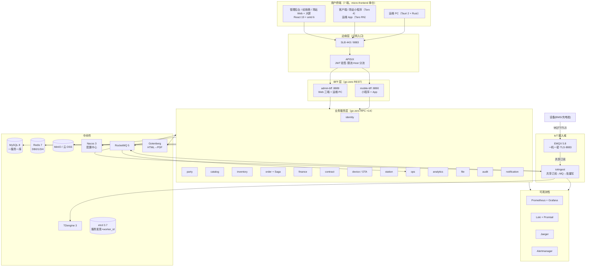

# 电池全生命周期管理平台 · 技术架构文档

**版本**：v2.0
**日期**：2026-10-06
**对应需求**：《01-需求文档.md》v2.0
**相对 v1 的关键变化**：前端合仓改名 **micro-frontend**；**删除 Centrifugo**（统一轮询）；**引入 Nacos 配置中心**（砍自研 config 服务）；JWT 内置 kid；RBAC 改每请求校验；PDF 渲染选型 Gotenberg；服务数 20→**18**。逐条见本目录 [README.md](README.md) 决策总表。

---

## 目录

1. [文档说明](#1-文档说明)
2. [总体架构](#2-总体架构)
3. [仓库架构与工程组织（5 仓方案）](#3-仓库架构与工程组织5-仓方案)
4. [后端技术选型详解](#4-后端技术选型详解)
5. [接入与边缘组件](#5-接入与边缘组件)
6. [自研公共组件库（common，11 包）](#6-自研公共组件库common11-包)
7. [关键机制设计](#7-关键机制设计)
8. [前端技术选型](#8-前端技术选型)
9. [可观测性架构](#9-可观测性架构)
10. [安全架构](#10-安全架构)
11. [数据架构](#11-数据架构)
12. [部署架构](#12-部署架构)
13. [测试与质量体系](#13-测试与质量体系)
14. [架构决策记录（ADR）汇总](#14-架构决策记录adr汇总)

---

## 1. 文档说明

- 每个选型按"**是什么 → 为什么选 → 用来干什么 → 放弃了什么**"书写，新人看加粗句即可。
- v2 已把 v1 的技术债 C1/C2/C3/C7/C8 转为**硬约定/既定选型**，不再以"债"的形式存在。
- `> 💡 教训` 标注来自原 micro 项目实施过程中的真实踩坑，重建直接规避。

---

## 2. 总体架构

### 2.1 架构总览图



### 2.2 一次典型请求

**管理端查询**：浏览器 → APISIX（验 RS256 JWT + 限流）→ admin-bff（三层鉴权）→ 业务 RPC（gRPC，etcd 发现）→ MySQL。

**页面"实时性"（v2 轮询方案）**：告警/工单页每 10s 调轻量增量接口（未读计数 + since_id），页面隐藏自动暂停；异步触达走微信订阅消息/短信/站内信。**没有任何 WebSocket 长连接组件**。

**设备遥测**：电池 → EMQX（一机一密 + TLS）→ iotingest → RocketMQ（缓冲）→ 批量写 TDengine；越限 → alert_candidate → ops 判定。

### 2.3 分层职责与禁区

| 层 | 职责 | 禁止事项 |
|---|---|---|
| 边缘层 | TLS 终结、JWT 验签、限流、路由 | 不做业务逻辑 |
| BFF 层 | 聚合 RPC、字段裁剪、越权拦截 | 不写业务规则、不直连数据库 |
| 业务服务层 | **唯一写入方原则**：每张表只归属一个服务 | 禁止跨服务直连他人数据库 |
| IoT 接入域 | 协议终结、认证、削峰、批量写时序库 | 不做业务判断（越限规则来自 ops 下发的缓存） |
| 基础设施层 | 通知/文件/审计通用能力 | 不依赖业务服务 |

---

## 3. 仓库架构与工程组织（5 仓方案）

### 3.1 仓库清单

| 仓库 | 内容 | 独立理由 |
|---|---|---|
| **`micro-common`** | Go 公共库（11 个包，单一 Go module） | 稳定、被所有服务依赖，**必须版本化发布**（semver tag） |
| **`micro-server`** | 18 个后端服务（每服务独立 Go module + go.work）+ tools 工具箱 | 服务迭代快，与 common 解耦 |
| **`micro-frontend`** | 前端全部端：Web 三端（admin/dealer/station）+ 客户端/场站小程序 + 运维 App + packages/shared（pnpm workspace） | **v2 定稿**：前端团队规模小，合仓共享请求层/权限/类型最省事；命名中性（不再叫 web） |
| **`micro-desktop`** | Tauri 运维 PC（Rust + 复用 micro-frontend 产物） | Rust 工具链隔离 |
| **`micro-deploy`** | compose / K3s / ArgoCD / Nacos 配置基线 / 密钥样例 / runbook | 部署配置单独授权，密钥边界清晰 |

> 为什么 `micro-frontend` 一个仓装下 Web + 小程序 + App：①前端 1~2 人，分仓的版本同步成本大于收益；②pnpm workspace 统一依赖与 CI；③TS 类型由 apitypes 生成到一处（shared/types）多端消费。**拆分触发条件**：前端 ≥4 人或小程序团队独立——届时按 `apps/*` 目录 `git filter-repo` 抽仓，目录边界即拆分边界。

### 3.2 跨仓库协作规则

| 规则 | 说明 |
|---|---|
| **common 版本化** | 合并 main 打 tag（v0.x.y）；服务仓库 go.mod 版本引用；破坏性变更升次版本 + CHANGELOG |
| **本地联调** | 开发机约定目录 clone 全部仓库，根放**不入库的开发用 go.work**（`use ./micro-common; ./micro-server/services/*`）——分仓存储、单仓开发体验 |
| **接口先行** | `.api`/`.proto` 是前后端/服务间唯一契约源；契约 PR 先行评审 |
| **类型生成** | apitypes 从 `.api` 生成 TS 类型到 micro-frontend；openapi 生成文档；CI 漂移阻断 |
| **提交规范** | 中文 conventional commits + 任务号（S<N>-<NN>） |

### 3.3 目录骨架

```
micro-common/                  # 11 个包（见第 6 节）
micro-server/
├── go.work                    # services/* + tools
├── services/                  # 18 个服务
└── tools/                     # migrate/seed/envcheck/dodcheck/openapi/apitypes/devicesim...
micro-frontend/
├── pnpm-workspace.yaml
├── apps/                      # admin / dealer / station
├── apps-miniapp/              # client / station（Taro）
├── apps-mobile/               # 运维 App（Taro RN）
└── packages/shared/           # 请求层/权限/轮询 hook/生成类型
micro-desktop/                 # src-tauri（diag/flash/transfer）
micro-deploy/                  # compose / k8s / docker / nacos / runbook / docs
```

---

## 4. 后端技术选型详解

### 4.1 语言与框架

#### Go 1.26

- **是什么**：编译型静态语言，云原生事实标准。
- **为什么选**：单二进制部署（18 服务 = 18 个 exe，镜像 ~20MB）；编译快、Windows 开发 → Linux 容器运行交叉编译方便；goroutine 适合 IoT 转发高并发；团队技能栈。
- **放弃了什么**：Java/Spring（重、内存大、小团队运维成本高）；Node.js（CPU 密集的加解密/序列化弱）。

#### go-zero v1.10 + goctl

- **为什么选**：①**接口即代码**（.api/.proto 生成 handler/路由/客户端）；②内置 etcd 服务发现、熔断、限流、Prometheus、OpenTelemetry——可观测零改造；③zrpc 生态成熟；④中文文档社区。
- **注意**：go-zero **没有内置配置中心**（只有本地 yaml + env 覆盖 + 远程配置扩展点）——多语言配置需求由 Nacos 承担（§5.4）。
- **放弃了什么**：Kratos（约定少、风格易发散）；gin/echo（要自己拼全家桶）；自研框架。

#### GORM v2

- **为什么选**：开发效率 + **Callbacks 机制是多租户插件的基础**（ORM 层强制注入 tenant_id，业务零感知）。
- **v2 硬约定（偿还 v1 技术债 C1）**：所有 DB 访问必须 `db.WithContext(ctx)`——lint 规则 + review checklist 把关；租户插件单级解析（stmt.Context），**不引入协程级 ambient**。
- **放弃了什么**：sqlx（手写扫描太多）；ent（生成重、学习曲线陡）。

#### golang-migrate

纯 SQL 成对迁移（up/down），CI 静态检查成对与顺序；`tools/migrate -svc <name> up` 自动建库。

#### etcd 3.7

**仅做两件事**：go-zero 服务发现 + 雪花 worker_id 租约分配。**不承担配置**（配置在 Nacos，见 ADR-10 v2）。

### 4.2 数据层

#### MySQL 8.0（一服务一库）

- 一服务一库是数据自治底线：服务 A 永不 JOIN 服务 B 的表；聚合走 BFF（实时）/analytics 读模型（报表）。
- 规范：全表通用字段；雪花 int64 主键；对外 ID 字符串化；utf8mb4/InnoDB。
- v2 库清单（14 个业务库）：identity/party/catalog/inventory/order/finance/contract/device/station/ops/analytics/notification/file/audit + TDengine iot_db。（v1 的 config_db、subscription_db 删除。）

#### Redis 7（逻辑 DB 划分）

| DB | 用途 |
|---|---|
| 0 | 业务缓存（含设备影子、告警规则缓存） |
| 1 | 预留（任务队列位，当前延迟任务走 RocketMQ） |
| 2 | **预留**（v1 为 Centrifugo 引擎，v2 组件已删；编号保留不复用，避免新旧环境混淆） |
| 3 | 分布式锁（库存预扣） |
| 4 | 认证会话中心 + **auth_cache（RBAC 每请求校验缓存，见 §7.5）** |

#### RocketMQ 5.x（事件总线 + 延迟消息 + 遥测缓冲）

- **为什么不用 Kafka**：规模匹配（200~2000 条/s）；**原生延迟消息**（支付超时/工单升级/退避重试）；内置消费组重试与死信队列；运维成本低。
- **教训**：topic 只允许 `[%|a-zA-Z0-9_-]`（下划线命名）；**rocketmq-client-go/v2 直连 NameServer**；Docker broker 必须 `brokerIP1=宿主机IP`；**消费者实例名全局唯一**；topic 预建。

#### TDengine 3.x（时序库）

- **为什么选**：超级表-子表模型贴合"一设备一子表"查询；内置连续查询（降采样保留策略开箱即用）；压缩率高；**同时间戳覆盖写 = 遥测重传天然幂等**。
- 建模式（ADR-013）：按 product_key 超级表、SN 子表；热点五指标独立列 + raw VARCHAR 列；REST 6041 **必须 Basic 认证**。
- **放弃了什么**：InfluxDB（开源版集群受限）；TimescaleDB（运维栈分裂）；VictoriaMetrics（那是监控指标场景，ADR-15）。

#### MinIO（S3 兼容对象存储）

本地 MinIO 开发、上云换 OSS endpoint 零改码。双桶：普通文件 + 合同桶（版本控制）。存：合同归档件、保单文件、固件包、巡检照片、导出文件。

#### Gotenberg（HTML→PDF 渲染服务）★v2 新增

- **是什么**：封装好 Chromium 的 Docker 转换服务，HTTP API（HTML/Markdown → PDF），语言无关。
- **为什么选**：合同/复杂版式报表需要"所见即所得"的 PDF；自管 headless Chrome（Puppeteer/chromedp）要处理进程池与崩溃恢复，Gotenberg 全包了；一个 HTTP 调用即用即走。
- **分工**：报表类简单表格 PDF 用 Go 原生库（进程内，零依赖）；**合同打印稿/复杂版式走 Gotenberg 容器**。
- **放弃了什么**：Selenium（浏览器自动化测试工具，做 PDF 太重）；wkhtmltopdf（停更）。

### 4.3 端口规划（v2 定稿）

| 服务 | RPC/HTTP | Metrics | 服务 | RPC/HTTP | Metrics |
|---|---|---|---|---|---|
| identity | 8081 | 9101 | order | 8090 | 9110 |
| party | 8082 | 9102 | station | 8091 | 9111 |
| catalog | 8083 | 9103 | finance | 8092 | 9112 |
| inventory | 8084 | 9104 | contract | 8093 | 9113 |
| device | 8085 | 9105 | ops | 8094 | 9114 |
| file | 8086 | 9106 | analytics | 8095 | 9115 |
| audit | 8087 | 9107 | hello(模板) | 8888 | 9117 |
| notification | 8089 | 9109 | **admin-bff** | **8889** | 9118 |
| iotingest | —（OCPP 8182） | 9120 | **mobile-bff** | **8890** | 9119 |

> 预留不分配：8088/9108（原 config）、8096/9116（原 subscription）、9116。**新服务先在此表登记再取号**。

---

## 5. 接入与边缘组件

### 5.1 APISIX 3.11（API 网关）

- **为什么选**：etcd 原生存储（prefix `/apisix` 隔离）；插件全（jwt-auth RS256/限流/灰度 traffic-split）；动态路由 Admin API 热更新；中文文档。
- **用来干什么**：公网唯一 HTTP 入口；Host 分流（admin./dealer./station. → admin-bff，m. → mobile-bff）；边缘 JWT 验签；限流。
- **v2 变化**：不再需要 WebSocket 透传（无长连接组件）。
- **放弃了什么**：Kong（配置链路重）；Nginx 手写（无动态 API）；云网关（锁定供应商）。

### 5.2 EMQX 5.8（MQTT Broker）

- **为什么选**：开源版内置认证库（一机一密 REST 写入）；共享订阅（`$share/ingest/...` 多实例消费不丢）；管理台可观测；TLS/ACL 开箱即用。
- **ACL**：设备仅可发布 `up/{tenant}/{pk}/{自身SN}/#`、订阅 `down/{自身SN}/#`。
- **教训**：数据出口走"共享订阅→自研 iotingest"而非 EMQX bridge（开源版 bridge 不稳，ADR-04）；**容器重建后必须重跑 bootstrap.sh**（认证器丢失）；TLS 证书挂载 via `SSL_OPTIONS__*`。

### 5.3 OCPP 1.6J 网关（iotingest 内置）

平台充当 CSMS；BootNotification/Heartbeat/StatusNotification/MeterValues 映射进既有遥测五指标链路——桩与电池同一套监控告警。**验收口径=协议标准+模拟桩**（v2 定稿）；OCPP 2.0.1 预留扩展位。

### 5.4 Nacos 3（配置中心）★v2 新增

- **是什么**：阿里开源的配置管理+服务发现组件；这里**只用作配置中心**。
- **为什么引入**：①**多语言是确定需求项**（Go/Java/Node/Python SDK 全有）；②管理台+命名空间+版本历史/回滚+灰度，是自研 config 服务的严格超集；③**长轮询秒级推送**——替代原 config_changed 事件失效机制，各服务挂 listener 即可；④go-zero 本身没有配置中心，自研补丁不如成品。
- **托管内容**：业务字典、功能开关、灰度配置、告警规则参数兜底值、轮询间隔等运行时可调参数。服务自身的基础配置（端口/DSN）仍是 yaml+env（启动前就要用，不该依赖配置中心）。
- **连带删除**：自研 config 服务与 dict 表（服务 19→18）；config_changed 事件 topic。
- **分工边界**：**服务发现仍走 etcd**（go-zero 原生路径，稳定零代码）；Nacos 只管配置——各司其职，不引入 Nacos 服务发现插件（非官方主线维护，见 ADR-10）。

### 5.5 实时性方案：统一轮询（v2 定稿，替代推送组件）

```
前端 usePolling hook（10s 间隔）
  ├─ 页面隐藏自动暂停（visibilitychange），回前台立即拉一次
  ├─ 轮询接口 = 轻量增量：GET /api/v1/alerts/pending?since_id=xxx
  │    返回：未读计数 + 增量告警列表（单响应 < 5KB，P95 < 100ms）
  └─ 任何写操作（确认/转工单）成功后手动触发立即刷新
异步触达（人不在页面时）：微信订阅消息 / 短信 / 站内信（notification 统一出口）
```

- **为什么砍 Centrifugo**：原组件只服务"页面开着时的实时刷新"，非必达通知；App 退后台本就收不到。轮询按 500 并发用户 × 10s 一次轻量查询 = 50 QPS，任何一层都无压力。
- **WebSocket 升级条件（ADR-02）**：告警时效要求进到秒级、或要做"派单即时弹窗"——届时引入组件或自研网关，接口层只需把轮询 hook 换成订阅实现，业务代码不动。

---

## 6. 自研公共组件库（common，11 包）

> 全部在 `micro-common`。v2 变化：**删除 pushjwt**（Centrifugo 已砍）。

| 包 | 一句话职责 | v2 要点 |
|---|---|---|
| **errcode** | 错误码分段注册器（万位段），gRPC status 无损往返 | 每服务 `*_err.go` 集中登记，禁止裸数字 |
| **response** | `{code,msg,data}` 信封；业务错误 HTTP 200，认证码 10401~10406 映射 401 | 前端一套拦截器处理全部错误 |
| **ctxkit** | 操作人/租户/端/角色统一从 context 取 | 不在函数间透传参数 |
| **snowflake** | 分布式 ID（etcd 租约分配 worker_id） | 41bit+10bit+12bit；冲突不静默 |
| **crypto** | argon2id / AES-256-GCM / 脱敏 / KeyProvider（kid 轮换） | 密钥环境变量注入 |
| **jwtauth** | RS256 签发校验；**header 内置 kid + 多公钥集合**（v2 偿还 C3） | claims 极简（uid/sid/client/level/jti），权限不进 JWT |
| **sessionx** | Redis DB4 会话中心（互斥/踢人/refresh 轮换/锁定） | identity 唯一读写方 |
| **authz** | BFF 三层鉴权 + **RBAC 每请求查 Redis auth_cache**（v2 偿还 C2），本地缓存仅 Redis 故障降级兜底 | fail-open 普通路由 / fail-close 指令与财务 |
| **tenant** | GORM 插件强制 tenant_id 过滤；**单级解析（仅 stmt.Context）**，ambient 机制不引入（v2 偿还 C1）；RPM 配额 | Scoped/ExemptWithColumn 清单 + tenantaudit CI |
| **eventbus** | Outbox（事务内写事件）+ Relay（SKIP LOCKED 投递）+ Subscriber（event_dedup 幂等） | 平台一致性基石 |
| **testinfra** | 测试环境三级解析（env→本机→testcontainers→Skip） | **v2：CI 增 TDengine 容器作业强制全量**（偿还 C8） |

---

## 7. 关键机制设计

### 7.1 Saga 订单状态机（自研，确认维持）

```
CREATED → INVENTORY_LOCKED → PAID → STOCK_OUT → CONTRACT → [STATION] → DONE
```

- 三件套：saga 表 + outbox + RocketMQ 延迟消息（30min 支付超时；退避 1m/5m/30m；超限人工介入队列）。
- 补偿：锁库存可释放、支付可退款、**出库不可自动补偿（人工队列）**、合同/建站重试至成功；幂等键 saga_id+step。
- **为什么不用 Temporal（ADR-03 定稿维持）**：单编排主干几百行可控；触发重评：编排流 ≥3 条或多天级人工节点。
- 教训：事件消费推进 Saga 用 `context.WithoutCancel`（严禁挂请求 ctx）。

### 7.2 库存防超卖（双保险）

Redis DECRBY 原子预扣（负值回滚拒绝）→ DB 行锁兜底（FOR UPDATE + 余量守卫）；Redis 故障自动降级纯 DB 路径；四态记账 + stock_record 流水；幂等键 (biz_type, biz_no)。100 并发抢 50 零超卖为 CI 固化用例。

### 7.3 事件驱动与最终一致

Outbox（业务事务内）→ Relay → RocketMQ（at-least-once）→ event_dedup 幂等消费 → 重试 16 次进 DLQ → Alertmanager 告警；库存/资金日结对账兜底，**差异修复只允许补投递重放**。

### 7.4 多租户运行时

GORM 插件：显式租户自动注入 WHERE/INSERT 回填，无租户业务查询 fail-closed 拒绝；`tenant.Skip` 显式豁免后台作业；平台共享表清单豁免；事件信封 tenant_id 在消费侧恢复；tenantaudit CI 静态对账。

### 7.5 认证体系（三层检查点 + v2 强化）

```
APISIX（快）           BFF 中间件（准）                    identity（唯一写入方）
├─ TLS/限流            ├─ 验签（按 kid 选公钥★）           ├─ 登录/刷新/踢人/封禁
├─ JWT 验签+过期       ├─ 查 sess:{sid} 会话状态           ├─ refresh 轮换+重用检测
└─ Host 路由           ├─ client 端匹配校验                ├─ step-up 二级认证
                       ├─ RBAC：每请求查 Redis auth_cache★ ├─ 会话查询/踢人 API
                       ├─ 敏感路由查 auth_level
                       └─ 注入 uid/sid/tenant 到 ctx
```

- ★kid（v2 内置）：JWT header 带 kid，验签方按 kid 从多公钥集合选择——**密钥轮换期新旧并存，零停机**；轮换流程写 runbook。
- ★auth_cache（v2 内置）：identity 将"角色→权限码"写入 Redis（变更即时失效），BFF **每请求一次 GET**（+0.3~0.5ms）——**降权即时生效**；本地 LRU 仅在 Redis 故障 fail-open 窗口兜底。
- 同端互斥 QQ 模式；认证码 10401~10406 前端分流（10401 静默刷新/10402 互斥弹窗/10406 提级弹窗）。
- **为什么继续自研不换框架（ADR-11 维持）**：互斥/踢人/封禁即时生效是有状态会话语义，标准 IdP（Keycloak/Zitadel/Kratos）面向无状态 OIDC，即时作废是弱项；自研收敛在 sessionx+authz 两包。**重评条件**：要对外发 OIDC token（开放平台）或 3+ 外部 IdP 联邦——届时首选 **Zitadel**（Go 原生）。

### 7.6 遥测管道（背压设计）

设备 → EMQX(TLS/一机一密) → iotingest 转发（共享订阅）→ RocketMQ 缓冲（**MQ ack 后才 ack MQTT**）→ 写入协程批量 500 条/200ms → TDengine；越限（本地规则缓存 30s TTL + Nacos 变更失效）→ alert_candidate → ops。iotingest 独立进程，遥测流量不穿透业务 RPC。

### 7.7 指令下行与 OTA

指令：cmd 表 + cmd_audit 独立审计 → MQTT down/{sn}/cmd QoS1 → ACK 3s → 重试≤3 → FAILED→告警；控制类 BFF 侧 step-up 强制。OTA：sha256 + Ed25519 签名（私钥环境变量）→ 灰度分批 → 失败率超阈暂停 → 断点续传 → 回滚。

### 7.8 analytics 读模型（CQRS 变体）

14 类事件 → 六大日聚合表（业务键幂等 + watermark + 消费组版本号全量重建）→ 日级对账（recon_diff）→ 异步导出（MQ 管道）。报表不 JOIN 业务库。

---

## 8. 前端技术选型

### 8.1 Web 三端：React 19 + TS + Vite 8 + antd 6（pnpm workspace，micro-frontend）

- **为什么**：antd 中后台组件密度最高（29 页管理后台开发速度第一优先）；三端共享 `packages/shared`。
- **shared 包核心**：request.ts（信封/Bearer/401 单飞静默刷新/10402/10406 分流）、permission.ts、**usePolling.ts（v2 新增：10s 轮询/隐藏暂停/回前台即拉/操作后手动刷新）**、生成类型。
- **放弃了什么**：Vue 系（团队背景）；微前端（不需要，见 04 文档 D9）。

### 8.2 小程序：Taro 4 + React（weapp）

- **为什么**：React 系与 Web 共享类型与请求层**设计**（fetch 与 Taro.request 各自实现，ADR-05）；一套框架出客户端+场站端两个小程序。
- v2：客户端小程序分包 = station/service/profile（**商城分包删除**）。
- 微信能力：wx.login 静默登录、getPhoneNumber、**订阅消息授权（askSubscribeMessage，异步告警触达）**、checkSession 续期；dev 用 MOCKWX_* 模拟。

### 8.3 运维 App：Taro + React Native

离线工单草稿 + client_action_id 幂等恢复同步；**RN 依赖安装与真机联调是高风险项，先做 spike**（回退：uni-app 壳，ADR-05）。上架审核为用户侧动作。

### 8.4 运维 PC：Tauri 2

- **为什么不是 Electron**：产物 ~10MB（Electron 100MB+）；capabilities 白名单更安全；串口/CAN/BLE 用 Rust 库（serialport/btleplug）稳定。
- 前端复用 micro-frontend/apps/admin 产物；Rust 三模块：diag（串口/CAN/BLE JBD 帧，仅本地）、flash（XMODEM-1K 断点续传 + sha256 缓存）、transfer（CSV/XLSX/zip）。

### 8.5 类型生成（apitypes）

`.api` → TS 类型 → micro-frontend `packages/shared/types`，CI diff 校验防漂移（v1 的"小程序类型手写"债 C6 随合仓自然解决：类型生成到 shared，Taro 端同仓直接引用）。

---

## 9. 可观测性架构

```
指标: go-zero /metrics(:91xx) → Prometheus → Grafana RED 看板（provisioning 自动装配）
链路: go-zero otel → OTLP :4317 → Jaeger（trace_id 贯穿 HTTP→rpc→MQ→消费）
日志: logx(JSON 含 trace_id) → *_run.log → Promtail → Loki(:3100)（按 trace_id 检索）
告警: Prometheus 三级规则 → Alertmanager → webhook → notification（短信/企微）+ DLQ 告警
```

- **Jaeger 为主力**（SkyWalking 的 BanyanDB 有 NPE 阻塞史，处置方案见 04 文档）；Go 侧 otel exporter 直发，零 agent。
- **Loki 而非 ELK**：只索引标签（trace_id），资源占用低一个量级。
- 看板分层：全局总览（QPS/错误率/活跃设备/MQ 积压/Saga 卡单）→ 服务 RED → 业务指标 → 资源。
- **轮询监控（v2 新增）**：轮询增量接口自身 QPS/延迟进 RED 看板；`usePolling` 活跃连接数作为前端健康信号。

---

## 10. 安全架构

| 层 | 措施 |
|---|---|
| 边缘 | TLS 1.2+ 全站；APISIX jwt-auth RS256（**多公钥 kid 轮换**）；per-route 限流 |
| 应用 | argon2id 密码；BFF 统一越权拦截（水平+垂直）；登录失败锁定；会话/互斥/踢人/step-up |
| 设备 | 一机一密 + TLS 8883 唯一 + ACL 最小主题；错误凭证告警 |
| 指令 | 控制类 step-up + cmd_audit 100% 独立审计；QoS1 + ACK 状态机 |
| OTA | Ed25519 签名私钥出库；未签名不可下发 |
| 数据 | AES-256-GCM 信封加密；脱敏展示；kid 轮换 |
| 密钥 | 三件套（RS256/Ed25519/数据密钥）keygen 生成，仓库只存公钥样例；种子密码 MICRO_ADMIN_PW 环境变量 |
| 网络 | VPC 内网；公网仅 SLB(443/8883)；K3s NetworkPolicy |
| 合规 | 按等保 2.0 二级设计；审计追加式 ≥3 年（**测评为所有者决定的合规范畴**） |

---

## 11. 数据架构

### 11.1 库划分

14 个 MySQL 业务库 + TDengine iot_db + MinIO 双桶 + Redis DB0/1/3/4 + Nacos（配置数据）。跨库禁止 JOIN；跨服务逻辑引用 + 事件对账。

### 11.2 存储矩阵与保留

| 数据 | 存储 | 保留 |
|---|---|---|
| 业务库表 | MySQL | 永久 |
| 遥测原始 | TDengine | 3 个月 |
| 遥测降采样 | TDengine 连续查询（1min） | 3 年 |
| 告警/工单 | MySQL + 归档 | 热 1 年/归档 3 年 |
| 审计 | MySQL（追加式） | ≥3 年 |
| 合同/保单/固件/照片 | MinIO（合同桶版本控制） | 永久 |
| 配置（字典/开关/灰度） | **Nacos**（版本历史自带） | 永久 |

### 11.3 备份与恢复

| 对象 | 方案 | RPO/RTO |
|---|---|---|
| MySQL | 每日 mysqldump 全备 → MinIO；生产换 RDS 自动备份+binlog | RPO<5min / RTO<30min |
| TDengine | taosdump 每日 → MinIO；原始可从 MQ 重放（保留 3 天） | RPO 24h |
| Nacos | 自带导出（或 derby/mysql 持久化目录备份）每日 → MinIO | RPO 24h |
| RocketMQ/EMQX | 不备份（可重建/重放） | — |

### 11.4 灾后恢复三件套

① `compose up -d` + 手动 `docker start` 独立容器；② 重跑 `emqx/bootstrap.sh`；③ 全部后端服务 restart（Redis/EMQX 断连重连）。

---

## 12. 部署架构

### 12.1 环境矩阵

| 环境 | 用途 | 形态 |
|---|---|---|
| dev | 本地开发 | 本机五件套（MySQL/Redis/etcd/TDengine/RocketMQ）+ compose（EMQX/APISIX/可观测/MinIO/**Nacos**） |
| test | 部署验证 | 本机 compose 拉镜像（deploy-test.ps1）；ECS 就绪后平移 |
| staging | 预生产 | 与 prod 同构缩配 |
| prod | 生产 | 见 12.2 |

### 12.2 生产拓扑（两阶段）

**阶段一（Docker Compose）**：

| 资源 | 运行 |
|---|---|
| ECS-1 4C8G | APISIX、18 个业务服务容器、Nacos |
| ECS-2 4C16G+500G | RocketMQ、EMQX、TDengine、iotingest、Gotenberg、可观测套件 |
| MySQL/Redis | 本机 → 云托管（切换点已留） |
| OSS | MinIO → 云 OSS |

**阶段二（K3s + ArgoCD GitOps）**：K3s×3（无状态服务 replicas=2 模板化清单）+ obs 节点（可观测+TDengine local-path）+ ArgoCD app-of-apps + NetworkPolicy default-deny。

- **为什么 K3s**（ADR-06）：无专职运维，单二进制低占用；节点 >10 再升完整 K8s。
- 镜像：统一 `Dockerfile.service`（golang builder + alpine 非 root）+ docker-bake 参数化；tag=git sha；Trivy 扫描（CRITICAL/HIGH 有修复版才阻断）。

### 12.3 发布流程

```
PR → CI（lint/test/audit/build）→ 合并 main → 镜像构建+扫描 → push GHCR
  → test（本机拉镜像滚动重启）→ 手动批准 → staging → 生产窗口手动发布
数据库纪律：只前向兼容（先加列后删列、两阶段发布）
```

---

## 13. 测试与质量体系

| 层 | 手段 |
|---|---|
| 单测 | 各 module `go test`；testinfra 三级解析；核心域必覆盖（库存扣减/Saga 状态机/金额计算/权限中间件） |
| 集成 | testcontainers-go（MySQL/Redis）；**CI 含 TDengine 容器作业强制全量（v2 偿还 C8）**；本地跑 CI 同款命令文档化 |
| 冒烟 | e2esmoke/bizsmoke/p3~p6smoke/iotsmoke/otasmoke/chaosmoke/p5accept/p5perf——**严禁并发**（共享 FIFO 库存池） |
| CI 门槛 | build → tenantaudit → openapi -check → go vet → dodcheck → golangci-lint → oxlint → 全量 go test |
| 性能 | devicesim 2000 台（**协议标准报文**）；p4load 导出压测；p5perf NFR 复测 |
| 硬件口径 | **协议标准 + 模拟器全链 = 验收完成线**；真实硬件到位补兼容记录，不设门槛 |

---

## 14. 架构决策记录（ADR）汇总

| # | 决策 | 结论 | 理由 | 重新评估条件 |
|---|---|---|---|---|
| ADR-01 | 边缘网关 | APISIX；BFF 后不加内部网关 | etcd 原生/插件全 | 多语言后端或复杂流量治理 |
| ADR-02 | 实时性 | **不引入推送组件，统一 10s 轮询 + 微信订阅消息**（v2 定稿） | 组件只服务"页面开着"场景；轮询 50 QPS 无压力；少一个中间件 | 告警秒级时效或派单即时弹窗需求 |
| ADR-03 | Saga | 自研状态机（saga+outbox+延迟消息）——**v2 确认维持** | 单编排流几百行可控 | 编排流 ≥3 或多天级人工节点 → Temporal |
| ADR-04 | EMQX 出口 | 共享订阅 + 自研 iotingest，MQ 缓冲 | 开源 bridge 不稳 | EMQX 官方稳定支持 RocketMQ bridge |
| ADR-05 | Taro 栈 | Taro（React），Web 与小程序共享类型与请求层设计 | 团队 React 背景 | RN BLE spike 失败则运维端回退 |
| ADR-06 | 容器编排 | K3s | 无专职运维 | 节点 >10 或多集群 |
| ADR-07 | 托管/自建 | MySQL/Redis/OSS 云托管；MQ/EMQX/TDengine/Nacos 自建 | 不可丢的交云，可重放的自建 | 云服务降价 |
| ADR-08 | ORM | GORM + golang-migrate；**全量 WithContext（单级租户解析）** | Callbacks 支撑租户插件 | — |
| ADR-09 | 延迟任务 | RocketMQ 延迟消息 + cron 注册表（登记+last_run 指标）——**v2 确认维持** | 少一个组件；重试/死信内置 | 任务量极大或复杂依赖编排 |
| ADR-10 | 配置/发现 | **Nacos 只做配置中心（多语言 SDK）；服务发现仍 etcd**（v2 定稿，自研 config 服务删除） | go-zero 无配置中心；Nacos 是自研 dict 表的严格超集 | 多集群服务发现需求时评估 Nacos 发现（需社区插件转正） |
| ADR-11 | 认证 | 自研会话中心 + 双 Token + 三层检查——**v2 确认维持**（kid 内置、auth_cache 每请求校验） | 互斥/踢人/封禁需服务端权威 | 对外开放平台或 3+ IdP 联邦 → **Zitadel**（Go 原生） |
| ADR-12 | MQ 客户端 | rocketmq-client-go/v2 直连；topic 下划线预建 | 环境无 5.x Proxy | 升级 Proxy 后评估 v5 客户端 |
| ADR-13 | TDengine 建模 | 超级表按 product_key + SN 子表；热点列+raw 列；同 ts 覆盖幂等 | 设备查询快；新指标不改表 | — |
| ADR-14 | Elasticsearch | 不引入 | MySQL 检索够用 | 列表 P95>1s 或全文检索需求 |
| ADR-15 | VictoriaMetrics | 暂不引入 | 指标量未到 | 指标保留 >90 天 |
| ADR-16 | 多租户 | 共享库 + tenant_id + GORM 插件 + CI 审计 | 不分库成本低，插件强制不靠自觉 | 单租户 >500GB 或合规要求物理隔离 |
| ADR-17 | 仓库策略 | **5 仓：common/server/frontend/desktop/deploy**（v2：前端合仓 micro-frontend） | common 版本化隔离；前端小团队合仓省同步成本 | 前端 ≥4 人或小程序团队独立 |
| ADR-18 | PDF 渲染 | **Gotenberg 容器**（复杂版式）+ Go 原生库（报表）（v2 新增） | 免自管 headless Chrome | 超高并发渲染时加队列/池 |
| ADR-19 | 硬件验收 | **协议标准 + 模拟器全链 = 验收口径**（v2 新增） | 硬件到位时间不可控，不阻塞交付 | 真实样机到位补兼容记录 |

---

**文档结束**

> 维护约定：技术口径变更先改本文档并追加 ADR；与《01-需求文档》冲突以需求为准；实施细节见《03-任务清单》。
