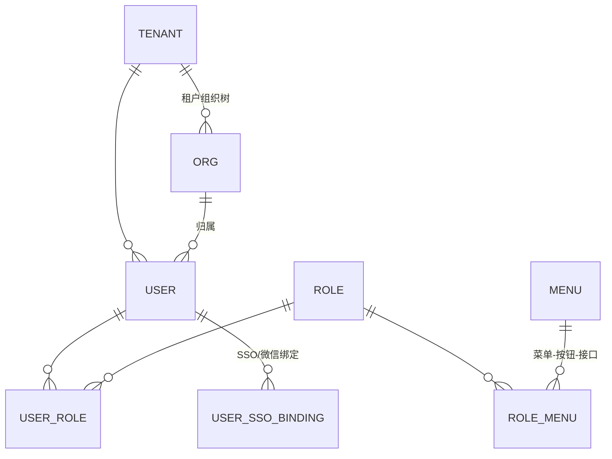

# 开发任务清单 · 分阶段实施指南（新手友好版）

**版本**：v2.0 ｜ **日期**：2026-10-06
**配套**：《01-需求文档》《02-技术文档》（同目录 v2 版）
**相对 v1 的关键变化**：仓库 5 个（前端合仓 micro-frontend）；无 Centrifugo（轮询方案）；Nacos 进环境（S2）；无租赁/订阅/商城/押金任务；合同签署=上传归档；JWT kid 与 auth_cache 直接做进 S3。逐条见本目录 [README.md](README.md)。

---

## 使用说明（先读这 10 行）

1. **顺序即依赖**：阶段 N 依赖阶段 N-1 的产物，跳阶段做会返工。
2. **任务号**：`S<阶段>-<序号>`（S3-04 = 阶段 3 第 4 个任务）；提交信息引用任务号。
3. **每个任务标配**：代码 + `.api`/`.proto` 契约 + 成对迁移脚本 + 单测 + 冒烟步（见附录 B）。
4. **勾选**：`[ ]` 未开始 / `[x]` 完成（标注日期）。
5. **冒烟纪律**：**严禁并发执行**（共享 FIFO 库存池会交叉消耗造成假失败）。
6. 命令默认在仓库根执行；端口见 02 文档 §4.3；服务共 **18 个**。
7. 遇到"为什么"：查《02-技术文档》对应章节。
8. 前端同学：从对应阶段"前端任务"小节入手，先读 S0-05 契约约定。
9. 启动总口诀：**中间件 → 迁移 → 种子 → 后端 → 前端**；环境问题先跑 envcheck。
10. 卡住了：先查附录 D 坑速查 → 02 文档 → 带 trace_id 问人（Jaeger :16686）。

---

## 阶段总览

| 阶段 | 名称 | 核心交付 | 依赖 |
|---|---|---|---|
| S0 | 工程准备 | 5 仓库骨架、CI、约定 | 无 |
| S1 | 公共库 | micro-common 11 个包 | S0 |
| S2 | 环境与中间件 | 五件套 + compose（含 Nacos）+ envcheck | S0 |
| S3 | 认证与后台骨架 | identity + admin-bff + Web 登录/用户管理 | S1、S2 |
| S4 | 主数据域 | party / catalog / inventory + file/audit/notification + Web 页面 | S3 |
| S5 | 交易域 | order + finance + contract（Saga/Outbox/支付/归档合同） | S4 |
| S6 | 资产与 IoT | device + station + iotingest + EMQX 链路 | S5 |
| S7 | 运维域 | ops + 轮询接口 + 微信订阅消息 + 场站 Web | S6 |
| S8 | 分析域 | analytics（读模型/报表/导出/对账） | S5~S7 |
| S9 | 多端 | mobile-bff + 客户端小程序 + 经销商端 + 场站小程序 + 运维 App/PC | S5~S7 |
| S10 | 增值域 | 梯次利用/回收 + BI + 返利（均 L3，按业务节奏） | S5~S9 |
| S11 | 上线准备 | 多租户复核 / 压测 / 生产部署 | 全部 |

---

# 阶段 0 · 工程准备与仓库骨架

**目标**：clone 完即可写代码；CI 第一天就拦坏代码。
**为什么最先做**：仓库结构、命名、CI 门槛后补的成本是先做的 10 倍。

### S0-01 创建 5 个仓库并初始化骨架

按 02 §3.3 骨架创建：

```
micro-common / micro-server / micro-frontend / micro-desktop / micro-deploy
```

- [ ] GitHub 建 5 个私有仓库；默认分支 `main` + PR 过 CI 才能合并
- [ ] 每仓库 `.gitignore`（Go 仓排除 `*.exe *_run.log`；deploy 仓排除真实密钥）+ `README.md`（一段话说清职责）
- [ ] `micro-server` 根建 `go.work`（先只含 tools）；module 命名 `micro-server/services/<svc>` 与 `micro-common`
- [ ] 开发机约定目录（如 `~/code/micro/`）clone 全部仓库，根放**不入库的开发用 go.work**（分仓存储、单仓开发体验）

> 若团队 ≤4 人且确定不拆，可合并为单仓（目录结构不变），任务照做——此决策可逆（02 ADR-17）。

### S0-02 工具链版本锁定

- [ ] Go ≥ 1.26 / Node ≥ 22 + pnpm ≥ 9 / Docker Desktop / PowerShell 7
- [ ] 工具：`goctl`、`golangci-lint` v2（lenient）、`oxlint`、`golang-migrate` CLI
- [ ] 各仓库 Makefile/Taskfile（build/test/lint/migrate/restart 十个常用命令）

### S0-03 统一编码与提交约定

- [ ] 中文 conventional commits：`feat(order): S5-03 支付超时自动取消`
- [ ] trunk-based（main 保护 + 短命分支）；支付/库存/IoT 三模块双人熟悉制
- [ ] PR 模板：变更范围勾选 + DoD 自查 6 项（编译+vet / 迁移成对+冒烟 / openapi 重生成 / 新表过 tenantaudit / dodcheck 0 FAIL / 冒烟串行）
- [ ] CODEOWNERS：common / identity / deploy 关键目录指定评审人

### S0-04 CI 流水线（第一天就能跑）

- [ ] `micro-server`：①build（workspace 用 import 路径 `micro-server/...`）②test（redis:7+mysql:8 service 容器 + MICRO_TEST_* 直连）③lint-go ④tenantaudit+openapi-check+dodcheck（占位）⑤images（仅 main：bake → GHCR → trivy）
- [ ] `micro-frontend`：pnpm install → oxlint → tsc --noEmit → build
- [ ] `micro-common`：test + lint；合并 main 自动打 tag（v0.1.x 起）
- [ ] 行尾 LF（.gitattributes）

### S0-05 契约先行约定（最重要的流程纪律）

**改任何接口，先改契约文件（`.api` / `.proto`），评审合并后再写实现。** apitypes/openapi 都以契约为源，CI 漂移阻断——契约对了一致性自动保证。

### S0-06 文档骨架

- [ ] 本套 4 份文档放 `micro-deploy/docs/`，README 索引
- [ ] `docs/runbook/README.md` 规范：每服务上线前补同名 runbook（职责依赖/健康指标/常见故障/发布回滚/紧急操作五节）

---

# 阶段 1 · 公共库（micro-common，11 包）

**目标**：11 个包一次建好全平台复用。
**为什么第二个做**：所有服务都依赖；先建库让服务从头就有统一错误码/响应/租户/事件能力。每包对应一个明确痛点（02 §6）。

- [ ] **S1-01 errcode**：Segment 万位段（identity=10000…platform=110000）；`New/Wrap/FromError/ToGRPC`；单测：业务码跨 gRPC 无损往返。*为什么分段：看码知域；status code 允许任意 uint32 是无损传输的关键。*
- [ ] **S1-02 response**：`{code,msg,data}` 信封；认证码 10401~10406 → HTTP 401；兜底 110500。*为什么：前端一套拦截器；HTTP 状态=系统健康、code=业务结果。*
- [ ] **S1-03 ctxkit**：With/Get 函数族（uid/sid/client/roles/tenant/data_scope）。*为什么：横切信息进 context 全链透传，避免函数参数膨胀与漏传越权。*
- [ ] **S1-04 snowflake**：41bit+10bit worker+12bit 序列；etcd 租约分配 worker_id（退出释放）；`NewAuto`（etcd→环境变量退化）。*为什么不用自增/UUID：多实例唯一 + 趋势有序 + int64 高效。*
- [ ] **S1-05 crypto**：argon2id（OWASP 参数）；AES-256-GCM + KeyProvider（EnvKeyProvider，密文头 kid 轮换）；Mask* 脱敏。单测：往返 + 轮换后旧密文可解。
- [ ] **S1-06 jwtauth**：RS256；access 30min；claims 仅 uid/sid/client/level/jti；**header 内置 kid，验签支持多公钥集合 map[kid]PublicKey**（v2 偿还 C3，轮换期新旧并存）。*为什么权限不进 JWT：塞进去 30 分钟内无法回收。*
- [ ] **S1-07 sessionx**：Redis DB4——sess:{sid} HASH / uid_sessions ZSET / mutex:{uid}:{client} / refresh 轮换+重用墓碑 / login_fail 锁定。单测：互斥踢旧、重用触发全端注销、锁定。
- [ ] **S1-08 authz**：三层中间件（验签(kid 选钥)→会话→client 匹配→**RBAC：每请求 GET Redis auth_cache**→敏感路由 auth_level→ctx 注入→rpc metadata 桥）；Redis 故障 fail-open+告警、FailClose 路径拒绝。*v2 口径：每请求查缓存（+0.3~0.5ms）换降权即时生效，本地 LRU 仅故障降级兜底。*
- [ ] **S1-09 eventbus**：Outbox `Emit(tx,...)` + Envelope 信封 + Topic 常量（下划线）；Relay（SKIP LOCKED + 退避 1m/5m/30m）；Subscriber（event_dedup 去重 + trace/租户恢复）。集成测试全链。*为什么 Outbox：杜绝"业务成功但事件丢失"，平台一致性基石。*
- [ ] **S1-10 tenant**：GORM Callbacks（INSERT 回填/查询注入 WHERE）；**单级解析：只从 stmt.Context 取租户——业务代码必须 WithContext(ctx)（lint 规则强制），无 ambient**（v2 偿还 C1）；Skip 显式豁免 + Scoped/Exempt 清单 + Limiter RPM。
- [ ] **S1-11 testinfra**：三级解析（MICRO_TEST_* → 本机 → testcontainers → Skip）。*v2：CI 配 TDengine 容器作业，本地 Skip 的用例在 CI 强制跑（偿还 C8）。*
- [ ] S1-12 收尾：全测绿、lint 0 告警、tag v0.1.0、micro-server 引用。

**阶段验收**：`go test ./...` 全绿；tag v0.1.0 发布。

---

# 阶段 2 · 开发环境与中间件

**目标**：envcheck 5/5 + compose 全家桶 + Nacos + 密钥就绪。

### S2-01 本机五件套

- [ ] MySQL 8.0（3306）/ Redis（6379）/ etcd 3.7（2379）/ TDengine（6041 REST，**Basic 认证必须**）/ RocketMQ NameServer 9876 + broker
- [ ] 端口/账号写 `micro-deploy/env.md`（dev 凭据仅 dev）；env.md.example 入库

### S2-02 compose 全家桶（micro-deploy/compose）

- [ ] `docker-compose.dev-extra.yml`：**emqx 5.8**（1883/8883/18083）、**apisix 3.11**（9080/9180）、**nacos 3**（**8848** 控制台，单机 derby 模式起步）、prometheus（9090）、alertmanager（9500）、grafana（3000 自动装配）、loki+promtail（3100）、jaeger 1.57（16686/4317）、minio+init（9000/9001 幂等建桶 micro-file/micro-contract）、**gotenberg**（3001，PDF 渲染）
- [ ] 配置子目录：`emqx/bootstrap.sh`（幂等建认证器+平台账号）、`apisix/config.yaml`（配置存 etcd prefix=/apisix）、`observability/`（三级告警规则+抓取任务）
- [ ] RocketMQ broker.conf：`brokerIP1=<宿主机IP>`；topic 由工具预建（S5-01）
- [ ] Nacos 初始化：命名空间规划（dev/test/prod）+ 初始配置导入脚本（字典/开关/轮询间隔等首批配置项）
- **v2 变化**：**无 Centrifugo**（原 v1 有；实时性走轮询）

### S2-03 envcheck

- [ ] `tools/envcheck`：MySQL/Redis/etcd/TDengine(带认证)/RocketMQ 五项连通 x/5。*中间件问题占新手环境故障 90%。*

### S2-04 密钥三件套 keygen + 种子密码

- [ ] `tools/keygen`：RS256（JWT，**同时产出 key_id**）/Ed25519（OTA）/数据密钥（AES）→ `deploy/conf/keys/`（gitignore）
- [ ] 种子管理员密码 `MICRO_ADMIN_PW` 环境变量（admpw 工具读取；seed 未设置强告警）

### S2-05 基础工具集

- [ ] `tools/migrate`（-svc up/down 自动建库）、`tools/seed`（default 租户/管理员/角色菜单）、`tools/newsvc.sh`（脚手架）、`tools/restart-svc.ps1`（重编译+拉起+日志重定向）、`deploy/start_all.ps1`（**路径含空格加引号**）

**阶段验收**：envcheck 5/5；compose 全 healthy（含 Nacos 控制台可登录）；keygen 产出且 keys 不在 git status。

---

# 阶段 3 · 认证服务 + 管理后台骨架（identity + admin-bff + Web）

**目标**：登录/登出/刷新/踢人/step-up 全链通；后台能登录并管用户/角色/组织。
**为什么先做认证**：所有接口都要过鉴权；且它验证公共库 80% 的代码。

## S3-01 用户数据库设计（identity_db）

### 表：user（字段逐个说理由）

| 字段 | 类型 | 说明与设计理由 |
|---|---|---|
| user_id | BIGINT PK | 雪花 ID。不用自增：多实例会撞、可被遍历 |
| org_id | BIGINT | 归属部门（逻辑外键，可空=未分配） |
| mobile | VARCHAR | **AES-256-GCM 加密存储**，拖库不泄露 |
| mobile_hash | CHAR(64) | mobile 的 HMAC-SHA256 + **唯一索引**。加密字段无法建索引，靠哈希列做唯一约束与等值查询 |
| email | VARCHAR | 同样加密 + hash |
| password_hash | VARCHAR(255) | argon2id PHC 串（含盐含参数） |
| types | JSON | 可登录端集合 `["ADMIN_WEB","OPS_APP"]`——单账号多端 |
| status | TINYINT | 1 正常 / 2 禁用 / 3 锁定；禁用即时踢全部会话 |
| locked_until | DATETIME | 5 次失败锁 30 分钟到期时间（自动解锁） |
| party_id | BIGINT | 关联参与方（S4 补充，可空） |
| 通用字段 | — | tenant_id / created_*/updated_*/deleted_at（全表强制） |

### 其余表

| 表 | 关键字段 | 理由 |
|---|---|---|
| tenant | tenant_code(UK)/name/plan/quota(JSON) | 多租户开户与配额 |
| org | org_id/parent_id/name/type | 组织树 |
| role | role_id/code(UK)/name/data_scope(JSON) | data_scope=数据权限过滤条件 |
| menu | menu_id/parent_id/perm_code(UK)/path/type | 菜单-按钮-接口四级；perm_code 是 RBAC 匹配键 |
| user_role / role_menu | 联合主键 | RBAC 多对多 |
| user_sso_binding | user_id/provider/openid(UK) | 钉钉/企微/微信绑定 |

### ER 图



> 会话数据在 Redis DB4（sessionx），MySQL 只存"账号是什么"。

- [ ] `migrations/000001_init.up.sql`（8 表 + 索引：mobile_hash UK）与 `.down.sql` 成对

## S3-02 identity RPC 接口（proto）

| 方法 | 入参 | 返回 | 说明 |
|---|---|---|---|
| LoginByPassword | mobile, password, client | token 对、uid、过期 | 锁定校验→argon2id→互斥踢旧→写会话→auth.login 审计事件 |
| LoginByWechat | code, client | token 对 + need_bind_phone | code2session；未绑手机返回 need_bind |
| BindParty | uid, party_id | — | 统一账号-参与方绑定 |
| Refresh | refresh_token, client | 新 token 对 | 轮换式；重用→注销全部+告警 |
| Logout / StepUp | sid / password+sid | — / level=2（5min） | step-up 供敏感路由 |
| ListSessions / KickSessions | uid(可按 client) / uid+client 或 sid | 会话列表 / — | 会话管理页 |
| ValidateSession / GetAuthCache | sid / uid | 状态 / 角色+权限码集合 | **auth_cache 的写入方与刷新源（BFF 每请求 GET）** |
| User/Role/Org/Menu/Tenant CRUD + 绑定 | 常规 | — | 管理功能 |
| Impersonate | target_uid | 临时凭证（imp_by） | 模拟他人（L2） |

**v2 内置**：签发 JWT 时写 header `kid`；RotateKey 工具方法（新钥加入集合→发新 token→观察期后移除旧钥），流程写 runbook。

## S3-03 admin-bff 骨架

- [ ] go-zero api 骨架 + authz 中间件（免鉴权：/auth/* /sso/*；FailClose 预留指令/财务）
- [ ] 端点：

| 端点 | 方法 | 入参 | 返回 | 前端行为 |
|---|---|---|---|---|
| /api/v1/auth/login | POST | mobile, password, client | {access,refresh,uid} | 存 localStorage(micro.access/refresh)，跳工作台 |
| /api/v1/auth/refresh | POST | refresh | 新 token 对 | **单飞**（并发 401 只刷一次，其余等待重放） |
| /api/v1/auth/logout | POST | — | — | 清凭证回登录页 |
| /api/v1/auth/step-up | POST | password | level=2 | 敏感操作前弹密码框 |
| /api/v1/auth/me | GET | — | uid/mobile(脱敏)/types/roles | 顶部用户信息 |
| /api/v1/auth/menus | GET | — | 菜单树 | 动态侧边栏（失败回退静态） |
| /api/v1/users 等 CRUD | — | 分页+筛选 | 分页 | 用户/角色/组织/租户/会话管理页 |

- [ ] `tools/openapi` 生成 `docs/api/admin-bff.json`（CI -check 生效）；`tools/apitypes` 生成 TS 类型到 micro-frontend shared

## S3-04 前端：登录 + 布局 + 用户管理（micro-frontend/apps/admin）

- [ ] `packages/shared`：request.ts（信封/Bearer/401 单飞刷新/10402 互斥弹窗/10406 提级）、auth.ts、permission.ts、**usePolling.ts（10s/隐藏暂停/回前台即拉/手动刷新）**
- [ ] 登录页（错误码分流：10400 凭证错误/10407 锁定倒计时）；AppLayout（菜单数据驱动 + step-up 全局 Modal）
- [ ] 页面：用户管理（列=姓名/手机号脱敏/部门/端标签/状态；操作=编辑/禁用/重置密码/绑角色）、角色管理（CRUD+菜单权限树+data_scope）、组织树、会话管理（在线列表+踢下线）、租户管理（CRUD+配额）
- [ ] 展示规则：**ID 一律字符串渲染**；列表统一 usePaged

## S3-05 服务启动与部署（identity 示范，全服务通用）

```
# 首次
go run ./tools/migrate -svc identity up
go run ./tools/seed                        # default 租户+管理员（密码读 MICRO_ADMIN_PW）
# 启动
go run ./services/identity -f services/identity/etc/identity.yaml   # RPC 8081 / metrics 9101
./tools/restart-svc.ps1 identity           # 或脚本后台拉起
# 验证
curl http://localhost:8889/api/v1/auth/me -H "Authorization: Bearer <token>"
# 容器
docker buildx bake --file deploy/docker-bake.hcl identity
```

- [ ] `etc/identity.yaml`：端口/etcd/Redis/MySQL DSN 全 `${ENV}` 占位；**Nacos 地址占位**（业务配置从 S4 起接入）
- [ ] runbook `identity.md` 五节（含**密钥轮换流程**）

## S3-06 hello 模板服务

- [ ] `services/hello`（GET /api/v1/ping）：新服务参考模板，新人抄它

**阶段验收**：登录→me→menus 通；authctl 验证互斥踢旧（旧 token 10402）与刷新单飞；openapi/apitypes 生成物入库；dodcheck 0 FAIL；Grafana 出现 identity RED；Jaeger 可查登录链路。

---

# 阶段 4 · 主数据域（party / catalog / inventory + 基础三件套）

**目标**：参与方/商品/库存可用；file/audit/notification 就绪；Nacos 配置接入。
**为什么这个顺序**：订单（S5）的外键全是它们；基础三件被所有服务依赖。

## S4-01 party 参与方服务（party_db）

| 表 | 关键字段与理由 |
|---|---|
| party | type 存 JSON **SET 语义**（CUSTOMER/DEALER/SUPPLIER/ENTERPRISE/RECYCLER 可并存——经销商自己也会下单）；credit_code 企业唯一 |
| contact | party_id FK；mobile 加密；is_default；notify_pref(JSON) 通知偏好 |
| staff | user_id 逻辑引用 identity（一人一账号，员工属性归 party）；staff_type；**skill_tags(JSON) + work_region——S7 派单匹配依据** |
| dealer_ext | party_id PK(1:1)；dealer_level；authorized_region（下单校验）；rebate_rule(JSON) |
| crm_record / opportunity | 跟进记录 / 商机 |

接口：CreateParty/GetParty/ListParty/UpdateParty/AddContact/ListContact/CreateStaff/ListStaff/UpsertDealerExt/GetDealerExt/CreateOpportunity/ListOpportunity/UpdateOpportunityStage。
前端：参与方管理（列表+详情含联系人/跟进）、商机看板（阶段列）。

## S4-02 catalog 商品服务（catalog_db）

表：product、sku（type=STANDARD/EXT_WARRANTY——**延保也是 SKU，下单链路统一**）、price（price_type=RETAIL/DEALER/TIER + tier_qty + version 版本化）、warranty_policy（按 SKU：period_months + start_rule=ACTIVATION/RECEIPT）、station_product(+item)（场站 BOM）。
接口：CreateProduct/ListProduct/CreateSKU/ListSKU/SetPrice/ListPrice/UpsertWarrantyPolicy/CreateStationProduct/GetStationProduct。
前端：商品中心（版本切换）、场站模板管理（BOM 明细编辑）。

## S4-03 inventory 库存服务（inventory_db）★核心

表：warehouse、inventory（warehouse_id+sku_id 唯一；四态账 + low_stock_threshold）、stock_record（biz_type+biz_no+before/after 流水）、stocktake(+item)。

**防超卖双保险（按 02 §7.2 实现）**：

```
Reserve(sku, qty, bizType, bizNo):
  1. Redis DECRBY inv:{wid}:{sku}，负值→INCRBY 回滚+返回不足（挡并发）
  2. DB 事务：SELECT...FOR UPDATE 行锁→校验余量→available-=qty,locked+=qty→INSERT stock_record
  3. 幂等键 (biz_type,biz_no) 唯一约束，重复返回 ErrTxnReplay
  4. Redis key 缺失/故障→跳过 1 纯 DB 路径（同样不超卖）
```

- [ ] 接口：CreateWarehouse/ListWarehouse/StockIn/Reserve/Release/DeductLocked/GetInventory/ListInventory/ListStockRecord/CreateStocktake/SubmitStocktakeCount/ApproveStocktake/SpareOut/SpareReturn
- [ ] **并发测试固化：100 goroutine 抢 50 零超卖（CI 必跑）**
- 前端：库存中心（仓库/四态库存/出入库/流水/盘点）

## S4-04 基础三件套（file / audit / notification）+ Nacos 配置接入

| 服务 | 表 | 要点 |
|---|---|---|
| file | file_meta | S3 兼容 MinIO；oss_key 规范 `/{tenant}/{biz_type}/{yyyy}/{mm}/{uuid}.{ext}`；**临时下载令牌**（HMAC 签名 URL）；biz_type 路由双桶（contract→合同桶） |
| audit | audit_log + **cmd_audit（指令独立流）** | 追加式禁改删；before/after JSON；trace_id；on_behalf_of 预留 |
| notification | message/notify_template/notify_channel/outbound_log/user_notify_setting | **只消费 notification_request 事件**（业务不直连渠道）；渠道 Provider（dev=log 桩；**微信订阅消息 Provider 预留**）；频控/免打扰 |

- [ ] **Nacos 配置接入**（替代 v1 的自研 config 服务）：各服务启动时从 Nacos 拉业务字典/开关 + 挂 listener（变更秒级生效）；首批配置项：告警规则参数兜底、轮询间隔、功能开关、灰度白名单。*为什么 Nacos：多语言 SDK、版本回滚、管理台（02 §5.4/ADR-10）。*

## S4-05 阶段联调

- [ ] admin-bff 补齐业务端点；apitypes/openapi 重生成；页面六张（参与方/商机/商品/库存/消息/审计）
- [ ] 冒烟前置用例：建仓库→入库→预留→释放→流水核对；Nacos 改配置 30s 内服务生效验证

---

# 阶段 5 · 交易域（order + finance + contract）

**目标**：下单→支付→出库→合同质保全链自动流转；Saga 补偿可用。

## S5-01 RocketMQ topic 预建 + 事件契约

- [ ] `tools/mqinit` 预建：order_created/order_paid/order_cancelled/order_pay_timeout/stock_out/stock_low/payment_refunded/order_return_approved/warranty_started/notification_request/audit_event
- [ ] 铁律：topic 下划线、event_type 点号、消费者组名全局唯一

## S5-02 order 订单服务（order_db）

表：order（**type=DEVICE/STATION/PURCHASE/RETURN**；pay_expire_at 30min）、order_item（sku_id+sn+**单价快照**）、shipment(+trace)（轨迹手工录入基线）、return_order、**saga**。

**Saga 状态机**：

| 步骤 | 动作 | 服务 | 补偿 | 幂等键 |
|---|---|---|---|---|
| 1 | 创建订单 | order | 本地回滚 | order_no |
| 2 | 锁定库存 | inventory | 释放 | saga_id+lock |
| 3 | 发起支付 | finance | 退款 | saga_id+pay |
| 4 | 出库扣减 | inventory | **不可自动补偿→人工队列** | saga_id+out |
| 5 | 合同+质保 | contract | 重试至成功 | saga_id+contract |
| 6 | 建站+绑设备（场站单） | station | 重试+人工队列 | saga_id+station |

- [ ] saga 表（step/status/retry/next_retry_at/context_json）；支付超时延迟消息 30min；事件消费推进（**context.WithoutCancel**）
- [ ] 接口：CreateOrder/GetOrder/ListOrder/PayOrder/CancelOrder/GetSaga/CreateReturnOrder/ApproveReturnOrder/CreateShipment/AddShipmentTrace/ConfirmShipmentSigned/SumPaidSales
- 前端：订单列表（倒计时）+ 详情（**Saga 进度条可视化** + 人工介入按钮）+ 退货/发运

## S5-03 finance 财务服务（finance_db）

表：payment（payment_no UK + channel_txn_id UK；WECHAT/ALIPAY/BANK_OFFLINE；REVIEWING 双人复核中间态）、refund、invoice（ISSUED/REVERSED）、reconcile_task、rebate_settlement（L3 预留表）。

- [ ] 微信 v3（JSAPI+回调验签）+ 支付宝 RSA2；**dev 模拟网关**（冒烟不依赖真实商户号）
- [ ] 对公：录入→**第二人复核**（ApprovePayment，职责分离）
- [ ] 退款：退货审批事件→CreateRefund 原路退回→payment_refunded 回写
- [ ] 接口：CreatePayment/ConfirmPayment/ApprovePayment/SettlePayment/WechatPayURL/WechatCallback/AlipayPayURL/AlipayCallback/GetPayment/ListPayment/CreateRefund/ListRefund/IssueInvoice/ReverseInvoice/ListInvoice/CreateReconcileTask/ResolveReconcileTask
- 前端：支付单（REVIEWING 高亮+复核弹窗）、退款、发票、对账任务

## S5-04 contract 合同质保服务（contract_db）★v2 口径变更

表：contract_template（变量+body，L2）、contract（type=SALES/STATION/SERVICE/FRAMEWORK/EXTENDED；status 草稿→审批→生效→归档）、**contract_file（归档件：file_id+version+uploaded_by+签署方信息）**、warranty（STATION/DEVICE 双层 + start_rule 快照）、warranty_extension、sla_strategy、contract_sla、claim。

**合同签署 = 线下签署 + 上传归档（v2 基线）**：

- [ ] 归档五要素：上传人（审计）/版本/关联（订单/客户/场站）/状态（生效/归档）/受控下载（临时令牌）；**平台不解析文件内容**
- [ ] 上传归档动作走 step-up（防误传/冒传）；PDF 存合同桶（版本控制）
- [ ] 可选辅助：合同模板变量填充 → 调 **Gotenberg**（HTML→PDF）生成打印稿（L2）
- [ ] 质保起算：消费 device_activated / shipment_signed 事件 → 按策略快照写 warranty.start_at → warranty_started 事件
- [ ] 接口：CreateTemplate(L2)/CreateFromOrder/GetContract/ListContract/UploadContractFile/ArchiveContract/ListWarranty/GetWarrantyByTarget/CreateSlaStrategy/BindContractSla/CreateClaim/ApproveClaim/SettleClaim/SellExtension/TransferExtension/RefundExtension
- 前端：合同列表/详情（归档件版本列表+预览下载+上传弹窗 step-up）、质保查询、SLA 策略、延保销售、索赔

## S5-05 对账兜底 + 冒烟

- [ ] `tools/reconcile`：库存日结 + 资金日结 → 差异报告（修复只补投递）
- [ ] **e2esmoke**：导入 SN→入库→下单→支付→Saga→出库全链
- [ ] **chaosmoke**（6 用例）：幂等重放/部分锁定补偿/并发支付/无超卖（CI 串行跑）

**阶段验收**：e2esmoke/chaosmoke 全绿；杀 contract 再恢复，步骤 5 停靠订单自动续推；对公双人复核手测；合同归档上传→受控下载链路通。

---

# 阶段 6 · 资产与 IoT 域（device + station + iotingest）

**目标**：设备上云——导入即有凭证、上报即入库、越限即告警候选、指令可下发可审计、OTA 可灰度。

## S6-01 device 设备服务（device_db）

表：device（sn UK；product_key；device_secret 加密；status=**PRODUCED/IN_STOCK/OUT/ACTIVATED/RETIRED/SCRAPPED**（v2 无 RENTED）；customer_id/order_no/activated_at）、device_lifecycle_log（状态机流水，**只由事件驱动**）、device_topology、firmware（sha256+Ed25519）、ota_task+ota_device、cmd。

- [ ] ImportSN：批量导入 + 唯一校验 + **ProvisionCredential 自动写 EMQX** + secrets CSV（产线一次明文）
- [ ] 状态机消费：stock_in/stock_out→IN_STOCK/OUT；cmd_ack 回执；ota_check 定时校验
- [ ] 指令下行：cmd+cmd_audit → MQTT down/{sn}/cmd QoS1 → ACK 3s → 重试≤3 → FAILED→告警；控制类 step-up 强制
- [ ] OTA：SaveFirmware（**未签名拒绝入库**）→ CreateOtaTask（灰度）→ 失败率超阈自动 PAUSED → RollbackOtaTask
- [ ] 影子 internal/shadow：Redis 最近遥测 + Lua 时间戳比较防乱序
- 接口：ImportSN/GetDevice/ListDevice/ListByOrderNo/Transition/Activate/ProvisionCredential/GetDeviceShadow/SendCommand/ListCmd/GetDeviceTopology/SaveDeviceTopology/SaveFirmware/ListFirmware/CreateOtaTask/GetOtaTask/ListOtaTask/RollbackOtaTask
- 前端：设备列表 + **详情页**（影子卡片/TDengine 趋势/生命周期时间线/指令弹窗 step-up）+ OTA 任务页

## S6-02 station 场站服务（station_db）

表：station（station_no UK/类型/经纬度/容量/生命周期/order_no 来源）、station_device（**station_id+device_id 联合 PK；sn 冗余展示**）、station_staff（驻场+排班）、station_topology（version+nodes/edges）。
- [ ] CreateStation：Saga 步骤 6 → 建站+绑清单 → station_created 事件（ops 消费建巡检计划）
- 接口：CreateStation/GetStation/ListStation/BindDevices/ListStationDevices/SaveTopology/GetTopology/GetStationMonitor/AddStationStaff/RemoveStationStaff/ListStationStaff/GetDeviceStation
- 前端：场站管理（列表/详情/绑定表格/拓扑图 React Flow/监控聚合卡片）

## S6-03 iotingest 遥测接入（独立进程）

- [ ] forwarder：EMQX `$share/ingest/up/+/+/+/telemetry` → produce `iot_telemetry_raw`；**MQ 成功才 ack MQTT**
- [ ] writer：批量 **500 条/200ms** 写 TDengine（超级表/SN 子表/热点列+raw/同 ts 覆盖幂等）→ 影子 → 规则命中发 alert_candidate
- [ ] rules：ops 告警规则只读缓存（30s TTL + **Nacos 配置变更失效**）
- [ ] ocpp：OCPP 1.6J WebSocket CSMS（四类核心消息→五指标映射）
- [ ] `tools/devicesim`（协议标准报文压测）/`tools/ocppsim`（模拟桩）
- [ ] EMQX bootstrap 重跑进 runbook

**阶段验收**：iotsmoke（上报→TDengine P95<5s→影子→越限候选）；otasmoke（签名/灰度/暂停/回滚）；devicesim 2000 台稳定段（正式 72h 上线前做）；TDengine 停机重启零丢失。

---

# 阶段 7 · 运维域（ops + 轮询 + 场站 Web）

**目标**：告警产生到关闭全闭环；工单派单到验收全流程；巡检异常自动转工单；SLA 计时升级；**轮询实时性方案落地**。

## S7-01 ops 服务（ops_db）

表：alert_rule（metric/comparator/threshold/duration/level/suppress_window/scope）、alert（OPEN/ACKED/CLOSED/ARCHIVED；aggregate_count；closed_ticket_id 关闭前置）、ticket（type=ALERT/AFTER_SALE/INSPECTION/INSTALL/STATION；source 溯源；状态机）、ticket_log、sla_strategy、**sla_timer（策略快照冻结+pause_minutes+escalate_level）**、inspection_plan/template/task/item（**item.ticket_id 异常项直生成工单**）。

- [ ] 告警：消费 alert_candidate/cmd_failed/ota_paused/device_anomaly → 判定（抑制/级别）→ 场站聚合 → alert_created 事件 + notification 持久通知（**无推送组件**）
- [ ] 工单：TransferAlertToTicket（隐含确认；level→优先级）；**MatchStaff（区域+技能标签）**→ DispatchTicket；接单超时延迟消息升级
- [ ] SLA：ScanBreaches 定时扫描（快照/暂停留痕/分级升级）
- [ ] 巡检：station_created 自动建计划；cron 生成任务；异常项批量生成工单
- [ ] **轮询增量接口（v2 核心）**：
  - `GET /api/v1/alerts/pending?since_id=` → `{unread_count, items[]}`（增量，<5KB）
  - `GET /api/v1/tickets/pending?since_id=` 同构
  - 实现：since_id 索引扫描（alert_id/ticket_id 趋势有序，雪花天然支持）；unread_count 用 Redis 计数器或 status 索引 count
- 接口：告警规则 CRUD / AckAlert/ListAlert/PendingAlerts/TransferAlertToTicket/CloseAlert/ArchiveAlert / 工单 12 个 / SLA 4 个 / 巡检 8 个

## S7-02 微信订阅消息（L2，异步触达）

- [ ] notification 增加微信订阅消息 Provider：小程序端关键动作后 `askSubscribeMessage` 请求授权；告警/工单派单/账单提醒按模板发送
- [ ] 前置（用户侧动作）：微信后台申请订阅消息模板 ID
- [ ] dev：MOCKWX_* 模拟

## S7-03 场站 Web 端（apps/station）

- [ ] 登录（STATION_WEB）→ data_scope 锁定本场站
- [ ] 5 页：工作台 / 监控（聚合+设备+影子）/ 运维（告警确认转工单、工单处理、巡检批量提交——**告警与工单列表用 usePolling 10s 增量刷新**）/ 我的（排班/消息/合同）/ 大屏（4K scale、免登录设备账号、10s 轮询）

**阶段验收**：p3smoke（告警闭环/工单/SLA 升级/巡检转工单）；轮询接口 P95<100ms、响应<5KB；页面隐藏暂停轮询（DevTools Network 验证）；订阅消息授权后模拟告警触达（dev mock）。

---

# 阶段 8 · 分析域（analytics）

**目标**：六大报表 + 异步导出 + 日级对账，业务库零报表负担。

- [ ] S8-01 读模型：14 类事件 → 六大日聚合表；业务键幂等 + watermark + 消费组版本号（全量重建）；handler 失败不阻塞（对账+backfill 补）
- [ ] S8-02 指标字典表（18+ 口径可查）
- [ ] S8-03 异步导出：export_requested 事件 → export_task → CSV/XLSX/**PDF（简单表格 Go 原生；复杂版式走 Gotenberg）** → 下载中心；10 万行 <5s 零影响（p4load）
- [ ] S8-04 日级对账：recon_diff + 差异站内信；`tools/p4backfill` 补投递（**禁止裸删**）
- [ ] S8-05 报表接口 + BFF 端点 + 前端报表页/下载中心
- 验收：p4smoke；p4quality 差异率 0.0000%；对账能抓出注入的"上游漏发事件"用例

---

# 阶段 9 · 多端（mobile-bff + 小程序 + 经销商 + 运维 App/PC）

## S9-01 mobile-bff（:8890）

- [ ] approutes：运维 App（login/me/我的工单/巡检/告警 pending 增量/健康检查，client=OPS_APP）
- [ ] customerroutes：客户端小程序端点（微信登录→自动注册→need_bind_phone；档案/联系人/设备激活/合同/质保/延保购买/工单/消息/场站/SLA）——**requireParty：一切查询按 party_id 隔离**
- [ ] dev 微信模拟：MOCKWX_*
- **v2 变化**：无商城路由（mallroutes 删除）

## S9-02 客户端小程序（apps-miniapp/client）

- [ ] 主包 4 页：首页（指标+扫码激活）/ 登录（wx.login 静默+手机号绑定）/ 设备列表（影子卡片）/ 设备详情（影子+质保+TDengine 趋势+场站归属）
- [ ] 分包 3 个：**station**（我的场站）、**service**（质保/合同下载/延保购买/售后拍照/进度）、**profile**（消息/我的）
- [ ] 请求层：Taro.request 版同款设计（401 刷新/重登兜底 wxLogin）；**订阅消息授权**（告警提醒场景）
- [ ] 主包 ≤2M；appid 占位（正式 appid 为用户侧动作）

## S9-03 场站小程序（apps-miniapp/station）

- [ ] 5 页：登录 / 工作台 / 告警（确认/转工单，**usePolling 增量**）/ 工单（自领/处理/提交）/ 巡检（表单+getLocation gcj02+拍照+批量提交）；走 admin-bff /station-web/* 同一套 data_scope

## S9-04 经销商端（apps/dealer）

- [ ] 7 页：登录 / 工作台（指标+信用额度卡）/ 目录（经销商价回退零售价+可售库存）/ 下单（购物车批量+现结/账期+场站单）/ 我的订单/库存/客户 / 代客服务（扫 SN）/ 对账（续签提醒+对账单+发票+返利占位）

## S9-05 运维 App（apps-mobile）与运维 PC（micro-desktop）

- [ ] App：6 页骨架（登录/工作台/告警轮询/工单**离线草稿+client_action_id 恢复同步**/巡检/设置）；**先做 RN 依赖安装 spike**（失败回退 uni-app 壳）
- [ ] PC：Tauri 2 壳复用 admin（frontendDist 指向 micro-frontend/apps/admin 产物）；Rust diag（串口/CAN/BLE JBD 帧，仅本地）/flash（XMODEM-1K+断点续传+sha256 缓存）/transfer（CSV/XLSX/zip）；capabilities 白名单；/diag 页 invoke 调用，非 Tauri 环境占位拒绝

**阶段验收**：p5smoke（小程序基座+客户接口+微信支付模拟）；互斥矩阵全组合；PC Windows 实机构建通过（Rust 工具链预装验证放最前）。

---

# 阶段 10 · 增值域（L3，按业务节奏独立启动）

## S10-01 梯次利用 + 回收（退役评估）

- [ ] device_db：retirement_assessment（SOH/循环数/内阻/安全检测 JSON/**grade A/B/C**/disposition）+ device_soh_snapshot + recycle_order（回收商/残值/凭证 file/溯源码）
- [ ] 评级判定（已定稿）：**A**（SOH≥80 且循环<1500 且一致性达标）→二次销售给新质保；**B**（70~80）→降容备电不给销售质保；**C**（<70 或安全不过）→报废走回收单
- [ ] 检测工单复用 ops 体系录入；party 增 RECYCLER 类型关联
- 验收：三评级分支各一例；A 级新质保生效；C 级回收单+溯源码留痕

## S10-02 BI 自助 + 数仓

- [ ] analytics：BIQuery **白名单查询引擎**（表/字段/维度/聚合白名单，参数化防注入）+ dw_dim_date/tenant/party + dw_fact_order/payment 星型 ETL 日调度
- 验收：白名单外查询被拒；ETL 重跑幂等

## S10-03 经销商返利

- [ ] finance：rebate_settlement（规则快照/月度结算/对账）；party dealer_ext.rebate_rule 维护
- 验收：结算金额可追溯规则快照；月度对账差异为 0

---

# 阶段 11 · 上线准备

- [ ] S11-01 多租户复核：tenantaudit 0 FAIL；双租户隔离渗透用例；配额限流 429 验证
- [ ] S11-02 性能复测：p5perf（NFR 全表）；devicesim 2000 台 72h（**协议标准报文**）；轮询接口压测（500 并发用户）；MQ 积压恢复演练
- [ ] S11-03 故障演练（deploy/runbook 脚本）：station 停机→Saga 卡建站→恢复自动补齐；inventory 停机→下单降级拒绝不超卖；analytics 停机→积压→恢复补投递
- [ ] S11-04 生产部署：阶段一 compose（02 §12.2）→ 阶段二 K3s+ArgoCD（清单：deployment 模板/NetPol/app-of-apps/发布演练 5 项）
- [ ] S11-05 上线门槛清仓：种子密码轮换、密钥出库核查、GHCR PAT、备份定时任务、Nacos 生产命名空间与配置导出、runbook 全服务补齐
- [ ] S11-06 试运行：灰度切流→双跑观察→全量
- **合规范畴（非开发交付，由所有者决定）**：等保测评是否做/何时做；运维 App 应用市场上架；微信订阅消息模板与正式 appid 申请

---

# 附录 A · 新建一个微服务的 checklist（照抄）

1. `./tools/newsvc.sh <name> rpc|api` → 骨架
2. 端口：RPC 80xx / metrics 91xx **在 02 §4.3 表登记后使用**（预留号不复用）
3. 建库：`tools/migrate -svc <name> up`；迁移成对
4. 新表过**附录 B** checklist
5. 契约：`.api`/proto → 评审 → 实现 → apitypes + openapi 重生成
6. 事件：eventbus.Emit（事务内）+ topic 预建 + 消费组唯一名
7. 消费者协程 `select {}` 挂住（**defer+return 会立即 Shutdown**）
8. **Nacos：新增配置项登记到命名空间 + listener 接入**
9. runbook 五节 → dodcheck 0 FAIL → 冒烟步加入 smoke 工具
10. start_all.ps1 / 端口表 / README 服务清单同步登记

# 附录 B · 新表 checklist

- [ ] 通用字段齐全（tenant_id/created_*/updated_*/deleted_at）
- [ ] tenant：Scoped 登记或 ExemptWithColumn 豁免（写理由）→ tenantaudit 过
- [ ] 雪花 BIGINT 主键；**对外 ID string**（proto/JSON 层）
- [ ] 唯一约束覆盖幂等键；加密列配 hash 列索引
- [ ] 金额 DECIMAL；状态 VARCHAR 枚举（加枚举零 DDL）
- [ ] **业务代码一律 `db.WithContext(ctx)`（租户单级解析的前提）**
- [ ] 迁移成对且 down 真能回滚
- [ ] 大字段（JSON）单独评估拆表；列表禁止 SELECT *

# 附录 C · 关键环境变量清单

| 变量 | 用途 |
|---|---|
| MICRO_ADMIN_PW | 种子管理员密码（seed/admpw） |
| MICRO_WORKER_ID | 雪花 worker_id 退化来源 |
| MICRO_TEST_MYSQL/REDIS_DSN | 单测中间件（testinfra 一级） |
| MOCKWX_* | dev 微信登录/订阅消息模拟 |
| JWT_KEYS_DIR / MICRO_DATA_KEY | RS256（含 kid）/ AES 数据密钥目录 |
| OTA_SIGN_KEY | Ed25519 固件签名私钥（不入库） |
| NACOS_ADDR / NACOS_NAMESPACE / NACOS_GROUP | 配置中心接入（**v2 新增**） |
| GOTENBERG_URL | PDF 渲染服务地址（**v2 新增**） |
| 各服务 etc/*.yaml | 全部 `${ENV}` 覆盖（DSN/密钥零硬编码） |

# 附录 D · 常见坑速查（原项目真实教训）

| 症状 | 原因与解法 |
|---|---|
| go build 报找不到包 | workspace 模式用 `micro-server/...` 而非 `./...` |
| 服务起不来 | envcheck 5/5 → `<svc>_run.err.log` → Loki 按 trace_id 搜 |
| RocketMQ producer 发不出 | broker.conf `brokerIP1` 未设宿主机 IP；topic 未预建 |
| 消费者互相"消失" | 消费者实例名（clientID）重复，必须全局唯一 |
| 消费协程启动即退出 | `select {}` 挂住，defer Shutdown 模式错 |
| EMQX 重启设备全连不上 | 认证器随容器丢失，重跑 `emqx/bootstrap.sh` |
| TDengine 查询"空结果" | REST 必须 Basic 认证，401 易误判为无数据 |
| 冒烟大量假失败 | 冒烟并发了（共享 FIFO 库存池），串行重跑 |
| Saga 卡住不推进 | 消费协程挂了 HTTP 请求 ctx；换 context.WithoutCancel |
| Windows 路径脚本失效 | 路径含空格，PowerShell 引号补全 |
| 服务重启后行为异常 | 独立容器（redis/tdengine/rocketmq）不自启，执行灾后恢复三件套（02 §11.4） |
| Nacos 配置不生效 | 检查命名空间/分组是否与服务配置一致；listener 是否挂载（日志有 Nacos register 记录） |
| Gotenberg 超时 | 复杂 HTML 字体/图片外链阻塞渲染，资源内联（base64）再试 |

---

**文档结束**

> 维护约定：完成任务勾选并标日期；新任务插入对应阶段编续号；跨阶段机制改动先回 02 文档补 ADR。
