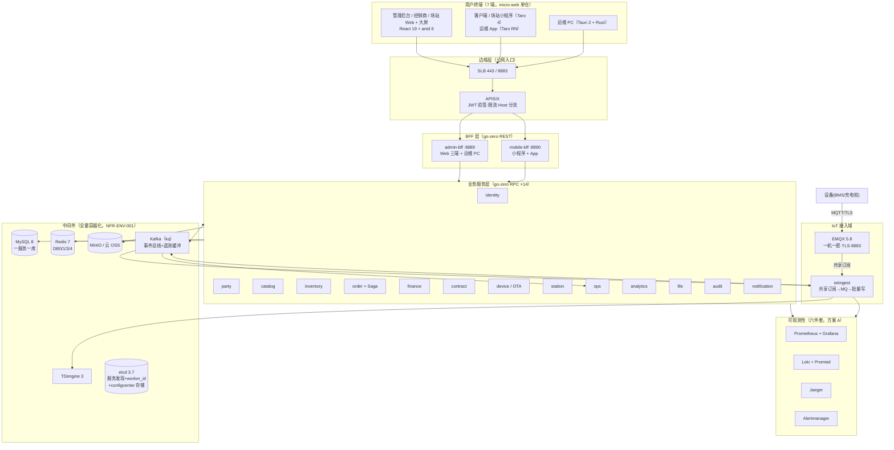

# 电池全生命周期管理平台 · 技术架构文档

**版本**：v4.0
**日期**：2026-10-06
**对应需求**：《01-需求文档.md》v4.0
**重构说明**：本版以 **go-zero 官方工程范式与官方生态**（zero-skills 知识库 + go-zero.dev 官网指南）为骨架重写——三层架构、goctl 代码生成流水线、httpx 错误语义、sqlx 数据访问、内置韧性组件、可观测三支柱全部对齐 go-zero 原生路径；**中间件全量官方化：配置中心 = core/configcenter（etcd）、消息队列 = go-queue（Kafka kq）、延迟任务 = 业务表 next_exec_at + cron 注册表扫描**，边缘网关复核维持 APISIX（ADR-01）；同时把 v3 增量（中间件全量容器化、micro-web 仓名、可观测六件套方案 A）合并为正文。**两大技术变更：数据访问层 GORM → goctl model + sqlx（ADR-08）；配置中心 Nacos → configcenter（ADR-10）、消息队列 RocketMQ → go-queue（ADR-12）**。逐条决策见 §17 ADR 汇总与本目录 [README.md](README.md)。

---

## 目录

1. [文档说明](#1-文档说明)
2. [总体架构](#2-总体架构)
3. [go-zero 工程范式（代码怎么写）](#3-go-zero-工程范式代码怎么写)
4. [仓库架构与工程组织（5 仓方案）](#4-仓库架构与工程组织5-仓方案)
5. [服务清单与端口规划](#5-服务清单与端口规划)
6. [数据层](#6-数据层)
7. [接入与边缘组件](#7-接入与边缘组件)
8. [自研公共组件库（micro-common，11 包）](#8-自研公共组件库micro-common11-包)
9. [关键机制设计](#9-关键机制设计)
10. [韧性设计](#10-韧性设计)
11. [可观测性架构](#11-可观测性架构)
12. [前端技术选型（micro-web）](#12-前端技术选型micro-web)
13. [安全架构](#13-安全架构)
14. [数据架构：存储矩阵与备份](#14-数据架构存储矩阵与备份)
15. [部署架构（中间件全量容器化）](#15-部署架构中间件全量容器化)
16. [测试与质量体系](#16-测试与质量体系)
17. [架构决策记录（ADR）汇总](#17-架构决策记录adr汇总)
18. [附录](#18-附录)

---

## 1. 文档说明

- **书写范式**：每个选型按"是什么 → 为什么选 → 用来干什么 → 放弃了什么"书写；go-zero 原生能力优先于自研与三方件，偏离处必须有 ADR 说明。
- **代码范式来源**：第 3 节的工程规范与 go-zero 官方模式一致（Handler→Logic→ServiceContext 分层、契约先行、httpx 错误语义、Context 传播纪律）；`E<编号>` 标注来自原 micro 项目真实踩坑（E1~E18，见附录 C）。
- v1~v3 的技术债已全部偿还或定稿：C1~C10 处置结果见《04-待办与演进.md》清仓表，本文不再出现"技术债"条目。

---

## 2. 总体架构

### 2.1 架构总览图



### 2.2 一次典型请求

**管理端查询**：浏览器 → APISIX（验 RS256 JWT + 限流）→ admin-bff（authz 三层鉴权）→ 业务 RPC（gRPC，etcd 发现 + p2c_ewma 负载均衡 + 内置熔断）→ MySQL（sqlx，行缓存）。

**页面"实时性"（轮询方案，定稿）**：告警/工单页每 10s 调轻量增量接口（未读计数 + since_id），页面隐藏自动暂停；异步触达走微信订阅消息/短信/站内信。**没有任何 WebSocket 长连接组件**。

**设备遥测**：电池 → EMQX（一机一密 + TLS）→ iotingest → Kafka（缓冲）→ 批量写 TDengine（BulkExecutor 500 条/200ms）；越限 → alert_candidate → ops 判定。

### 2.3 分层职责与禁区

| 层 | 职责 | 禁止事项 |
|---|---|---|
| 边缘层 | TLS 终结、JWT 验签、限流、路由 | 不做业务逻辑 |
| BFF 层 | 聚合 RPC（mr.Finish 并行扇出）、字段裁剪、越权拦截 | 不写业务规则、不直连数据库 |
| 业务服务层 | **唯一写入方原则**：每张表只归属一个服务 | 禁止跨服务直连他人数据库；Handler 不写业务逻辑 |
| Model 层 | 显式 SQL + 行缓存 + 事务 | 禁止在 Logic 层拼 SQL；禁止缓存与 DB 双写不一致的旁路写 |
| IoT 接入域 | 协议终结、认证、削峰、批量写时序库 | 不做业务判断（越限规则来自 ops 下发的缓存） |
| 基础设施层 | 通知/文件/审计通用能力 | 不依赖业务服务 |

---

## 3. go-zero 工程范式（代码怎么写）

> 本节是全平台代码的"宪法"。goctl 生成的边界是**约定**而非运行时强制，必须靠 review 与 CI 维持。

### 3.1 三层架构与 ServiceContext

go-zero REST/RPC 服务统一生成 `route → handler → logic → model/RPC client` 四段流，**业务逻辑只允许出现在 Logic 层**：

```go
// Handler：只做 HTTP 语义（解析/响应），零业务逻辑
func CreateOrderHandler(svcCtx *svc.ServiceContext) http.HandlerFunc {
    return func(w http.ResponseWriter, r *http.Request) {
        var req types.CreateOrderReq
        if err := httpx.Parse(r, &req); err != nil {          // 类型/校验标签解析
            httpx.ErrorCtx(r.Context(), w, err)
            return
        }
        l := order.NewCreateOrderLogic(r.Context(), svcCtx)
        if resp, err := l.CreateOrder(&req); err != nil {
            httpx.ErrorCtx(r.Context(), w, err)               // 统一错误出口
        } else {
            httpx.OkJsonCtx(r.Context(), w, resp)
        }
    }
}
```

**ServiceContext 是组装根**：长生命周期依赖（DB 连接、Redis、RPC client、模型、中间件）在此构造一次并共享；请求级数据只走 `context.Context` 或方法参数，禁止全局变量：

```go
type ServiceContext struct {
    Config       config.Config
    OrderModel   model.OrderModel        // goctl model 生成 + 自定义扩展
    InventoryRpc inventoryclient.Inventory
    Auth         rest.Middleware         // authz 中间件
}

func NewServiceContext(c config.Config) *ServiceContext {
    conn := sqlx.NewMysql(c.DataSource)
    return &ServiceContext{
        Config:       c,
        OrderModel:   model.NewOrderModel(conn, c.Cache),   // 自带行缓存
        InventoryRpc: inventoryclient.NewInventory(zrpc.MustNewClient(c.InventoryRpc)),
    }
}
```

**Logic 层规范**：内嵌 `logx.Logger`（`logx.WithContext(ctx)` 初始化）；错误用 `%w` 包装并带上操作上下文（`fmt.Errorf("lock inventory for order %s: %w", req.OrderNo, err)`）；**同一错误只在一层记录日志**（有足够上下文采取行动的那层）；对外错误在传输边界映射为稳定业务码，不泄露 SQL/拓扑/凭证。

### 3.2 契约先行与 goctl 生成流水线

**`.api` / `.proto` 是前后端与服务间的唯一契约源**——改接口先改契约，评审合并后再写实现。生成物不入库手工修改（重新生成会覆盖）；确需定制模板时，模板与 goctl 版本一起锁定。

| 生成物 | 命令 | 说明 |
|---|---|---|
| REST 服务骨架 | `goctl api go -api order.api -dir . --style go_zero` | 可重复执行，不覆盖已实现的 handler/logic |
| RPC 服务骨架 | `goctl rpc protoc order.proto --go_out=. --go-grpc_out=. --zrpc_out=. --style go_zero` | 生成 logic 骨架 + pb + client |
| 数据模型 | `goctl model mysql ddl -src migrations/0001_init.up.sql -dir ./model -cache --style go_zero` | **迁移 SQL 即模型源**；`-cache` 开启行缓存 |
| API 校验 | `goctl api validate -api order.api` | 契约静态检查 |
| OpenAPI 文档 | `goctl api swagger --api entry.api --dir docs/swagger --filename order` | goctl ≥ 1.8.4 内置，替代自研工具（ADR-20） |
| Dockerfile | `goctl docker --go 1.26 --port 8090` | 生成多阶段构建基线，统一硬化后入库 |
| K8s 部署清单 | `goctl kube deploy --name order --port 8090 --namespace micro` | K3s 阶段二基线模板 |

**每次生成后的固定流水线**（写进 Makefile，CI 同款）：

```
go mod tidy → 校验 import 路径与 go.mod module 一致 → go build ./...
→ go vet → golangci-lint → goctl api swagger 重生成（CI diff 阻断文档漂移）
```

**风格统一**：全仓 `--style go_zero`（下划线文件名）；新建服务一律走 `tools/newsvc.sh`（封装 goctl + 端口登记校验，见附录 B）。

### 3.3 HTTP 语义与错误信封

- 响应统一 `{code, msg, data}` 信封：**HTTP 状态码表达系统健康（200/401/403/500），code 表达业务结果**（业务错误也返回 HTTP 200）。
- 通过 `httpx.SetErrorHandler` 注册全局错误出口（micro-common/response 包实现，见 §8）：

```go
func ErrorHandler(err error) (int, any) {
    var ce *errcode.CodeError
    if errors.As(err, &ce) {
        return http.StatusOK, ce.Body()          // 业务错误：200 + {code,msg}
    }
    // 认证类错误码 10401~10406 映射 401，触发前端单飞刷新/互斥弹窗/提级弹窗
    if code, ok := errcode.AsAuthError(err); ok {
        return http.StatusUnauthorized, code.Body()
    }
    return http.StatusInternalServerError, errcode.Internal().Body()  // 不回传内部细节
}
```

- 错误码分段注册（errcode 包，万位段 per 服务），**禁止裸数字**；gRPC 侧经 status code 无损往返。
- 请求类型在 `.api` 里用标签表达校验与文档：`json:"name,example=张三"`、`options=A|B`（枚举）、`range=[1:120]`、`default=1`、`optional`、`path:"id"`、`form:"page,default=1"`——这些标签同时是 goctl swagger 的文档来源（example/options/range 全部进 OpenAPI）。

### 3.4 配置规范

- 配置即 Schema：Go 结构体是唯一配置契约，yaml 里写了结构体不存在的键**不会生效**；`conf.MustLoad(&c, *configFile)` 加载，`${ENV}` 占位符注入敏感值，仓库零真实密钥。

```go
type Config struct {
    zrpc.RpcServerConf                       // RPC 服务必嵌
    DataSource   string                      // DSN 从 env 注入
    Cache        cache.CacheConf             // 行缓存（Redis DB0）
    ConfigKey    string `json:",optional"`   // configcenter etcd key（§7.4）
    OrderTimeout int64 `json:",default=1800"`          // 支付超时秒数
    Mode         string `json:",default=pro,options=[dev|test|pro]"` // pro 开启自适应卸载
}
```

- **启动期配置（端口/DSN/etcd）走本地 yaml + env**——这些在配置中心可用之前就要用；**运行时参数（字典/开关/灰度/告警兜底值/轮询间隔）走 go-zero configcenter**（etcd 存储，`ConfigCenter[T]` listener 秒级生效，见 §7.4 / ADR-10）。
- **配置正本 Git 化**：运行时配置文件存 micro-deploy 仓（PR 评审 + CI 推送 etcd）——Git 即版本历史、diff 即审计、revert 即回滚（configcenter 无管理台 UI，属已知取舍）。
- 每个出站依赖显式超时：服务级 `Timeout`（yaml 毫秒）、RPC client 级 `Timeout`、操作级 `context.WithTimeout`；禁止无限超时。

### 3.5 Context 传播纪律

- `ctx` 一路透传到 model/RPC/MQ 生产（cancel、deadline、trace、租户全靠它）；任何阻塞调用不带 ctx 视为缺陷（review 硬项）。
- goroutine 不丢 ctx：`go func(ctx){...}(l.ctx)`；需要独立生命周期的后台任务（事件消费推进 Saga 等）用 `context.WithoutCancel` 显式声明，**严禁挂请求 ctx**（E5）。
- 不把请求 ctx 存进单例；后台作业失败要"可观测的失败"（日志 + 对账暴露），不静默重试（E13）。

---

## 4. 仓库架构与工程组织（5 仓方案）

### 4.1 仓库清单

| 仓库 | 内容 | 独立理由 |
|---|---|---|
| **`micro-common`** | Go 公共库（11 个包，单一 Go module） | 稳定、被所有服务依赖，**必须版本化发布**（semver tag） |
| **`micro-server`** | 18 个后端服务（每服务独立 Go module + go.work）+ tools 工具箱 | 服务迭代快，与 common 解耦 |
| **`micro-web`** | 前端全部端：Web 三端（admin/dealer/station）+ 客户端/场站小程序 + 运维 App + packages/shared（pnpm workspace） | **v3 定稿更名**（原 micro-frontend）；前端团队小，合仓共享请求层/权限/类型最省事 |
| **`micro-desktop`** | Tauri 运维 PC（Rust + 复用 micro-web/apps/admin 产物） | Rust 工具链隔离 |
| **`micro-deploy`** | compose（profiles）/ K3s / ArgoCD / **configcenter 配置正本（Git 化）** / 密钥样例 / env.md / runbook | 部署配置单独授权，密钥边界清晰 |

> 拆分触发条件：前端 ≥4 人或小程序团队独立——届时按 `apps/*` 目录 `git filter-repo` 抽仓，目录边界即拆分边界。

### 4.2 跨仓库协作规则

| 规则 | 说明 |
|---|---|
| **common 版本化** | 合并 main 打 tag（v0.x.y）；服务仓库 go.mod 版本引用；破坏性变更升次版本 + CHANGELOG |
| **本地联调** | 开发机约定目录 clone 全部仓库，根放**不入库的开发用 go.work**（`use ./micro-common; ./micro-server/services/*`）——分仓存储、单仓开发体验 |
| **接口先行** | 契约 PR 先行评审；apitypes/swagger 都以契约为源，CI 漂移阻断 |
| **类型生成** | apitypes 从 `.api` 生成 TS 类型到 micro-web/packages/shared/types；swagger 用 goctl 内置生成 |
| **提交规范** | 中文 conventional commits + 任务号（S<N>-<NN>） |

### 4.3 目录骨架

```
micro-common/                  # 11 个包（见第 8 节）
micro-server/
├── go.work                    # services/* + tools
├── services/                  # 18 个服务（goctl 生成骨架 + logic 实现 + model）
│   └── order/
│       ├── api/order.api      # 或 pb/order.proto —— 契约入库
│       ├── internal/
│       │   ├── config/        # 配置 Schema（§3.4）
│       │   ├── logic/         # 业务逻辑（唯一允许写业务的地方）
│       │   ├── handler/ | server/  # goctl 生成，禁止手改
│       │   ├── svc/           # ServiceContext 组装根
│       │   ├── model/         # goctl model 生成 + custom 扩展（§6.2）
│       │   └── middleware/    # 服务私有中间件
│       └── etc/order.yaml     # `${ENV}` 占位配置
└── tools/                     # migrate/seed/envcheck/dodcheck/apitypes/mqinit/devicesim/reconcile...
micro-web/
├── pnpm-workspace.yaml
├── apps/                      # admin / dealer / station
├── apps-miniapp/              # client / station（Taro）
├── apps-mobile/               # 运维 App（Taro RN）
└── packages/shared/           # 请求层/权限/轮询 hook/生成类型
micro-desktop/                 # src-tauri（diag/flash/transfer）
micro-deploy/
└── compose/dev/               # docker-compose.dev.yml + .env.example + 各组件配置子目录
```

---

## 5. 服务清单与端口规划

### 5.1 服务清单（18 个）

| 类别 | 服务 | 说明 |
|---|---|---|
| RPC ×14 | identity / party / catalog / inventory / order / finance / contract / device / station / ops / analytics / file / audit / notification | zrpc + etcd 注册，一服务一库 |
| BFF ×2 | admin-bff（:8889）/ mobile-bff（:8890） | go-zero REST，聚合与鉴权 |
| IoT | iotingest（OCPP :8182） | 独立进程，遥测/指令/OCPP 网关 |
| 模板 | hello（:8888） | 新服务参考模板 |

### 5.2 业务服务端口（定稿）

| 服务 | RPC/HTTP | Metrics | 服务 | RPC/HTTP | Metrics |
|---|---|---|---|---|---|
| identity | 8081 | 9101 | order | 8090 | 9110 |
| party | 8082 | 9102 | station | 8091 | 9111 |
| catalog | 8083 | 9103 | finance | 8092 | 9112 |
| inventory | 8084 | 9104 | contract | 8093 | 9113 |
| device | 8085 | 9105 | ops | 8094 | 9114 |
| file | 8086 | 9106 | analytics | 8095 | 9115 |
| audit | 8087 | 9107 | hello(模板) | 8888 | 9117 |
| notification | 8089 | 9109 | **admin-bff** | **8889** | 9118 |
| iotingest | —（OCPP 8182） | 9120 | **mobile-bff** | **8890** | 9119 |

> 预留不分配：8088/9108（原 config）、8096/9116（原 subscription）。**新服务先在此表登记再取号**（E12）。Metrics 端口即 go-zero `Prometheus.Port`，Prometheus 抓取目标 = `host.docker.internal:91xx`（容器内 127.0.0.1 指容器自己，E17）。

### 5.3 中间件端口（全量容器化，宿主机端口 = 官方默认 + 20000）

| profile | 服务 | 容器端口 | 宿主机端口 | 备注 |
|---|---|---|---|---|
| core | MySQL 8.0 | 3306 | **23306** | root + 应用账号双账号；镜像 tag 锁定小版本 |
| core | Redis 7 | 6379 | **26379** | requirepass；DB0/1/3/4 划分沿用 §6.3 |
| core | etcd 3.7 | 2379 / 2380 | **22379 / 22380** | 服务发现 + worker_id + APISIX 配置存储 |
| core | TDengine 3 | 6041 / 6030 | **26041 / 26030** | REST 必须 Basic 认证（E7） |
| core | **Kafka 4.x（KRaft 单机）** | 9092 | **29092** | 事件总线 + 遥测缓冲（kq）；dev 免 ZooKeeper |
| edge | EMQX 5.8 | 1883/8883/18083 | **21883/28883/38083** | TLS 8883 唯一生产口径不变；WS 8083 不映射（OCPP WebSocket 在 iotingest:8182） |
| edge | APISIX 3.11 | 9080/9180 | **29080/29180** | etcd 走容器网 `http://etcd:2379` |
| edge | MinIO | 9000/9001 | **29000/29001** | init 容器幂等建双桶 micro-file / micro-contract |
| obs | Prometheus | 9090 | **29090** | 抓取 `host.docker.internal:91xx`（E17） |
| obs | Grafana | 3000 | **23000** | provisioning 自动装配 |
| obs | Loki / Promtail | 3100 / — | **23100** / 不映射 | Promtail 只出站推送 |
| obs | Jaeger all-in-one | 16686/4317/4318 | **36686/24317/24318** | UI / OTLP gRPC / OTLP HTTP |
| obs | Alertmanager | 9093 | **29093** | webhook → notification |
| obs | Pyroscope（可选） | 4040 | **24040** | 持续剖析火焰图（ADR-24）；排障时随 obs profile 启动 |

> 15 个常驻容器（含可选 Pyroscope，另 + minio init 一次性容器）。端口冲突处理：落地前 `netstat` 核对 22379~38083 号段，被占则 +1 顺延并**回写本文档表、compose 注释、env.md 三处**；新增组件按 +20000 规则取号并先登记（E12）。组件取舍依据见 §17 ADR（10/12/18/21/24）。

---

## 6. 数据层

### 6.1 MySQL 8.0（一服务一库）

- 一服务一库是数据自治底线：服务 A 永不 JOIN 服务 B 的表；聚合走 BFF（实时）/ analytics 读模型（报表）。
- 库清单（14 个业务库）：identity / party / catalog / inventory / order / finance / contract / device / station / ops / analytics / notification / file / audit，外加 TDengine iot_db。
- 规范：全表通用字段（tenant_id/created_*/updated_*/deleted_at 软删）；雪花 int64 主键；对外 ID 字符串化；金额 DECIMAL；状态用 VARCHAR 枚举（加枚举零 DDL）；utf8mb4/InnoDB。
- **迁移 SQL 是表结构唯一事实源**：golang-migrate 成对 up/down（CI 静态检查成对与顺序），goctl model 从迁移 SQL 生成模型（§6.2）。

### 6.2 数据访问：goctl model + sqlx（ADR-08）

数据访问采用 go-zero 原生路径（goctl model + sqlx）；与 ORM 方案（GORM + Callbacks）的对比如下：

| 维度 | v2（GORM + Callbacks） | v4（goctl model + sqlx）✅ |
|---|---|---|
| 代码来源 | 手写模型 + 手写链式查询 | **迁移 SQL → goctl 生成**：Insert/FindOne/FindOneByXxx/Update/Delete + 行缓存自动生成 |
| 缓存 | 自行维护 cache-aside | `-cache` 生成物自带：按主键/唯一键缓存，Update/Delete 自动失效 |
| 事务 | db.Transaction | `sqlx.TransactCtx(ctx, func(ctx, session) error)`，ctx 全程透传 |
| 租户隔离 | ORM Callbacks 注入 WHERE/INSERT 回填（隐式魔法） | **SQL 显式携带** `tenant_id = ?`：model 层 SQL 是明文字符串，tenantaudit 静态检查直接 grep 文本，比 AST 分析链式调用可靠得多 |
| 软删 | Callbacks 全局 scope | custom model 覆写生成方法，SQL 显式带 `deleted_at IS NULL` |
| 依赖 | 重依赖 + 链式 API 黑盒 | 仅 sqlx 轻量层；与 go-zero 熔断/指标天然集成 |

**约定（写进附录 B 新表 checklist，tenantaudit CI 把关）**：

1. **生成物只作参考**：租户表/软删表的标准方法必须在 custom 文件覆写——`FindOne` 重定义为 `WHERE id = ? AND tenant_id = ? AND deleted_at IS NULL`；goctl 重生成只写 `_gen.go`，custom 文件不会被覆盖。
2. **行缓存键与租户**：主键行缓存命中可能返回其他租户的行——租户敏感查询一律走 custom 方法（带 tenant_id 条件 + `QueryRowNoCacheCtx`/`QueryRowsNoCacheCtx`），或以 `tenant:{tid}:{pk}` 复合键手工缓存（`CachedConn`）。
3. **INSERT 必含 tenant_id**：Logic 层从 ctx 取租户（tenantx.MustTenantFromCtx）填入模型再 Insert；tenantaudit 校验每条租户表 INSERT 都带 tenant_id 列。
4. **唯一键兜底幂等**：幂等键（payment_no、saga_id+step、event_dedup）建唯一约束，插入冲突按 `mysql.MySQLError 1062` 判定转业务语义；`model.ErrNotFound`（sqlc.ErrNotFound）必须显式处理，不得裸抛。
5. **列表禁 SELECT \***：显式列名；大字段（JSON）单独评估拆表；列表查询走 `QueryRowsNoCacheCtx`（列表不缓存）。

**典型事务**（库存扣减，模式来自 zero-skills）：

```go
err := l.svcCtx.DB.TransactCtx(l.ctx, func(ctx context.Context, session sqlx.Session) error {
    // 行锁 + 余量守卫：affected==0 即库存不足
    res, err := session.ExecCtx(ctx,
        `UPDATE inventory SET available = available - ?, locked = locked + ?
          WHERE warehouse_id = ? AND sku_id = ? AND available >= ? AND tenant_id = ?`,
        qty, qty, wid, sku, qty, tid)
    if err != nil {
        return err
    }
    if n, _ := res.RowsAffected(); n == 0 {
        return ErrInsufficientStock
    }
    return l.insertStockRecord(ctx, session, ...)   // 同事务写流水 + Outbox 事件
})
```

### 6.3 Redis 7（逻辑 DB 划分）

| DB | 用途 |
|---|---|
| 0 | 业务缓存（goctl model 行缓存 + 设备影子 + 告警规则缓存） |
| 1 | 预留（任务队列位；当前延迟任务走 DB 扫描——next_exec_at + cron 注册表） |
| 2 | **预留**（v1 曾为 Centrifugo 引擎，组件已删；编号保留不复用，避免新旧环境混淆） |
| 3 | 分布式锁（库存预扣） |
| 4 | 认证会话中心 + auth_cache（RBAC 每请求校验，见 §9.5） |

- go-zero `cache.CacheConf` 配置在 DB0，node 模式（集群化时改 cluster，代码零改动）。
- 分布式限流用 go-zero `limit.PeriodLimit`/`TokenLimit`（§10）；分布式锁用 `redis.NewRedisLock`（SET NX + 看门狗续期）。

### 6.4 TDengine 3.x（时序库）

- 超级表-子表模型贴合"一设备一子表"；内置连续查询做降采样保留策略；**同时间戳覆盖写 = 遥测重传天然幂等**。
- 建模（ADR-13）：按 product_key 超级表、SN 子表；热点五指标独立列 + raw VARCHAR 列；REST 6041 **必须 Basic 认证**（E7）。
- 放弃了什么：InfluxDB（开源版集群受限）；TimescaleDB（运维栈分裂）；VictoriaMetrics（监控指标场景，ADR-15）。

### 6.5 MinIO（S3 兼容对象存储）与 PDF 渲染（Go 原生库）

- MinIO：本地开发、上云换 OSS endpoint 零改码。双桶：micro-file（普通文件）+ micro-contract（合同桶，版本控制）。oss_key 规范 `/{tenant}/{biz_type}/{yyyy}/{mm}/{uuid}.{ext}`；临时下载令牌（HMAC 签名 URL）。
- **PDF 渲染走 Go 原生库（进程内，零外部依赖，ADR-18）**：报表导出（FR-ANA-003 的 CSV/XLSX/PDF）与合同打印稿（FR-CTR-001，L2 辅助能力）均为简单表格/文字版式，Go 原生 PDF 库（如 go-pdf 系）完全覆盖；合同基线是"线下签署 + 上传归档"，平台不解析、不生成正式合同文书。**再评条件**：出现复杂版式硬需求（高保真图文混排/签章位排版）时引入 Gotenberg 容器（:23001，先登记再起），调用统一走异步导出队列（切换点登记于 04 §2）。

### 6.6 消息队列：go-queue——Kafka(kq)（ADR-12）

- **是什么**：go-zero 官方队列库 [go-queue](https://github.com/zeromicro/go-queue) 的 `kq`：封装 Kafka（底层 segmentio/kafka-go）做**事件总线**（发布/订阅 + 消费组）。官网指南齐备（guides/queue/kafka），go-zero 官方示例项目 looklook 即 kq 生产用例。**只引入 Kafka 一件**：延迟任务不引入 Beanstalkd/dq，统一走"DB 扫描"模式（见下，ADR-09）。
- **为什么替换 RocketMQ**：①事件总线 + 遥测削峰（200~2000 条/s）Kafka 一步到位；②RocketMQ 的三坑（brokerIP1/listenPort 自洽、topic 预建、消费者实例名唯一）随之消失；③官方生态一致性（looklook 先例），KRaft 单机 dev 零负担。
- **kq 事件总线要点**：
  - 生产：`kq.NewPusher(brokers, topic)` + `PushWithKey(ctx, key, val)`——**同聚合（order_no/sn）同 key 同分区，per-aggregate 有序**；可选 chunkSize/flushInterval 批量；
  - 消费：`kq.MustNewQueue(KqConf{Group/Topic/Offset/Consumers/Processors}, handler)`，handler 签名 `Consume(key, val string) error`；以 `service.ServiceGroup` 统一启动/停止；
  - **重试/DLQ 官方不内置，eventbus 自建承接**（这是替换 RocketMQ 换来的责任）：消费失败 → Relay 按 next_retry_at **DB 退避重投**（1m/5m/30m）≤16 次 → **eventbus dead 表 + 告警**；解码失败的畸形消息记轨迹后 ack，不无限重试；幂等照旧（event_dedup 同事务，at-least-once 是前提，不存在 exactly-once）；
  - topic 命名**延续下划线**（Kafka 允许点号，为与历史事件契约一致不改）；topic 由 `tools/mqinit` 预创建。
- **延迟任务机制（不用 MQ 延迟消息）**：全项目延迟需求均为分钟级（支付超时 30min、工单升级、Saga 重试、消费失败重投）——统一模式 = **业务表状态字段 + `next_exec_at` 索引列 + cron 注册表扫描（登记 + last_run 指标）**，与 saga.next_retry_at / Relay SKIP LOCKED / 巡检生成是同一套语义；任务与业务状态同库，积压一查便知。**再评条件（ADR-09）**：出现秒级延迟需求或任务量级显著上升时，加回 go-queue 的 dq（Beanstalkd，官方 Delay/At API 现成，成本 = 一个容器）。
- **放弃了什么**：RocketMQ 原生消费组重试/死信的"白嫖" → 转为 eventbus 包自建职责（本就是自研包装层，职责变厚而非新增组件）；MQ 延迟消息（RocketMQ delay 消息与 go-queue dq 均不用）→ DB 扫描模式；go-queue 之外的自研队列。

---

## 7. 接入与边缘组件

### 7.1 APISIX 3.11（API 网关）

- etcd 原生存储（prefix `/apisix` 隔离）；插件全（jwt-auth RS256/限流/traffic-split 灰度）；Admin API 热更新。
- 用途：公网唯一 HTTP 入口；Host 分流（admin./dealer./station. → admin-bff，m. → mobile-bff）；边缘 JWT 验签；per-route 限流；**灰度发布通道一**（traffic-split 按 header/权重，§15.4 ADR-22）。
- **v4 复核（ADR-01）**：不采用 go-zero 内置 gateway 做边缘——它是库级"HTTP↔gRPC 代理"（静态 Mappings、Target 直连、无鉴权/限流/插件/灰度能力），定位是体系内粘合工具，接不住边缘需求（TLS 终结/JWT 验签/限流/Host 分流/traffic-split）；其 gRPC 网关（REST→gRPC，proto 驱动）保留为"内部 gRPC 快速暴露"的备选工具，非默认路径。
- 放弃：go-zero 内置 gateway（边缘定位不符，见上）、Kong（配置链路重）、Nginx 手写（无动态 API）、云网关（锁定供应商）。

### 7.2 EMQX 5.8（MQTT Broker）

- 开源版内置认证库（一机一密 REST 写入）；共享订阅（`$share/ingest/...` 多实例消费不丢）；TLS/ACL 开箱即用。
- ACL：设备仅可发布 `up/{tenant}/{pk}/{自身SN}/#`、订阅 `down/{自身SN}/#`。
- 教训：数据出口走"共享订阅→自研 iotingest"而非 EMQX bridge（开源 bridge 不稳，ADR-04）；**容器重建后必须重跑 emqx/bootstrap.sh**（认证器随容器丢失，E6；挂卷降低概率但不豁免）。

### 7.3 OCPP 1.6J 网关（iotingest 内置）

平台充当 CSMS；BootNotification/Heartbeat/StatusNotification/MeterValues 映射进既有遥测五指标链路——桩与电池同一套监控告警。验收口径 = 协议标准 + 模拟桩；OCPP 2.0.1 预留扩展位。**协议适配拆分条件（ADR 定稿）**：接入协议 ≥3 种（MQTT/OCPP/Modbus/厂商私有）时拆 protocol-gateway 独立部署，共享"五指标→MQ"契约。

### 7.4 配置中心：go-zero core/configcenter（ADR-10）

- **是什么**：go-zero 内置配置中心 `configcenter.ConfigCenter[T]`——官方内置 etcd subscriber，`GetConfig()` 走内存快照（不逐次打远程）、`AddListener` 注册变更回调秒级生效、泛型类型安全、json/yaml/toml 格式 + go-zero 标签校验；自定义 `Subscriber` 接口（`AddListener`/`Value` 两方法）可对接 Consul/Nacos/Apollo，接口留作后备。
- **托管内容**：业务字典、功能开关、灰度配置、告警规则参数兜底值、轮询间隔等运行时可调参数；各服务挂 listener 感知变更，**不引入 config_changed 事件**。启动期配置（端口/DSN/etcd 地址）仍走本地 yaml + env（配置中心可用之前就要用）。
- **配置正本 Git 化**：configcenter **无管理台 UI/版本历史/回滚按钮**——运行时配置文件存 **micro-deploy 仓**（修改走 PR 评审），CI 推送至 etcd：**Git 即版本历史、diff 即审计、revert 即回滚**；灰度开关 = Git 配置 + APISIX traffic-split 双通道（ADR-22）。
- **为什么替换 Nacos**：官方原生组件，etcd 本就常驻（服务发现/worker_id），**删 Nacos 容器与 derby→MySQL 生产化项**；原 v2 引入 Nacos 的"多语言 SDK"理由经盘点不成立（18 个服务全 Go，前端不读配置）。**需要管理台/多语言/灰度控制台时**：自定义 Subscriber 对接 Nacos，客户端代码不变，只换存储后端。
- 分工边界：**服务发现与配置中心共用 etcd**——prefix 隔离：configcenter 配置挂 `/micro/config/...`，服务注册 key 照旧，APISIX prefix `/apisix` 照旧，三者互不相交。

### 7.5 实时性方案：统一轮询（定稿，替代推送组件）

```
前端 usePolling hook（10s 间隔）
  ├─ 页面隐藏自动暂停（visibilitychange），回前台立即拉一次
  ├─ 轮询接口 = 轻量增量：GET /api/v1/alerts/pending?since_id=xxx
  │    返回：未读计数 + 增量列表（单响应 < 5KB，P95 < 100ms）
  └─ 任何写操作（确认/转工单）成功后手动触发立即刷新
异步触达（人不在页面时）：微信订阅消息 / 短信 / 站内信（notification 统一出口）
```

- 500 并发用户 × 10s 一次轻量查询 = 50 QPS，任何一层无压力；轮询接口自身 QPS/延迟进 RED 看板（§11）。
- **升级条件（ADR-02）**：告警时效进秒级、或"派单即时弹窗"成为硬需求、或轮询接口压力逼近阈值——**升级首选 go-zero 内置 SSE**（Server-Sent Events，rest 框架原生支持的单向推送，零新增组件；前端 EventSource 取代 usePolling），其次才评估 WebSocket/自研网关；接口层只换 hook 实现，业务代码不动。

---

## 8. 自研公共组件库（micro-common，11 包）

> go-zero 内置能力之外的补集。v4 变化：tenant 由 GORM 插件改为 SQL 规约支撑包；response 落在 `httpx.SetErrorHandler` 上；其余包接口稳定。

| 包 | 一句话职责 | v4 要点 |
|---|---|---|
| **errcode** | 错误码分段注册器（万位段），gRPC status 无损往返 | 每服务 `*_err.go` 集中登记，禁止裸数字 |
| **response** | `{code,msg,data}` 信封；**基于 `httpx.SetErrorHandler` 全局注册**；业务错误 HTTP 200，认证码 10401~10406 映射 401 | 前端一套拦截器处理全部错误；不再包装 w.Write |
| **ctxkit** | 操作人/租户/端/角色/data_scope 统一从 context 取写 | 横切信息进 ctx 全链透传，杜绝参数膨胀 |
| **snowflake** | 分布式 ID：41bit+10bit worker+12bit 序列；**etcd 租约分配 worker_id**（退出释放；etcd 不可用时退化环境变量） | 冲突不静默 |
| **crypto** | argon2id（OWASP 参数）/ AES-256-GCM + KeyProvider（kid 轮换，EnvKeyProvider 起步，KMS 补位即插）/ Mask* 脱敏 | 密钥环境变量注入 |
| **jwtauth** | RS256 签发校验；**header 内置 kid + 多公钥集合**（轮换期新旧并存） | claims 极简（uid/sid/client/level/jti），权限不进 JWT |
| **sessionx** | Redis DB4 会话中心：sess:{sid} / uid_sessions ZSET / mutex:{uid}:{client} / refresh 轮换+重用墓碑 / login_fail 锁定 | identity 唯一读写方 |
| **authz** | BFF 三层鉴权中间件（按 zero-skills middleware 模式实现）：验签(kid 选钥)→会话→client 匹配→RBAC 每请求查 Redis auth_cache→敏感路由 auth_level→ctx 注入→RPC metadata 桥 | fail-open 普通路由（Redis 故障 + 本地 LRU 兜底）/ fail-close 指令与财务 |
| **tenantx** | **SQL 规约支撑包**（ADR-08 配套）：租户从 ctx 注入模型、`Skip` 显式豁免、Scoped/Exempt 登记表、`limit.PeriodLimit` RPM 配额 | 过滤本身在 model SQL 显式携带；tenantaudit CI 静态对账 |
| **eventbus** | Outbox（业务事务内 `Emit(tx, ...)` 写事件）+ Envelope 信封 + Topic 常量（下划线）+ Relay（SKIP LOCKED 投递 + 消费失败 next_retry_at DB 退避重投 ≤16 次 → dead 表 + 告警）+ Subscriber（event_dedup 同事务去重 + trace/租户恢复） | 平台一致性基石；kq Pusher（PushWithKey 保序）封装（同步发送 + 关闭 Flush）；RocketMQ 原生重试/DLQ 的职责由本包承接（ADR-12） |
| **testinfra** | 测试环境三级解析（MICRO_TEST_* env → 本机 → testcontainers → Skip） | CI 含 TDengine 容器作业强制全量；本地跑 CI 同款命令 |

**明确不写的包**（go-zero 已内置，重复造轮子=负资产）：熔断（`core/breaker`，RPC/sqlx/Redis 自动生效）、自适应卸载（`Mode: pro`）、负载均衡（p2c_ewma）、限流（`core/limit`）、并发原语（`mr`/`threading`/`syncx.SingleFlight`）、批量缓冲（`executors`）、本地缓存（`collection.Cache`）、定时轮（`collection.TimingWheel`）、日志/指标/链路（logx/Prometheus/otel）。

---

## 9. 关键机制设计

### 9.1 Saga 订单状态机（自研，ADR-03 维持）

```
CREATED → INVENTORY_LOCKED → PAID → STOCK_OUT → CONTRACT → [STATION] → DONE
```

三件套：saga 表（step/status/retry/next_retry_at/context_json）+ outbox + **cron 扫描推进**（支付超时 = pay_expire_at 扫描；重试按 next_retry_at 退避 1m/5m/30m；超限 → 人工介入队列）。

| 步骤 | 动作 | 服务 | 补偿 | 幂等键 |
|---|---|---|---|---|
| 1 | 创建订单 | order | 本地回滚 | order_no |
| 2 | 锁定库存 | inventory | 释放 | saga_id+lock |
| 3 | 发起支付 | finance | 退款 | saga_id+pay |
| 4 | 出库扣减 | inventory | **不可自动补偿→人工队列** | saga_id+out |
| 5 | 合同+质保 | contract | 重试至成功 | saga_id+contract |
| 6 | 建站+绑设备（场站单） | station | 重试+人工队列 | saga_id+station |

**补偿纪律**（对齐 zero-skills Saga Compensation Checklist）：

- 补偿不是数据库回滚，是**新的业务动作**，可能晚很久才执行——saga.context_json 必须保存补偿所需的全部原始业务标识。
- 补偿动作必须在部分执行后仍安全（幂等键 saga_id+step）；补偿自身反复失败 → 冻结 + 人工队列，不做有损补偿。
- 全局事务 ID（saga_id）进日志与审计；补偿分支接口不接受任意调用方触发（仅 saga 推进器可达）。
- 教训：事件消费推进 Saga 用 `context.WithoutCancel`（E5）。

**为什么不用 DTM / Temporal**：单编排主干几百行可控；DTM（含 go-zero driver）提供现成 Saga/TCC + barrier 幂等表，是多流编排时的首选迁移目标；Temporal 面向长周期工作流。**重评条件（ADR-03）**：编排流 ≥3 条或多天级人工节点——届时优先迁 DTM（Saga 语义同构，barrier 思路已被本设计吸收），其次 Temporal。

**验证策略（固化进 chaosmoke 用例）**：正向成功 / 正向失败+补偿成功 / 分支重复投递 / 本地提交后响应丢失 / 服务超时 / 协调器（order 进程）重启 / 补偿失败后重试 / 同一业务资源并发事务——至少覆盖前六项。

### 9.2 库存防超卖（双保险）

Redis `DECRBY` 原子预扣（负值回滚拒绝，挡并发）→ DB 事务行锁兜底（`FOR UPDATE` 语义 UPDATE + 余量守卫，见 §6.2 事务样例）；Redis 故障自动降级纯 DB 路径（同样不超卖）；四态记账 + stock_record 流水；幂等键 (biz_type, biz_no) 唯一约束。100 并发抢 50 零超卖为 CI 固化用例。

### 9.3 事件驱动与最终一致（Outbox 指南）

Outbox（业务变更与事件同事务写入，event_id 稳定）→ Relay（SKIP LOCKED 拉取，标记可恢复的状态迁移，退避重投）→ Kafka kq（at-least-once，`PushWithKey` 顺序键=聚合 ID）→ 消费端 event_dedup 同事务去重 → 消费失败 Relay 按 next_retry_at DB 退避重投 ≤16 次 → **eventbus dead 表 + 告警** → 库存/资金日结对账兜底，**差异修复只允许补投递重放**（禁止裸删，E10）。

> 语义声明：这不是 exactly-once——投递侧 at-least-once + 消费侧幂等，才是完整的正确性。

### 9.4 多租户运行时（v4 机制）

- **数据层**：租户过滤在 model 层 SQL 显式携带（§6.2 约定）；Logic 层经 tenantx 从 ctx 取租户填模型；无租户上下文的业务查询 fail-closed 拒绝（tenantx.MustTenantFromCtx）。
- **豁免**：平台共享表走 Exempt 清单（登记理由）；后台作业用 `tenantx.Skip` 显式豁免；事件信封携带 tenant_id，消费侧恢复。
- **CI 门槛**：tenantaudit 静态对账——每张租户表的每条 model SQL 必须含 tenant_id 条件/列，或已登记豁免；漏配直接阻断合并。
- **配额**：`limit.PeriodLimit`（Redis，60s 分钟桶）按 tenant 限 RPM，429 + RateLimit 头；default 租户与 quota=0 不限。

### 9.5 认证体系（三层检查点 + 每请求鉴权）

```
APISIX（快）           BFF 中间件（准）                    identity（唯一写入方）
├─ TLS/限流            ├─ 验签（按 kid 选公钥★）           ├─ 登录/刷新/踢人/封禁
├─ JWT 验签+过期       ├─ 查 sess:{sid} 会话状态           ├─ refresh 轮换+重用检测
└─ Host 路由           ├─ client 端匹配校验                ├─ step-up 二级认证
                       ├─ RBAC：每请求查 Redis auth_cache★ ├─ 会话查询/踢人 API
                       ├─ 敏感路由查 auth_level            └─ GetAuthCache 权限集写入
                       └─ 注入 uid/sid/tenant 到 ctx
```

- **kid**：JWT header 带 kid，验签方按 kid 从多公钥集合选择——密钥轮换期新旧并存、零停机；轮换流程写 runbook。
- **auth_cache**：identity 将"角色→权限码"写入 Redis（变更即时失效），BFF 每请求一次 GET（+0.3~0.5ms）——**降权即时生效**；本地 `collection.Cache`（LRU）仅在 Redis 故障 fail-open 窗口兜底。
- 同端互斥 QQ 模式；认证码 10401~10406 前端分流（10401 静默刷新/10402 互斥弹窗/10406 提级弹窗）。
- **为什么不用 go-zero 内置 jwt 注解、不换 IdP**：内置 `jwt: Auth` 是无状态验签，无法做互斥/踢人/封禁即时生效这类**服务端权威的有状态会话**；标准 IdP（Keycloak/Zitadel）面向无状态 OIDC，即时作废是弱项（ADR-11）。**重评条件**：对外开放平台（对外发 OIDC token）或 3+ 外部 IdP 联邦——届时首选 Zitadel（Go 原生）。

### 9.6 遥测管道（背压设计，全部使用 go-zero 原生组件）

```
设备 → EMQX(TLS/一机一密)
  → iotingest forwarder（$share/ingest 共享订阅）→ Kafka iot_telemetry_raw（MQ ack 后才 ack MQTT）
  → writer 消费组 → executors.BulkExecutor（WithBulkTasks(500) + WithBulkInterval(200ms)）
       → 批量写 TDengine（超级表/SN 子表/热点列+raw/同 ts 覆盖幂等）
       → Flush/Wait 于优雅关闭，缓冲不丢
  → 规则命中：本地规则缓存（collection.Cache LRU，30s TTL + configcenter 变更失效 + syncx.SingleFlight 防击穿）
       → 发 alert_candidate → ops 判定
```

- **BulkExecutor 回调不返回错误**：批量写失败必须持久化重试轨迹（回灌 MQ），不允许只打日志（组件语义约束）。
- **TimingWheel 与持久延迟的分工**：指令 ACK 3s 等进程内细粒度定时用 `collection.TimingWheel`（O(1) 增删，`MoveTimer` 续期）——**内存态，进程重启即失**，因此 cmd 表状态机 + 定时扫描（cron 注册表 + last_run 指标）兜底重发；跨进程/跨重启的延迟任务（支付超时/工单升级）一律 next_exec_at 扫描（ADR-09）。
- iotingest 独立进程，遥测流量不穿透业务 RPC。

### 9.7 指令下行与 OTA

- 指令：cmd 表 + cmd_audit 独立审计 → MQTT `down/{sn}/cmd` QoS1 → TimingWheel 计 ACK 3s → 超时重试 ≤3 → FAILED→告警；控制类 BFF 侧 step-up 强制 + 100% 审计。
- OTA：sha256 + Ed25519 签名（私钥环境变量，未签名拒入库）→ 灰度分批 → 失败率超阈自动 PAUSED → 断点续传 → 回滚。

### 9.8 analytics 读模型（CQRS 变体）

14 类事件 → 六大日聚合表（业务键幂等 + watermark + 消费组版本号全量重建）→ 日级对账（recon_diff）→ 异步导出（MQ 管道：CSV/XLSX/PDF，PDF 用 Go 原生库渲染）。报表不 JOIN 业务库；BFF 聚合多源指标用 `mr.Finish` 并行扇出。

---

## 10. 韧性设计

> 分层防线：`请求 → 自适应卸载 → 限流 → 熔断 → 超时 → 服务`。go-zero 内置项**默认开启**，项目只做策略配置与自研补集。

| 防线 | 机制 | 归属 | 本项目用法 |
|---|---|---|---|
| 自适应卸载 | CPU 驱动过载拒绝（503），自动恢复 | go-zero 内置 | 生产配置 `Mode: pro`（dev/test 自动关闭） |
| 负载均衡 | p2c_ewma（延迟+并发感知） | go-zero 内置 | zrpc 默认，零配置 |
| 熔断 | Google SRE 算法，错误率阈值自动开合 | go-zero 内置 | RPC/sqlx/Redis **全部自动生效**；外部依赖（支付渠道/短信）用 `breaker.DoWithAcceptable` 显式包裹 + 命名监控 |
| 超时 | 服务级 `Timeout` / RPC client 级 / 操作级 `WithTimeout` | go-zero + ctx | 每个出站依赖显式预算；**禁止无限超时** |
| 重试 | `retry.Do`（次数/延迟/指数退避） | go-zero | **仅幂等操作可重试**；多层重试会放大故障——每条出站链路只允许一层重试 |
| 分布式限流 | `limit.PeriodLimit`（周期配额）/ `TokenLimit`（令牌桶） | go-zero | 租户 RPM 配额（§9.4）；公开接口按 IP/用户限流（429 + RateLimit 头） |
| 并发隔离 | `threading.TaskRunner`（worker pool）/ `mr.Finish`（并行扇出）/ `mr.MapReduce`（并行管道） | go-zero | BFF 聚合页并行调 RPC（任一失败快速失败）；导出批处理限并发 |
| 缓存防护 | `syncx.SingleFlight`（合并并发回源）+ LRU 本地缓存 | go-zero | 规则缓存重载防击穿；auth_cache 降级兜底 |
| 认证降级 | 普通路由 fail-open（≤30min 暴露窗口 + 告警）/ 指令与财务路由 fail-close | 自研 authz | NFR-AVL-005 |

**出站依赖韧性策略表**（每个依赖一行，写进各服务 runbook）：

| 依赖 | 超时预算 | 重试 | 熔断 | 降级行为 |
|---|---|---|---|---|
| 内部 RPC | 3~5s | 禁（Saga/事件兜底） | 自动 | BFF 快速失败返回业务码 |
| Kafka 生产（kq Pusher） | 2s | 同步 1 次 + Outbox 重投 | 自动 | Outbox 积压告警 |
| 微信/支付宝渠道 | 5s | 查询类可 2 次退避 | DoWithAcceptable | 渠道降级开关（configcenter）→ 只收对公 |
| 短信 Provider | 3s | 2 次退避 | DoWithAcceptable | 频控 + outbound_log 留痕 |

---

## 11. 可观测性架构

> 四类数据 + 持续剖析全部使用 go-zero 内置出口 + 官方后端（六件套方案 A 定稿 + 可选 Pyroscope 第 7 件，NFR-OBS；ADR-21/ADR-24）。

```
指标: go-zero Prometheus 中间件（:91xx /metrics）→ Prometheus(29090) → Grafana(23000) RED 看板
链路: go-zero otel（Telemetry → OTLP :24317）→ Jaeger（trace_id 贯穿 HTTP→RPC→MQ→消费）
日志: logx（Encoding: json，含 trace_id）→ *_run.log → Promtail 打标 → Loki(23100)（按 trace_id/服务/级别检索）
告警: Prometheus 三级规则 → Alertmanager(29093) → webhook → notification（企微/短信）+ eventbus dead 表/逾期扫描积压告警
剖析: go-zero Profiling（yaml 三行开启）→ Pyroscope(24040) 火焰图（CPU/内存/协程，排障时随 obs profile 启动）
```

- **配置即开关**：yaml 里 `Prometheus: {Host, Port, Path}` 与 `Telemetry: {Name, Endpoint, Sampler, Batcher: otlpgrpc}` 两段即接入；Sampler dev=1.0、生产 0.1（高流量服务）。
- **链路接入硬约束**：`Batcher: jaeger` 已在 go-zero v1.10.0 **删除**（OTel 官方废弃该 exporter，配了启动失败）——必须 `otlpgrpc`/`otlphttp`；Jaeger 镜像 ≥1.35 且 `COLLECTOR_OTLP_ENABLED=true`（all-in-one 1.57 满足）。配置 Telemetry 后 **trace_id/span_id 官方自动注入 logx 每条日志**（无需手动传字段），日志与 Jaeger span 可互跳。
- **业务指标用 go-zero 内置 `core/metric` 注册**（官方姿势：`metric.NewCounterVec/NewHistogramVec` + Namespace/Subsystem/Labels，框架统一注册），命名空间 `micro_`：`orders_created_total{status,channel}`、`telemetry_e2e_latency_seconds`（直方图）、`saga_stuck_orders`（Gauge）、`eventbus_dead_events_total`（dead 表计数）、`cron_overdue_tasks`（next_exec_at 逾期扫描积压）、轮询接口专项（QPS/P95/响应字节数）。**禁止高基数标签**（uid/order_no 不进 label，进日志）；**不要在 handler 重复实现框架已记录的 HTTP/RPC 指标**（`http_server_requests_total`/`rpc_server_requests_total` 等已内置）。
- **logx 结构化日志**：`logx.WithContext(ctx).Infow("order created", logx.Field("order_no", no))`——禁 fmt.Println/log.Println；file 模式落 `logs/`（KeepDays 7 + Compress），Promtail 统一采集。**PII 脱敏走框架机制**：含敏感字段的结构体实现 logx `Sensitive` 接口（`MaskSensitive()`，v1.9.0+），`Infov/Errorv` 及全部 LogField 值自动脱敏，掩码函数统一在 micro-common 定义（§13）。
- **看板分层**：全局总览（QPS/错误率/活跃设备/Kafka 消费延迟 lag/Saga 卡单/逾期扫描积压）→ 服务 RED → 业务指标 → 资源；**服务 RED 基线直接导入 Grafana 官方市场 go-zero 社区看板**（provisioning 引用，不自画），业务指标看板自建；Grafana provisioning 自动装配（micro-deploy 仓）。
- **持续剖析（可选第 7 件，ADR-24）**：服务 yaml 三行开启 `Profiling: {ServerAddr: http://pyroscope:4040}`（v1.8.4+ 原生集成，零代码侵入）→ Pyroscope 火焰图。生产用默认 `CpuThreshold: 700`（CPU 70% 触发），Mutex/Block 采样默认关（影响性能）；价值=资源告警"响了之后怎么定位"：CPU 飙高/内存泄漏/热点函数，与 Grafana 集成协同分析。
- **告警规则基线**（prometheus/rules/）：HighErrorRate（5m 错误率 >5% critical）、HighLatency（P99 >1s warning）、ServiceDown（up==0 critical）、eventbus dead 表积压 >0 warning、Saga 卡单 >0 critical——分级触达电话/短信/企微（NFR-OBS-004）。
- **健康检查**：go-zero 提供 `Mode` 健康口；BFF 另设 `/healthz` 深检（DB/Redis Ping），容器 livenessProbe 指向它。
- **演进位（不加组件）**：需要多后端分发/集中采样策略时，在服务与 Jaeger 之间插入 OTel Collector（官方建议的规模化路径，切换点登记于 04 §2）。
- **上线 DoD（dodcheck 静态把关）**：指标注册 + Telemetry 接入 + 健康检查 + runbook 五节，0 FAIL 才可合并。

---

## 12. 前端技术选型（micro-web）

### 12.1 Web 三端：React 19 + TS + Vite 8 + antd 6（pnpm workspace）

- antd 中后台组件密度最高（29 页管理后台开发速度第一优先）；三端共享 `packages/shared`。
- **shared 包核心**：request.ts（信封/Bearer/401 单飞刷新/10402/10406 分流）、permission.ts、**usePolling.ts（10s/隐藏暂停/回前台即拉/操作后手动刷新）**、apitypes 生成类型。
- 放弃：Vue 系（团队背景）；微前端（明确不做，唯一例外是"客户系统内嵌监控组件"场景用独立 iframe 微应用）。

### 12.2 小程序：Taro 4 + React（weapp）

- React 系与 Web 共享类型与请求层**设计**（fetch 与 Taro.request 各自实现，ADR-05）；一套框架出客户端+场站端两个小程序。
- 客户端小程序分包 = station/service/profile；微信能力：wx.login 静默登录、getPhoneNumber、订阅消息授权（askSubscribeMessage）、checkSession 续期；dev 用 MOCKWX_* 模拟。

### 12.3 运维 App：Taro + React Native

离线工单草稿 + client_action_id 幂等恢复同步；**RN 依赖安装与真机联调先做 spike**（回退：uni-app 壳，ADR-05）。上架审核为用户侧动作。

### 12.4 运维 PC：Tauri 2

- 产物 ~10MB（Electron 100MB+）；capabilities 白名单；串口/CAN/BLE 用 Rust 库（serialport/btleplug）。
- 前端复用 micro-web/apps/admin 产物；Rust 三模块：diag（串口/CAN/BLE JBD 帧，仅本地）、flash（XMODEM-1K 断点续传 + sha256 缓存）、transfer（CSV/XLSX/zip）。

### 12.5 类型与文档生成

- **apitypes**（自研，唯一保留的自定义生成器）：`.api` → TS 类型 → micro-web/packages/shared/types，CI diff 校验防漂移（goctl 无官方 TS 生成器）。
- **swagger**（goctl 内置，ADR-20）：入口 `.api` 写 info 块（`wrapCodeMsg: true` 直接产出 {code,msg,data} 信封文档、`useDefinitions: true` 类型去重、`securityDefinitionsFromJson` + `@server authType: apiKey` 声明 Bearer），`@server tags` 分组、`@doc` summary、字段 example/options/range 标签全部进文档；CI 重生成 + diff 阻断。

---

## 13. 安全架构

| 层 | 措施 |
|---|---|
| 边缘 | TLS 1.2+ 全站；APISIX jwt-auth RS256（多公钥 kid 轮换）；per-route 限流 |
| 应用 | argon2id 密码；BFF 统一越权拦截（水平+垂直）；登录失败锁定；会话/互斥/踢人/step-up；`.api` 校验标签做输入白名单（parameterized SQL 由 sqlx 占位符强制）；**日志脱敏走框架机制**——含 PII 的结构体实现 logx `Sensitive` 接口（v1.9.0+，`Infov/Errorv`/LogField 自动脱敏），maskPhone/maskEmail 等掩码函数统一在 micro-common 定义 |
| 设备 | 一机一密 + TLS 8883 唯一 + ACL 最小主题；错误凭证告警 |
| 指令 | 控制类 step-up + cmd_audit 100% 独立审计；QoS1 + ACK 状态机 |
| OTA | Ed25519 签名私钥出库；未签名不可下发 |
| 数据 | AES-256-GCM 信封加密 + hash 列索引；脱敏展示；kid 轮换 |
| 密钥 | 三件套（RS256/Ed25519/数据密钥）keygen 生成，仓库只存公钥样例；种子密码 MICRO_ADMIN_PW 环境变量；dev 中间件密码 MICRO_DEV_* 组 |
| 网络 | VPC 内网；公网仅 SLB(443/8883)；K3s NetworkPolicy default-deny；dev 中间件端口一律绑定 127.0.0.1 |
| 合规 | 按等保 2.0 二级设计；审计追加式 ≥3 年（测评为所有者决定的合规范畴） |

---

## 14. 数据架构：存储矩阵与备份

### 14.1 存储矩阵与保留

| 数据 | 存储 | 保留 |
|---|---|---|
| 业务库表 | MySQL（14 库） | 永久 |
| 遥测原始 | TDengine | 3 个月 |
| 遥测降采样 | TDengine 连续查询（1min） | 3 年 |
| 告警/工单 | MySQL + 归档 | 热 1 年/归档 3 年 |
| 审计 | MySQL（追加式） | ≥3 年 |
| 合同/保单/固件/照片 | MinIO（合同桶版本控制） | 永久 |
| 配置（字典/开关/灰度） | configcenter（etcd）+ Git 正本（micro-deploy 仓） | 永久 |

### 14.2 备份与恢复

| 对象 | 方案 | RPO/RTO |
|---|---|---|
| MySQL | 每日 mysqldump 全备 → MinIO；生产换 RDS 自动备份+binlog | RPO<5min / RTO<30min |
| TDengine | taosdump 每日 → MinIO；原始可从 MQ 重放（保留 3 天） | RPO 24h |
| etcd | etcd snapshot 每日 → MinIO（configcenter 配置存储随快照，正本另有 Git） | RPO 24h |
| Kafka/EMQX | 不备份（可重建/重放；outbox 原始可重投） | — |

### 14.3 灾后恢复（v4 简化）

`docker compose up -d`（全量容器化后一条命令）→ 重跑 `emqx/bootstrap.sh`（E6）→ 全部后端服务 restart（Redis/EMQX 断连重连）。

---

## 15. 部署架构（中间件全量容器化）

### 15.1 环境矩阵

| 环境 | 用途 | 形态 |
|---|---|---|
| dev | 本地开发 | **全量 compose（profiles：core/edge/obs）**，本机零安装；18 服务 + 前端 dev server 本机启动 |
| test | 部署验证 | 本机 compose 拉镜像（deploy-test.ps1）；ECS 就绪后平移 |
| staging | 预生产 | 与 prod 同构缩配 |
| prod | 生产 | 见 15.3 |

### 15.2 dev compose（micro-deploy/compose/dev）

- 全量单文件 `docker-compose.dev.yml`（顶层 `name: micro-dev`，容器名 `micro-dev-<服务>`，独立网络 micro-dev-net + named volume `micro-dev_` 前缀，与宿主机旧环境零共享）；
- `COMPOSE_PROFILES=core,edge,obs` 在 .env 一处控制；全部服务 `restart: unless-stopped`；
- 卷挂载：有状态数据全 named volume（mysql/redis/etcd/tdengine/kafka/minio/emqx/obs 各卷）；配置 bind mount 一律相对路径（规避 Windows 空格坑，E9）；
- 密码：`MICRO_DEV_*` 前缀，`.env` gitignore、`.env.example` 入库；MySQL 双账号（root 人工 / 应用账号 init SQL 授权 micro_% 库）；TDengine 必改默认密码；不开认证的组件以 127.0.0.1 回环绑定兜底；
- 组网：容器间走服务名+容器端口（apisix→etcd:2379）；Prometheus 抓 `host.docker.internal:91xx`；Kafka 单机 KRaft（dev 免 ZooKeeper，advertised listener 必须是客户端可达地址 `127.0.0.1:29092`，配错=能连上但拿不到元数据）。

### 15.3 生产拓扑（两阶段）

**阶段一（Docker Compose）**：

| 资源 | 运行 |
|---|---|
| ECS-1 4C8G | APISIX、18 个业务服务容器 |
| ECS-2 4C16G+500G | Kafka、EMQX、TDengine、iotingest、可观测六件套（Pyroscope 可选） |
| MySQL/Redis | 本机 → 云托管（切换点已留，B1） |
| OSS | MinIO → 云 OSS |

**阶段二（K3s + ArgoCD GitOps）**：K3s×3（无状态服务 replicas=2，清单由 goctl kube 生成后模板化）+ obs 节点（可观测+TDengine local-path）+ ArgoCD app-of-apps + NetworkPolicy default-deny。节点 >10 再升完整 K8s（ADR-06）。

镜像：统一 Dockerfile（goctl docker 基线 + 硬化：非 root、tzdata、healthcheck、`-ldflags="-s -w"`）+ docker-bake 参数化；tag=git sha；Trivy 扫描（CRITICAL/HIGH 有修复版才阻断）。

### 15.4 发布与灰度

```
PR → CI（build/tenantaudit/swagger-diff/vet/lint/全量 test）→ 合并 main
  → 镜像构建+扫描 → push GHCR → test（拉镜像滚动重启）→ 手动批准 → staging → 生产窗口手动发布
数据库纪律：只前向兼容（先加列后删列、两阶段发布）
```

**灰度双通道（ADR-22 定稿）**：APISIX traffic-split（按 header/权重，流量侧）+ configcenter 灰度开关（Git 正本变更经 CI 推送 etcd，秒级生效）；启用时点 = 多端上线后第一个迭代，新功能先放 5% 内部账号。

---

## 16. 测试与质量体系

| 层 | 手段 |
|---|---|
| 单测 | 各 module `go test`；依赖经 ServiceContext 注入可 mock（model 接口/RPC client 接口）；核心域必覆盖（库存扣减/Saga 状态机/金额计算/权限中间件） |
| 集成 | testcontainers-go（MySQL/Redis）；**CI 含 TDengine 容器作业强制全量**；本地跑 CI 同款命令文档化 |
| 冒烟 | e2esmoke/bizsmoke/p3~p6smoke/iotsmoke/otasmoke/chaosmoke/p5accept/p5perf——**严禁并发**（共享 FIFO 库存池，E1）；chaosmoke 至少覆盖 §9.1 Saga 验证清单前六项 |
| CI 门槛 | build → tenantaudit → **swagger-diff（goctl api swagger 重生成 diff 阻断，含免认证清单校验）** → go vet → golangci-lint → dodcheck → oxlint → 全量 go test |
| 契约 | `goctl api validate` 入 CI；apitypes 生成物 diff 阻断 |
| 性能 | devicesim 2000 台（协议标准报文）；p4load 导出压测；p5perf NFR 复测；轮询接口 500 并发压测 |
| 硬件口径 | **协议标准 + 模拟器全链 = 验收完成线**；真实硬件到位补兼容记录，不设门槛（ADR-19） |

---

## 17. 架构决策记录（ADR）汇总

| # | 决策 | 结论 | 理由 | 重新评估条件 |
|---|---|---|---|---|
| ADR-01 | 边缘网关 | **APISIX（v4 复核维持）**；不采用 go-zero 内置 gateway 做边缘（库级 HTTP↔gRPC 代理：静态 Mappings、无鉴权/限流/灰度）；BFF 后不加内部网关；gateway 的 gRPC 模式留作"内部快速暴露"备选 | etcd 原生/插件全（jwt-auth/限流/traffic-split），go-zero gateway 定位是体系内粘合、接不住边缘需求 | 多语言后端或复杂流量治理 |
| ADR-02 | 实时性 | 不引入推送组件，统一 10s 轮询 + 微信订阅消息；**升级首选 go-zero 内置 SSE**（零新增组件），其次才评估 WebSocket | 组件只服务"页面开着"场景；轮询 50 QPS 无压力；SSE 为框架原生能力 | 告警秒级时效 / 派单即时弹窗 / 轮询压力逼近阈值 |
| ADR-03 | Saga | 自研状态机（saga+outbox+cron 扫描推进）；补偿纪律与验证清单已按业界范式补强 | 单编排流几百行可控 | 编排流 ≥3 或多天级人工节点 → 首选 DTM（go-zero driver），次选 Temporal |
| ADR-04 | EMQX 出口 | 共享订阅 + 自研 iotingest，Kafka 缓冲 | 开源 bridge 不稳（EMQX→RocketMQ 时代教训；自建转发同时获得"MQ ack 后才 ack MQTT"背压点） | EMQX 官方稳定支持 Kafka bridge 且背压语义可等价实现 |
| ADR-05 | Taro 栈 | Taro（React），Web 与小程序共享类型与请求层设计 | 团队 React 背景 | RN BLE spike 失败则运维端回退 uni-app |
| ADR-06 | 容器编排 | K3s | 无专职运维，单二进制低占用 | 节点 >10 或多集群 |
| ADR-07 | 托管/自建 | MySQL/Redis/OSS 云托管；Kafka/EMQX/TDengine 自建 | 不可丢的交云，可重放的自建 | 云服务降价 |
| **ADR-08** | **ORM（v4 变更）** | **GORM → goctl model + sqlx**：迁移 SQL 为唯一事实源，生成 CRUD+行缓存；租户/软删过滤在 model 层 SQL 显式携带，tenantaudit 静态把关 | 契约（DDL）→模型→缓存全自动；SQL 显式可静态审计，多租户隔离比 ORM Callbacks 更可验证；与 go-zero 熔断/指标原生集成；少一个重依赖 | 遇到复杂 ORM 场景（多态关联等）再评估，预计不触发 |
| ADR-09 | 延迟/定时任务（v4：不引入延迟队列） | **延迟任务统一 = 业务表状态字段 + next_exec_at 索引 + cron 注册表扫描**（登记+last_run 指标，分钟级精度；支付超时/工单升级/Saga 重试/消费失败重投同款）；独立批处理作业 → K8s CronJob（cobra 子命令，阶段二）；进程内细粒度定时 → TimingWheel（内存态，须有持久兜底） | 项目已有三处同款扫描模式（saga.next_retry_at / Relay SKIP LOCKED / 巡检 cron），统一一套语义；任务与业务状态同库可查；少一个容器与运维面 | **出现秒级延迟需求或任务量级显著上升** → 加回 go-queue dq（Beanstalkd，官方 Delay/At 现成，成本=一个容器） |
| **ADR-10** | **配置中心（v4 复核）** | **go-zero core/configcenter（etcd 存储）**：`ConfigCenter[T]` watch/内存快照/类型校验；配置正本 Git 化（micro-deploy 仓 PR 评审 + CI 推送 etcd），Git 即历史/回滚；服务发现与配置共用 etcd（prefix 隔离） | 官方原生组件，etcd 本就常驻——删 Nacos 容器与生产化项；"多语言 SDK"盘点无真实消费方 | 需要管理台 UI/多语言/灰度控制台时：自定义 Subscriber 对接 Nacos（接口已留），客户端代码不变 |
| ADR-11 | 认证 | 自研会话中心 + 双 Token + 三层检查（kid 内置、auth_cache 每请求校验） | 互斥/踢人/封禁需服务端权威；不用 go-zero 内置 jwt 注解（无状态） | 对外开放平台或 3+ IdP 联邦 → Zitadel |
| **ADR-12** | **消息队列（v4 复核）** | **go-queue：kq(Kafka) 事件总线**（仅此一件；延迟任务走 DB 扫描见 ADR-09），RocketMQ 整体退役（含 Proxy 议题）；topic 下划线命名沿用、`tools/mqinit` 预创建 | 官方生态原生（官网指南 + looklook 先例）；删 RocketMQ 三坑；消费侧重试/DLQ 由 eventbus 自建承接 | Kafka 运维成本失控 → 云托管/扩集群（客户端零改动）；跨语言消费需求出现 → Kafka 多语言生态天然满足 |
| ADR-13 | TDengine 建模 | 超级表按 product_key + SN 子表；热点列+raw 列；同 ts 覆盖幂等 | 设备查询快；新指标不改表 | — |
| ADR-14 | Elasticsearch | 不引入 | MySQL 检索够用 | 列表 P95>1s 或全文检索需求 |
| ADR-15 | VictoriaMetrics | 暂不引入 | 指标量未到 | 指标保留 >90 天 |
| ADR-16 | 多租户 | 共享库 + tenant_id + **SQL 显式过滤 + CI 审计**（机制随 ADR-08） | 不分库成本低；显式 SQL 比插件更可审计 | 单租户 >500GB 或合规要求物理隔离 |
| ADR-17 | 仓库策略 | 5 仓：common/server/**web**/desktop/deploy（v3 定名 micro-web） | common 版本化隔离；前端小团队合仓省同步成本 | 前端 ≥4 人或小程序团队独立 |
| ADR-18 | PDF 渲染 | **Go 原生库（进程内）**：报表导出/合同打印稿等简单版式；**不引入 Gotenberg**（v4 复核） | 合同基线=线下签署+上传归档（平台不生成正式文书）；报表 PDF 均为简单表格；进程内零外部依赖 | 出现复杂版式硬需求时引入 Gotenberg 容器（:23001，先登记 E12）+ GOTENBERG_URL，统一走异步导出队列 |
| ADR-19 | 硬件验收 | 协议标准 + 模拟器全链 = 验收口径 | 硬件到位时间不可控，不阻塞交付 | 真实样机到位补兼容记录 |
| **ADR-20** | **API 文档（v4 新增）** | **goctl api swagger 内置**（≥1.8.4）替代自研 openapi 工具；wrapCodeMsg/useDefinitions/securityDefinitions 全用上 | 官方内置零维护；契约标签（example/options/range）直接进文档；CI diff 门槛替代人工维护 | — |
| **ADR-21** | **可观测六件套（v4 定稿）** | **方案 A 全保留**：Prometheus/Grafana/Loki/Promtail/Jaeger/Alertmanager 各司其职；dev 按 compose profiles 可选启动，生产常驻；持续剖析第 7 件（Pyroscope，可选）见 ADR-24 | 官方镜像零代码侵入、~1GB 量级、obs 停了业务照跑；"想去掉"的真实诉求 = "dev 平常不启动" | 无（B/C/D 方案已评审否决） |
| **ADR-22** | **灰度发布（v4 定稿）** | 双通道：APISIX traffic-split（流量）+ configcenter 灰度开关（Git 正本 → etcd 推送，功能）；多端上线后首个迭代启用 | 两通道能力均已就位，零新增组件 | — |
| ADR-23 | 协议适配 | OCPP 内置 iotingest；协议 ≥3 种时拆 protocol-gateway | 单协议不值得独立部署 | 接入 Modbus/厂商私有协议时 |
| **ADR-24** | **持续剖析（v4 新增，可选第 7 件）** | **go-zero 内置 Profiling → Grafana Pyroscope**（obs profile 可选容器 :24040）：服务 yaml 三行开启（v1.8.4+ 原生集成），生产用默认 CpuThreshold=700（CPU 70% 触发），Mutex/Block 采样默认关 | 官方原生零代码侵入；补齐 NFR-OBS"告警响了之后怎么定位"（CPU/内存/协程火焰图）；与 Grafana 协同分析 | Pyroscope 常驻开销不可接受时改纯按需手动启动 |

---

## 18. 附录

### 附录 A · goctl 命令速查（每日用）

```bash
# ---- 生成（改契约后必跑，跑完走固定流水线：tidy→import 校验→build）----
goctl api go -api services/order/api/order.api -dir services/order --style go_zero   # REST 骨架
goctl rpc protoc services/order/pb/order.proto --go_out=. --go-grpc_out=. --zrpc_out=services/order --style go_zero
goctl model mysql ddl -src services/order/migrations/0002_add_refund.up.sql -dir services/order/internal/model -cache --style go_zero
goctl api validate -api services/order/api/order.api          # 契约校验（CI）
goctl api swagger --api services/admin-bff/api/entry.api --dir docs/swagger --filename admin-bff
goctl docker --go 1.26 --port 8090                             # Dockerfile 基线
goctl kube deploy --name order --port 8090 --namespace micro   # K8s 清单基线

# ---- 运行 ----
go run services/order/order.go -f services/order/etc/order.yaml
go run ./tools/migrate -svc order up                           # 建库+迁移
go run ./tools/envcheck                                        # 中间件连通 5/5
docker compose --profile core up -d                            # core profile（MySQL/Redis/etcd/TDengine/Kafka）
```

### 附录 B · 新建一个微服务的 checklist

1. `./tools/newsvc.sh <name> rpc|api`（封装 goctl）→ 骨架；
2. 端口：RPC 80xx / metrics 91xx **在 §5.2 表登记后使用**（预留号不复用）；
3. 建库：`tools/migrate -svc <name> up`；迁移成对 up/down；
4. 新表过附录 B2 checklist（下表）；
5. 契约：`.api`/`.proto` → 评审 → goctl 生成 → logic 实现 → swagger/apitypes 重生成；
6. 事件：eventbus.Emit（事务内）+ Kafka topic 预创建（tools/mqinit）+ 消费组 Group 命名规范 + `service.ServiceGroup` 注册消费；延迟任务 = 业务表 next_exec_at 列 + cron 注册表登记；消费协程挂进 ServiceGroup 而非裸 goroutine（E4）；
7. 出站依赖登记 §10 韧性策略表（超时/重试/熔断/降级一行）；
8. configcenter：新增配置项进 Git 正本（micro-deploy 仓）→ PR 评审 → CI 推送 etcd → 服务 listener 接入；
9. runbook 五节 → dodcheck 0 FAIL → 冒烟步加入 smoke 工具；
10. start_all.ps1 / 端口表 / README 服务清单同步登记。

**新表 checklist**：

- [ ] 通用字段齐全（tenant_id/created_*/updated_*/deleted_at）；唯一约束覆盖幂等键；加密列配 hash 列索引
- [ ] **租户表：custom model 覆写查询方法，SQL 显式带 `tenant_id = ? AND deleted_at IS NULL`**；INSERT 含 tenant_id（tenantaudit 过）
- [ ] 雪花 BIGINT 主键；**对外 ID string**（proto/JSON 层，E8）
- [ ] 金额 DECIMAL；状态 VARCHAR 枚举；大字段（JSON）单独评估拆表；列表禁 SELECT *；列表查询 QueryRowsNoCacheCtx
- [ ] 迁移成对且 down 真能回滚

### 附录 C · 常见坑速查（E1~E18，原项目真实教训 + 组件迁移沿用）

| # | 教训 | 对策落点 |
|---|---|---|
| E1 | 冒烟严禁并发（共享 FIFO 库存池交叉消耗→假失败） | §16 冒烟纪律 |
| E2 | Kafka topic 先创建后使用（下划线命名沿袭 RocketMQ 时代教训）；消费组 Group 名全局唯一 | §6.6 / mqinit |
| E3 | Kafka advertised listener 必须是客户端可达地址（dev=127.0.0.1:29092）——配错=能连上但拿不到元数据（原 brokerIP1 教训随组件迁移沿用） | §15.2 |
| E4 | 消费协程必须注册进 `service.ServiceGroup`（裸 goroutine defer+return 会立即退出） | §6.6 / 附录 B |
| E5 | Saga 异步推进 context.WithoutCancel | §3.5 / §9.1 |
| E6 | EMQX 认证器随容器重建丢失 → bootstrap.sh 幂等重跑 | §14.3 / §7.2 |
| E7 | TDengine REST 必须 Basic 认证（401 易误判空结果） | §6.4 / envcheck |
| E8 | 对外 ID 一律 string（int64 超 2^53 JS 丢精度） | 附录 B2 |
| E9 | Windows 路径含空格 → 脚本引号；bind mount 相对路径 | §15.2 |
| E10 | 对账差异修复只允许补投递重放，禁止裸删 | §9.3 |
| E11 | 密钥/密码出仓（环境变量注入） | §13 / §15.2 |
| E12 | 端口先登记后使用（预留号不复用；新组件先登记再起） | §5.2 / §5.3 |
| E13 | 消费 handler 失败要"可观测的失败"（日志+对账暴露），不静默重试 | §3.5 |
| E14 | 大字段 JSON 与列表列分开评估；列表禁 SELECT * | 附录 B2 |
| E15 | configcenter 配置不生效：先查 CI 是否推送成功（etcd key 存在性），再查服务 listener 是否挂载（日志有 reload 记录） | §7.4 |
| E16 | 延迟扫描任务三坑：未登记 cron 注册表（黑盒无 last_run 指标）、多实例重复执行（分布式锁或幂等键兜底）、扫描 SQL 缺 next_exec_at 索引拖库 | §6.6 / §9.1 |
| E17 | 容器内抓宿主机服务用 host.docker.internal（127.0.0.1 指容器自己） | §5.2 / §15.2 |
| E18 | go-zero v1.10.0 起 `Batcher: jaeger` 已删除（OTel 官方废弃该 exporter），必须 `otlpgrpc`/`otlphttp`，配了启动失败；Jaeger 镜像需 ≥1.35 且 `COLLECTOR_OTLP_ENABLED=true` | §11 |

---

**文档结束**

> 维护约定：技术口径变更先改本文档并追加 ADR；与《01-需求文档》冲突以需求为准；实施细节在 03-任务清单（待本文档评审确认后重写为 v4 版）。
